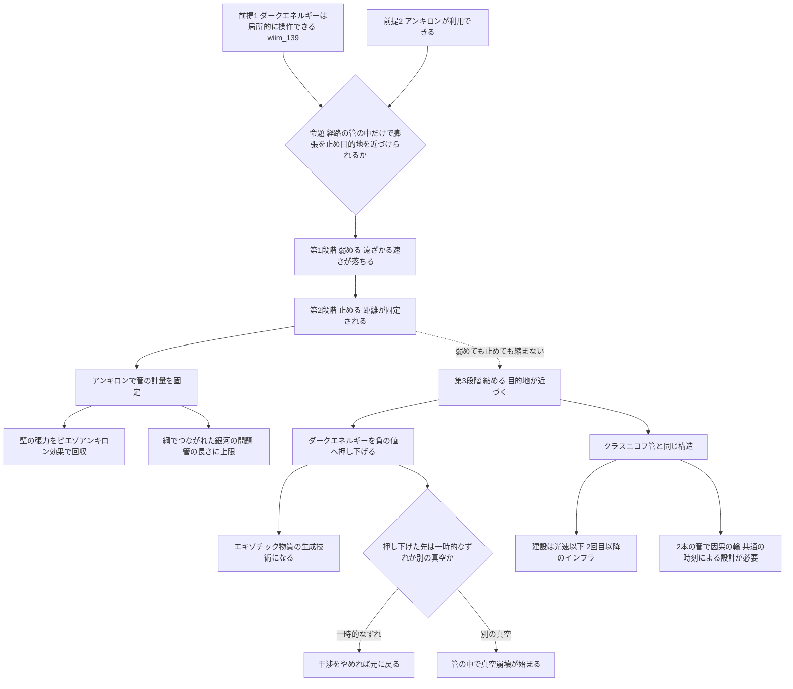

## 1. 概要 (Abstract)

[wiim_139](wiim_139.md)は、先進文明がダークエネルギー（g218）に干渉して弱らせられるかを検討し、最大の壁はエネルギーの量よりも**範囲**——膨張の速さを変えるには宇宙規模の体積を覆わなければならない——だと結論した。

本記事はその壁への一つの答えを検討する。宇宙全体ではなく、行きたい目的地までの経路に沿った細長い管の中だけで、ダークエネルギーに干渉する。これを**ダークエネルギーアンカーホール**（g526）と呼ぶ。範囲を管に絞れば、必要な規模は大きく下がるはずだ。そして管の中の膨張を止めるだけでなく、空間を縮めることまでできれば、目的地を実際に近づけられるかもしれない。

> **前提①:** ダークエネルギーは動く場であり、先進文明はその値を局所的に操作できる（wiim_139の方式A・D）。
> **前提②:** 計量に錨を打つ架空粒子アンキロン（[wiim_022](../physics/wiim_022.md)、g128）が利用できる。
> **命題:** 「経路の管の中だけでダークエネルギーに干渉し、膨張を止め、さらに目的地を近づけることはできるか？」

---

## 2. 実現不可能性の根拠 (Infeasibility Rationale)

### 物理的限界

ダークエネルギーを弱めたり、ゼロにしたりしても、距離は縮まない。空間の伸びが遅くなるか、止まるだけだ。距離を縮めるには、空間を収縮させる向きに働くもの——負のエネルギー密度を持つエキゾチック物質——が必要になる。これは、アルクビエレドライブ（g035）が要求する条件と同じであり、ダークエネルギーを弱める技術だけでは届かない。

さらに、管の中と外で空間の振る舞いが違えば、その境界には必ず歪みが集中する。外の空間は伸び続け、管の中は止まっている。管の長さが宇宙論的な距離になるほど、境界の両側のずれは大きくなる。

### 技術的限界

管を作るには、まず管の端を目的地まで届けなければならない。建設は光速以下でしか進まないため、最初の1回は近道なしで行き、管を敷きながら進むことになる。目的地が数十億光年先なら、建設だけで数十億年以上かかる。アンカーホールは、最初の旅を速くする技術ではなく、2回目以降の往来のためのインフラである。

### 論理的限界

管の中の空間を縮めて近道を作ると、管を通る移動は外から見て光より速くなる。光より速い移動は、別の速度で動く観測者から見ると「到着が出発より前」になる場合を含み、往復の組み合わせによっては自分の過去に戻れてしまう。1本の管は便利な近道でも、向きの違う2本の管を組み合わせると、タイムマシンになりうる。

---

## 3. 実験の設定 (Setup)

1. **主体:** ハッブル地平線に挑む4型文明（[wiim_079](wiim_079.md)）。
2. **環境:** 出発地の銀河と、数十億光年先の目的地の銀河。両者の間の空間は加速膨張しており、目的地はやがて事象の地平線の外へ去ろうとしている。
3. **操作:** 出発地から目的地まで、細長い管を敷設する。管の中で、次の三段階の干渉を順に試す。
   - **第1段階 弱める:** 管の中のダークエネルギーを弱める。
   - **第2段階 止める:** 管の中の空間の伸びを完全に止める。
   - **第3段階 縮める:** 管の中の空間を縮める。
4. **評価軸:** 目的地との距離がどう変わるか、必要な材料、管の構造への負荷、因果律との整合。

---

## 4. 考察と予測 (Speculation)

### 三段階の効果

| 段階 | 管の中で行うこと | 効果 | 必要な材料 |
|---|---|---|---|
| 第1段階 弱める | ダークエネルギーを弱める | 加速が緩み、目的地が遠ざかる速さが落ちる | 動く場への干渉（wiim_139の方式A・D） |
| 第2段階 止める | 管の中の空間の伸びを止める | 目的地との距離が固定され、地平線の外へ去らなくなる | 伸びようとする外の空間に逆らい、管の壁が張力に耐える必要がある |
| 第3段階 縮める | 管の中の空間を縮める | 目的地が実際に近づく | 負のエネルギー密度（エキゾチック物質） |

重要なのは、第1段階と第2段階の延長線上に第3段階がないことだ。弱めても、止めても、空間は縮まない。第3段階には、質的に別の材料が要る。

### 第2段階の実装——アンキロンによる裏打ち

第2段階（止める）は、WIIMの既存概念と自然に噛み合う。アンキロンは、時空の計量テンソル——距離の物差しそのもの——に錨を打つ架空粒子だ。管の内壁をアンキロンで裏打ちすれば、管の中の計量座標が固定され、空間が伸びなくなる。ここでアンキロンが固定するのはあくまで計量座標であって、管の中の物質を直接つなぎ留めているわけではない。物質は、固定された計量の上に置かれることで、結果として動かなくなる。

管の壁は、伸びようとする外の空間から張力を受け続ける。この張力は、[wiim_078](wiim_078.md)のエクスタイドフロートと同じピエゾアンキロン効果（g317）で、電気エネルギーとして回収できるかもしれない。管は、目的地を引き留めるインフラであると同時に、宇宙膨張から発電し続ける発電所にもなる。

第2段階だけでも、実用的な価値は大きい。目的地が事象の地平線の外へ去れば、光速で旅をしても永遠に届かなくなる。管の中の距離を固定することは、到達可能な目的地を失わないための保険になる。

### 管の境界に集まる負荷——綱でつながれた銀河の問題

第2段階には、構造上の大きな負荷が伴う。管の両端の出発地と目的地は、外の空間とともに遠ざかろうとする。管の中の距離を固定するのは、遠ざかろうとする2つの銀河を綱でつなぐのと同じだ。宇宙論には、これを正面から扱った「綱でつながれた銀河の問題」（2003年、デイビス、ラインウィーバー、ウェッブ）という議論がある。遠ざかる銀河を一定の距離に保つには、綱が銀河の後退に逆らう力を及ぼし続けなければならない。

その負荷は、管の長さとともに増える。現在の宇宙の膨張率では、距離が1億光年離れるごとに、遠ざかる速さはおよそ秒速2000キロメートルずつ増える。数十億光年の管なら、端の部分では外の空間が光速に近い速さで管の壁を引き裂こうとする。相対論は完全な剛体を許さないため（[wiim_021](../physics/wiim_021.md)が扱った剛体禁止の問題）、この張力はどこかで必ず伸びや歪みとして現れる。アンキロンの錨がどれほど強くても、管の長さには上限があると考えられる。

### 第3段階——ダークエネルギーを負の値まで押し下げる

[wiim_139](wiim_139.md)の前提となった整理では、ダークエネルギーは空間を押し広げる性質（負の圧力）を持つが、エネルギー密度は正の、いわば「半分だけエキゾチック」な材料だった。アルクビエレドライブに必要な負のエネルギー密度には届かない。

しかし、場への干渉でダークエネルギーの値をゼロの下、負の値まで押し下げられるとしたら、状況が変わる。

- 負の値のダークエネルギー（負の宇宙定数）を持つ空間は、膨張ではなく収縮する方向に働く
- 負の値のダークエネルギーは、エネルギー密度が負であり、エキゾチック物質の条件を満たす
- つまりダークエネルギーへの干渉技術は、突き詰めると**エキゾチック物質の生成技術**になる

DESIが示唆する弱まりを延長すると、いずれダークエネルギーが負になるという模型も実際に議論されている。ダークエネルギーの場のポテンシャルが負の値の領域を持つなら、管の中だけでそこへ押し込むことが、アンカーホールの第3段階の核心になる。

ただし、ここには致命的な分岐がある。押し下げた先が、場の単なる一時的なずれであれば、干渉をやめれば場は元に戻る。しかし押し下げた先が、より安定な**別の真空**だった場合、管の中で真空崩壊が始まる（[wiim_125](../physics/wiim_125.md)）。新しい真空の泡は管の壁を越えて光速近くで広がり、物理定数ごと宇宙を書き換える。近道を作るつもりの装置が、宇宙の崩壊装置になる。第3段階に踏み込む前に、場のポテンシャルの形——押し下げた先に別の谷があるかどうか——を知る必要があるが、それを確かめる手段は、実際に押し下げてみることしかないかもしれない。

### クラスニコフ管との同型性

アンカーホールが第3段階まで完成すると、物理学に既に提案されている構造とほぼ同じ形になる。1995年にセルゲイ・クラスニコフが提案した**クラスニコフ管**（g525）だ。最初の旅を光速以下で行いながら経路に沿って時空を加工した管を残し、2回目以降は管を通って速く行き来できる——アンカーホールの「建設は光速以下、2回目以降のインフラ」という性格と一致する。

クラスニコフ管の研究は、アンカーホールの将来を二つの点で予告している。

- **負のエネルギーの量:** 1997年、エベレットとローマンは、クラスニコフ管の維持に膨大な負のエネルギーが必要なことを示した。アンカーホールでは、それを負の値のダークエネルギーで賄うことになる。
- **タイムマシン化:** 同じく彼らは、向きの違う2本の管を組み合わせると、閉じた時間的曲線——自分の過去へ戻れる経路——ができることを指摘した。

アンカーホールを交通網として何本も敷設すれば、どこかで2本が「タイムマシンの配置」になる危険がある。[wiim_136](wiim_136.md)で論じたように、因果の輪を防ぐには、すべての管に共通の時刻を割り振り、管が常にその時刻の未来にしか運ばないように設計する必要があると考えられる。

### 既存の技術との位置づけ

| 技術 | 手段 | 目的 | 最大の壁 |
|---|---|---|---|
| ハッブル地平線の縫い留め（[wiim_116](wiim_116.md)） | 人工ブラックホールの質量でダークエネルギーに打ち勝つ | 銀河群を地平線の内側に引き留める | 観測可能な宇宙の総物質量に近い質量 |
| ギャラクシードライブ（[wiim_079](wiim_079.md)） | 銀河そのものを乗り物にする | 地平線を越える | 要求されるエキゾチック物質の量 |
| アルクビエレドライブ（g035） | 船の周りの空間を縮めて伸ばす | 超光速移動 | 負のエネルギー、泡の前方を制御できない |
| ダークエネルギーアンカーホール（本記事） | 経路の管の中だけでダークエネルギーに干渉する | 第2段階で目的地を固定、第3段階で近づける | 管の境界の張力、真空崩壊、因果の輪 |

wiim_116が「質量で膨張に打ち勝つ」方式なのに対し、アンカーホールは「膨張の原因そのものを経路の上だけで消す」方式だ。範囲を管に絞れる分、wiim_116の質量の壁を大きく下げられる可能性がある。その代わり、負荷は管の境界という細い線に集中する。

### 哲学的な問い

アンカーホールの第2段階は、宇宙が膨張によって文明を孤立させていく流れに、細い糸で抗う技術だ。何十億年もかけて敷かれた管は、その間に建設者の文明が滅びても、張力に耐えて目的地をつなぎ留め、膨張から発電し続けるかもしれない。建設者のいなくなった管は、それを見つけた別の文明にとって、[wiim_136](wiim_136.md)で論じた「先行文明の遺構」そのものになる。私たちが宇宙で見つけるかもしれない最初の異星文明の痕跡は、信号ではなく、銀河と銀河をつなぐ見えない糸なのかもしれない。

---

## 5. 図解 (Diagrams)

---

## 6. 関連記事 (Related)

- [wiim_139](wiim_139.md) — ダークエネルギーを弱らせる技術（本記事の入口記事。五つの干渉方式と範囲の壁）
- [wiim_116](wiim_116.md) — ハッブル地平線の縫い留め（質量で膨張に打ち勝つ方式との比較）
- [wiim_079](wiim_079.md) — ギャラクシードライブ（ハッブル地平線に挑む4型文明）
- [wiim_078](wiim_078.md) — エクスタイドフロート（ピエゾアンキロン効果による膨張エネルギーの回収）
- [wiim_022](../physics/wiim_022.md) — アンキロン（計量に錨を打つ架空粒子）
- [wiim_021](../physics/wiim_021.md) — 切れないエネルギー紐（剛体禁止と不変な距離）
- [wiim_125](../physics/wiim_125.md) — 真空崩壊を実験できるか（第3段階の危険）
- [wiim_136](wiim_136.md) — ブレーン宇宙の移動（因果律の3層と共通の時刻、先行文明の遺構）
- [wiim_023](../physics/wiim_023.md) — エキゾチック物質の生成
- （未作成）ダークエネルギーが弱まっているなら——加速膨張が止まる宇宙で、地平線に挑む技術はどう変わるか

**関連用語（用語集）**
- ダークエネルギーアンカーホール (g526)
- クラスニコフ管 (g525)
- ダークエネルギー (g218)
- アンキロン (g128)
- ピエゾアンキロン効果 (g317)
- ワープドライブ / アルクビエレドライブ (g035)
