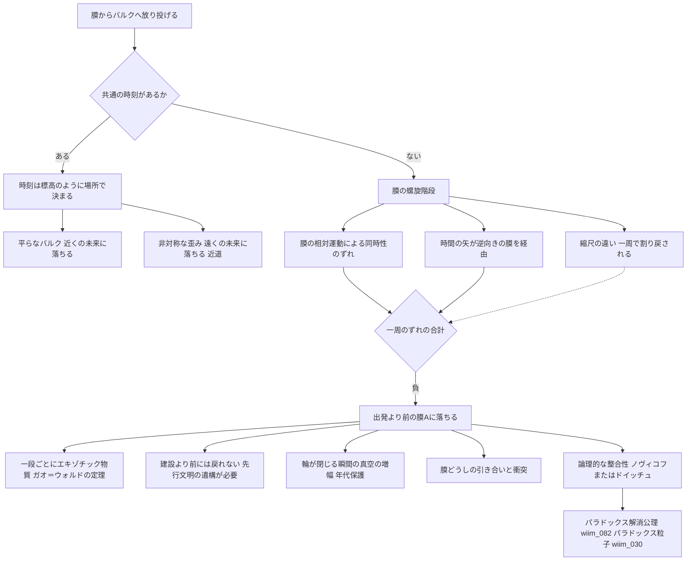

## 1. 概要 (Abstract)

[wiim_136](wiim_136.md)は、私たちの宇宙を高次元空間（バルク空間、[g524](../../glossary/terms/g524.md)）に浮かぶ膜とみなすブレーンワールド（[g523](../../glossary/terms/g523.md)）の描像で、隣の膜を経由して近道できるかを論じた。そこでは、近道が因果の矛盾を生まないための条件として、膜をまたぐ**共通の時刻**が必要だとされた。

本記事は、その条件を意図的に壊す構想を考える。

膜を地面、バルクを空にたとえてみる。膜から空へ放り投げたものは、やがてどこかに落ちてくる。1回投げただけなら、それは投げた時刻より後の、どこか別の場所に落ちる。しかし、何枚かの膜を経由し、乗り換えのたびに到着の時刻が少しずつずれるように経路を組んだらどうか。一段ずつは普通に上っているのに、一周すると元の高さより下にいる——ペンローズの無限階段のように、膜を巡って一周したとき、**出発した時刻より前に落ちてくる**ことはありうるだろうか。

本記事では、この複数の膜をらせん状に巡る機構を**ブレーンヘリクス**（[g535](../../glossary/terms/g535.md)、和名「膜の螺旋階段」）と呼ぶ。

> **前提①:** バルク空間の中に、膜A（この宇宙）、膜B、膜Cが浮かんでいる。各膜は縮尺、バルクの中での運動、時間の矢の向きが互いに異なりうる。
> **前提②:** wiim_136の方式③（バルクを貫くワームホール）または方式⑤（先行文明の遺構）により、膜と膜の間を近道で移る手段がある。
> **命題:** 「膜A→膜B→膜C→膜Aと巡る経路で、出発より前の膜Aに戻れるか。戻れるとすれば、何がそれを許し、何がそれを阻むか？」

---

## 2. 実現不可能性の根拠 (Infeasibility Rationale)

### 物理的限界

**近道そのものに負のエネルギーが要る.** 螺旋階段の各段は、膜から膜への近道でできている。しかしwiim_136で見たとおり、時間と空間が同じ割合で縮む限り、バルクを経由しても近道にはならない。近道には、空間が時間より大きく縮む非対称な歪みが必要だ。ガオとウォルドは2000年、負のエネルギーを持たないふつうの物質だけでできたある種の時空では、内部を通る経路が境界に沿う経路より早く着くことはないと証明した（ガオ＝ウォルドの定理）。階段の一段ごとに、エキゾチック物質（[wiim_023](../physics/wiim_023.md)）という代金が要ると考えられる。

**負のエネルギーの量には上限がある.** 量子論には、負のエネルギーは大きいほど短い時間、狭い範囲にしか存在できないという制限がある（フォード＝ローマンの量子不等式）。実在する負のエネルギーであるカシミール効果の板の間では、光がわずかに速く進むと予測されている（シャルンホルスト効果）が、その差は1マイクロメートルの間隔でおよそ10⁻³⁶にすぎない。

**輪が閉じる瞬間に、真空が暴れる.** ホーキングは1992年、時間の輪ができかけると、真空のゆらぎが輪を何周も回り、そのたびに増幅されて、輪を作る構造そのものを壊すと論じた（年代保護仮説）。これが絶対的な禁止なのかどうかはまだ決着していないが、階段が完成する瞬間が最も危険な瞬間であることを示唆している。

**膜Aのエネルギーの帳簿が時間をまたいで食い違う.** 渡航者が出発より前の膜Aに落ちてくると、出発の時刻までの間、膜Aには渡航者が二人存在する。膜Aの住人から見れば、ある時刻に質量がどこからともなく現れ、後の時刻に同じ質量がバルクへ消える。輪の全体を通せば収支は合うが、それは帳尻を膜の外と時間の輪の中で合わせているにすぎず、膜Aの各時刻で見たエネルギー保存は破れて見える。余剰次元とバルクは、この食い違いを消す場所ではなく、食い違いを記録する場所が膜の外に移るだけだと考えられる。

### 技術的限界

**膜の配置を保てない.** 膜どうしは重力で引き合い、膜の位置を決める場（ラディオン）も揺らぐ。階段の形を保ったまま膜を並べ続けることは難しく、最悪の場合は膜どうしが衝突する（[wiim_137](wiim_137.md)のケースB）。

**着地点を狙えない.** 空に投げたものがどこに落ちるかは、バルクの形で決まる。乗り換えのたびの時刻のずれを正確に足し合わせるには、バルクの歪みの地図が必要だが、膜の上からバルクを調べる手段は重力しかない（[wiim_138](wiim_138.md)）。

**建設より前には戻れない.** 時間の輪は、階段が一周つながった瞬間から存在する。そのため、どれほど周回を重ねても、階段が完成する前の過去には戻れない。これはワームホール型のタイムマシンなどにも共通する制約だ。

### 論理的限界

**階段は、因果の安全装置を壊す装置そのものである.** wiim_136は、共通の時刻があれば因果の輪は作れないことを、近道を安全に使うための条件とした。螺旋階段はその共通の時刻を意図的に壊すことで初めて機能する。つまり、この装置が「動く」ことと「因果の矛盾の危険がある」ことは、同じ一つの性質の表と裏だ。

**整合性は物理ではなく論理の要請である.** 輪ができれば、出発前の自分に会って出発を止める、という親殺しのパラドックスの経路が開く。wiim_136で整理したように、同じ事象が「起きた」と「起きなかった」を同時に満たせないという論理的な整合性は、時空の形に関係なく残る。階段が実在するなら、矛盾しない歴史しか実現しないか（ノヴィコフの自己無矛盾原理）、輪が閉じるように見えるとき実際には別の歴史の枝に着く（ドイッチュのモデル）か、いずれかの形で整合性が保たれるしかないと考えられる。

---

## 3. 実験の設定 (Setup)

1. **主体:** 膜Aの観測者と、膜を巡る渡航者（または探査機）。
2. **環境:** バルク空間に浮かぶ膜A・膜B・膜C。膜Aは縮尺の小さい側に、膜Bは膜Aに対してバルクの中を運動し、膜Cは時間の矢が膜Aと逆向きだと仮定する。
3. **操作A:** 膜Aからバルクへ1回だけ物体を投げ、どこに、いつ落ちてくるかを調べる。
4. **操作B:** 膜A→膜B→膜C→膜Aと巡り、乗り換えのたびに到着時刻のずれを記録する。
5. **操作C:** 一周のずれの合計がマイナスになるよう、膜の運動や経路を調整する。
6. **操作D:** 階段が一周つながる瞬間、真空のゆらぎの振る舞いを観測する。
7. **観察対象:** 渡航者が出発前の膜Aに着くか、着くならそれより前に何が起きていたか。

---

## 4. 考察と予測 (Speculation)

### 空に放り投げる——1回の投擲は未来に落ちる

操作Aから始めよう。

ランドール＝サンドラム型のブレーンワールドでは、バルクは反ド・ジッター空間と呼ばれる形に強く歪んでいる。私たちの膜を「縮尺の小さい側」に置く模型（重力が他の力に比べて極端に弱い理由を説明する第1模型）では、膜はバルクの谷底にあたり、膜から飛び出した質量のある粒子は膜の方へ引き戻される。膜の上から見れば、空に投げたボールが地面に落ちてくるのとよく似ている。

反ド・ジッター空間そのものには、振り子のような変わった性質もある。どんな速さで投げても、ほぼ同じ時間で戻ってくるのだ。強く投げれば高く上がるだけで、滞空時間は変わらない。

どこに落ちてくるかは、バルクの形で決まる。

| バルクの形 | 落ちてくる場所 | 落ちてくる時刻 |
|---|---|---|
| 平らで対称 | 投げた場所の近く | 未来 |
| 時間と空間の歪み方が食い違う、非対称な歪み | 遠く（近道） | 未来 |
| 複数の膜を経由する螺旋階段（共通の時刻がない） | 遠く | 過去もありうる |

1回の投擲で落ちてくるのは、必ず投げた時刻より後だ。ただし別の意味で「時間が違う」ことは起きる。投げたもの自身の時計は、空を飛んでいる間、膜の上より遅れて進む。双子のパラドックスと同じく、落ちてきたものは「若い」まま帰ってくる（ウラシマ効果、[wiim_016](wiim_016.md)）。

ここで区別しておくべきことがある。渡航者自身の時計（固有時間）は、どんな経路でも必ず前へ進む。行きも帰りも年を取るので、往復で打ち消し合うことはない。「過去へ行く」で問題になるのは渡航者の時計ではなく、**膜Aの歴史のどの時点に着くか**だ。

### 時刻は「標高」か「らせん階段」か

なぜ1回の投擲は未来にしか落ちないのか。それは、膜Aと膜Bとバルクに共通の時刻があれば、時刻は地図の上の**標高**のように、場所ごとに一つに決まる量になるからだ。

山を登ってから同じ地点に戻れば、標高の上下は必ず差し引きゼロになる。同じように、どの経路で膜の外を回っても、時刻は経路の途中で一方的に増えるだけで、出発地点より前には戻れない。行きと帰りが鏡写しに打ち消すからではなく、時刻が**場所の関数**として決まっているから戻れないのだ。

ところが、一般相対性理論では、経過時間は出発地と到着地だけでは決まらず、たどった経路によって変わる量だ。そして時刻を場所ごとに一つに決められない時空も存在する。らせん階段では、一周して真上の同じ位置に戻ると高さが変わっている。ペンローズの無限階段では、一段ずつ上っているのに、一周すると元の場所にいる。

**一周したときのずれの合計が0にならないこと**は、そのまま「全体に共通の時刻は存在しない」ことの証明になる。もし共通の時刻があれば、一周のずれは必ず0になるはずだからだ。

### 螺旋階段を組み立てる

操作Bでは、膜を乗り換えるたびに到着時刻がずれる。ずれを生む原因は三つ考えられる。

- **縮尺の違い:** 膜Aと膜Bで時間の刻みの基準が違えば、乗り換えのたびに時計の読みが換算される。ただし、縮尺の違いだけでは一周で必ず元に戻る。往きで掛けた倍率を帰りで割り戻すだけだからだ。
- **同時性のずれ:** 膜Bが膜Aに対してバルクの中を運動していれば、特殊相対性理論の「同時性の相対性」によって、膜Aにとっての「今」と膜Bにとっての「今」が食い違う。近道で膜Bへ渡り、膜Bの「今」の中を移動してから戻ると、膜Aの「今」より前に着く経路ができうる。
- **時間の矢の向き:** 膜Cの時間の矢が膜Aと逆向きなら、膜Cの「未来」へ進むことは、膜Aから見て過去の向きに進むことにあたる。

一周のずれの合計がマイナスになるように、これらを組み合わせる。各膜の中では普通の因果が成り立ち、各段の乗り換えも単独では安全に見える。それでも一周すると、出発前の膜Aに落ちてくる。

### 安全な部品の組み合わせで輪を作る——既存の系譜

一つひとつの部品は単独では因果的に安全なのに、組み合わせると時間の輪ができる。この構造は、物理学で知られたいくつかのタイムマシンの提案に共通している。

| 提案 | 部品 | 一周で時間が戻る仕組み |
|---|---|---|
| ワームホール型（モリス、ソーン、ユルトセヴァー、1988） | 片方の口だけを高速で往復させたワームホール | 口と口の間に双子のパラドックスの時間差が溜まる |
| ゴットの宇宙ひも（1991） | 高速ですれ違う2本の宇宙ひも | 各ひもの周りの近道を組み合わせる |
| 2つのワープバブル（エヴェレット、1996） | 互いに動く2つのアルクビエレドライブ | 2つの光より速い経路と同時性のずれ |
| 2本のクラスニコフ管（[g525](../../glossary/terms/g525.md)） | 往路で敷いた管を2本組み合わせる | 1本では安全だが2本で輪ができる（[wiim_140](wiim_140.md)） |
| **膜の螺旋階段** | 縮尺・運動・時間の向きの違う複数の膜と、それらを結ぶ近道 | 乗り換えごとの時刻のずれの合計 |

膜の螺旋階段は、この系譜の高次元版と位置づけられる。違いは、輪の部品が一つの時空の中の構造物ではなく、**別々の宇宙**だという点にある。

### 建設より前には戻れない——恐竜に会うには遺構が要る

時間の輪は、階段が一周つながった瞬間から存在する。何周しても、到着できるのは階段が完成した時刻より後だけだ。

そのため、たとえば恐竜の時代へ行くには、その時代にすでに誰かが階段を完成させている必要がある。ここで、wiim_136の方式⑤「先行文明の遺構」が別の意味を帯びる。遠い過去に階段を完成させた先行文明がいれば、その遺構を借りることで、私たちは自分たちが建設するより前の時代へ落ちていけるかもしれない。先行文明のワープ装置の正体をブレーンヘリクスとみなす一説は、補遺ノート「[ブレーンヘリクス遺構説](../notes/wiim_142_brane_helix_relic.md)」で整理した。

逆に言えば、未来の誰かが階段を建設したなら、その出口は建設の時刻にしか開かない。「未来からの旅行者がまだ一人も来ていない」ことは、タイムマシンが不可能な証拠として持ち出されることがあるが、この制約のもとでは、単に**まだ誰も階段を完成させていない**ことを意味するにすぎない。

### 階段が閉じる瞬間——年代保護

操作Dは、最も危険な瞬間を調べるものだ。

階段がまさに一周つながろうとするとき、真空のゆらぎは輪を一周して元の位置に戻ってくる。周回のたびに同じ場所に重なって増幅され、そのエネルギーが際限なく大きくなると考えられる。ホーキングの年代保護仮説は、この増幅が輪を作る構造を壊し、自然は時間の輪の形成を許さないと主張する。

ただし、増幅が本当に際限なく続くのか、量子重力の効果で途中で止まるのかは、まだ分かっていない。発散を起こさない真空の状態がありうるという計算もある。年代保護は、螺旋階段の完成を禁じる番人かもしれないし、乗り越えられる一時的な嵐かもしれない。

### 時間の矢が逆向きの膜を通るとき

膜Cを経由する経路には、もう一つ固有の危険がある。[wiim_137](wiim_137.md)で触れたように、物理学者シュルマンは、時間の矢が逆向きの二つの系は、相互作用が十分弱い場合に限って共存できると論じた。渡航者が膜Cで周囲の物質と強く触れ合えば、渡航者か周囲のどちらかの時間の矢が崩れる危険がある。

膜Cを通過する間、渡航者は周囲と触れ合わずに「重力だけでつながる」存在でいなければならない。それは、[wiim_138](wiim_138.md)で見たダークマターの姿とよく似ている。過去への近道を通る旅人は、通過する宇宙にとって見えない物質として通り過ぎることになる。

### 整合性の扱い——WIIMの既存の仕組みとの接続

輪ができたとき、論理的な整合性をどう保つかについては、WIIMの既存の思考実験に独自の仕組みがある。

- [wiim_082](../physics/wiim_082.md)（パラドックス解消公理）: 空間の歪みが因果の矛盾を自動的に解消する、という公理を置く立場
- [wiim_030](../physics/wiim_030.md)（パラドックス粒子）: エキゾチック物質の反動が、因果の矛盾を自動的に打ち消す粒子として現れる、という立場

螺旋階段の各段にエキゾチック物質が要ることを考えると、wiim_030の発想とは特に相性がよい。階段を作る代金として支払った負のエネルギーそのものが、輪の中の矛盾を解消する側に回る、という整理ができるかもしれない。

### 哲学的な問い

私たちは「時刻」を、宇宙全体に一枚の布のように広がった共通の目盛りだと感じている。しかし相対論は、時刻を場所ごとの局所的な目盛りの貼り合わせとして描き、その貼り合わせが一周で必ず整合するという保証はどこにもないことを示している。

膜の螺旋階段は、その貼り合わせの継ぎ目に意図的にずれを作る装置だ。もし宇宙に共通の時刻があるとすれば、それは自然法則が保証しているのではなく、まだ誰も継ぎ目をずらしていないという、宇宙の現在の状態にすぎないのかもしれない。そして年代保護が正しいなら、宇宙は継ぎ目をずらそうとする試みに抵抗する性質を、どこかに持っていることになる。共通の時刻は、宇宙の前提なのか、それとも宇宙が守り続けている状態なのだろうか。

---

## 5. 数式による表現 (Mathematical Notation)

膜A→膜B→膜C→膜Aと巡ったときの、一周の時刻のずれ：

$$\Delta T = \delta t_{AB} + \delta t_{BC} + \delta t_{CA}$$

δt は各乗り換えで到着時刻がどれだけずれるかを表す。膜A・膜B・膜Cとバルクに共通の時刻が存在するなら、ΔT はどの経路でも0以上になる。ΔT が負になる経路が一つでもあれば、共通の時刻は存在しない。その経路をたどった渡航者は、出発より |ΔT| だけ前の膜Aに落ちてくる。

---

## 6. 図解 (Diagrams)

---

## 7. 関連記事 (Related)

- [wiim_136](wiim_136.md) — ブレーン宇宙の移動（共通の時刻と近道の条件を論じた入口記事）
- [wiim_137](wiim_137.md) — 膜の外への避難（片道の移動は因果の輪を作らない、時間の矢が逆向きの膜）
- [wiim_138](wiim_138.md) — 膜の裏側の物理（重力だけでつながる存在とダークマター）
- [wiim_140](wiim_140.md) — ダークエネルギーアンカーホール（クラスニコフ管との同型性）
- [wiim_049](../physics/wiim_049.md) — 時間遡行は可能か（時間遡行の条件と限界の総論）
- [wiim_082](../physics/wiim_082.md) — パラドックス解消公理（輪の中の矛盾の扱い）
- [wiim_030](../physics/wiim_030.md) — パラドックス粒子（エキゾチック物質の反動による矛盾の解消）
- [wiim_016](wiim_016.md) — 時間同期技術（ウラシマ効果）
- [wiim_118](wiim_118.md) — 光速突破は時空を"破断"させるか（因果の順序を根本に置く見方）
- [wiim_119](wiim_119.md) — 宇宙は自分自身の母になれるか（時間の輪と宇宙の始まり）
- [wiim_141](../physics/wiim_141.md) — 物質とエネルギーは作用に還るか（経過時間が経路に依存すること、測れるのは差だけであること）
- [g535](../../glossary/terms/g535.md) — ブレーンヘリクス（本記事の構想、和名「膜の螺旋階段」）
- [ブレーンヘリクス遺構説](../notes/wiim_142_brane_helix_relic.md) — 先行文明のワープ装置の正体としての一説（補遺ノート）
- [g531](../../glossary/terms/g531.md) — 年代保護仮説
- [g532](../../glossary/terms/g532.md) — 反ド・ジッター空間
- [g533](../../glossary/terms/g533.md) — ゴットのタイムマシン
- [g534](../../glossary/terms/g534.md) — ガオ＝ウォルドの定理
- [g484](../../glossary/terms/g484.md) — 閉じた時間的曲線
- [g525](../../glossary/terms/g525.md) — クラスニコフ管
- [g523](../../glossary/terms/g523.md) — ブレーンワールド
- [g524](../../glossary/terms/g524.md) — バルク空間
- [g068](../../glossary/terms/g068.md) — エキゾチック物質
- [g016](../../glossary/terms/g016.md) — ウラシマ効果
