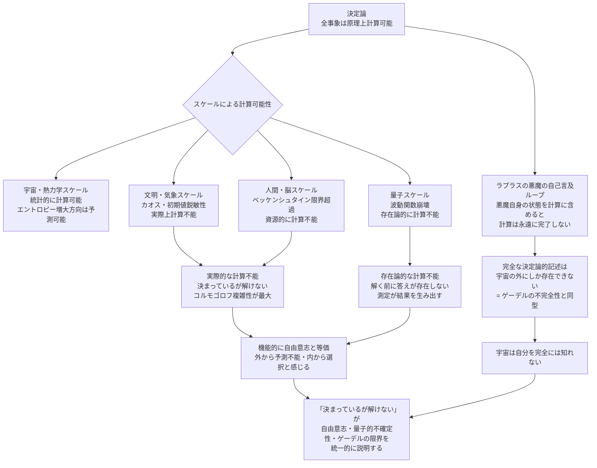

## 1. 概要 (Abstract)

決定論は強い主張をする——宇宙の全事象は先行する状態と物理法則から原理上計算できる、と。

しかしこの主張には隠れた前提がある。「計算できる」とはどういう意味か。

宇宙スケールで見れば、エントロピーが増大し熱的死に向かうことは統計的に確実だ。これは「計算できる決定論」だ。しかし同じ宇宙を人間スケールで見ると、一人の人間の意思決定を量子精度で予測するには宇宙全体のエネルギーを超える計算資源が必要になる——ベッケンシュタイン限界が壁として立ちはだかる。さらに量子スケールまで降りると、計算が難しいのではなく、**答えが観測の瞬間まで存在しない**という別の壁に突き当たる。

これは古典力学から量子力学への相転移と同じ構造だ。スケールが一定の閾値を下回ると、決定論的な記述が「使えなくなる」のではなく、**計算可能性そのものが相転移する**。

> **命題：** 「決定論は宇宙スケールでは計算可能だが、スケールが下がるにつれて実際的・存在論的に計算不能になる——ラプラスの悪魔は宇宙の外にしか立てない。」

---

## 2. 実現不可能性の根拠 (Infeasibility Rationale)

### 物理的限界

計算には媒体が必要で、媒体には空間とエネルギーが必要だ。

ベッケンシュタイン限界は、有限の空間領域に格納できる情報量の上限を定めている。宇宙全体の量子状態を完全に記述するには、宇宙全体のエネルギーに匹敵する媒体が必要になる——つまりラプラスの悪魔が宇宙の内側に存在する限り、悪魔のコンピュータは宇宙そのものと同じ大きさでなければならない。しかしそうなると、悪魔自身の状態もまた計算の対象に含まれ、計算は自己言及のループに陥る。

「完全な計算」は宇宙の外からしか実行できない。そして宇宙の外は定義上存在しない。

### 技術的限界

仮に計算資源が無限にあったとしても、カオス系は予測を拒む。

カオス理論の初期値鋭敏性——バタフライ効果——は、初期値の極わずかな誤差が指数関数的に拡大することを示す。大気の状態を予測するには、空気分子一個の位置誤差でさえ数週間後の天気を完全に変えてしまう。物理的な測定には必ず有限の精度しかなく、その誤差は時間とともに爆発的に増大する。文明スケールの長期予測は、計算資源の問題ではなく**測定精度の物理的限界**によって封じられている。

### 論理的限界

最も根本的な障壁はゲーデルの不完全性定理との類似だ。

「十分に複雑な公理系はその内側から自身の無矛盾性を証明できない」——これは計算可能性にも当てはまる。宇宙が自身の完全な記述を内包しようとするとき、その記述はすでに宇宙の一部となり、記述の対象が変化する。完全な自己記述は自己言及のパラドックスを生む。

チューリングの停止問題も同型だ——あるプログラムが停止するかどうかを、万能なアルゴリズムで判定することは不可能だと証明されている。宇宙という「プログラム」が最終状態（熱的死）に到達するかどうかの詳細な経路も、宇宙の内側から完全に記述することはできない。

---

## 3. 実験の設定 (Setup)

### 計算可能性の相転移

決定論の「計算可能性」はスケールによって段階的に崩壊する。

| スケール | 計算可能性の種類 | 崩壊の原因 |
|---------|--------------|----------|
| 宇宙・熱力学 | ◎ 統計的に計算可能 | — |
| 銀河・天体 | ○ 長期は難しいが短期は可能 | N体問題の複雑性 |
| 文明・気象 | △ 実際上不可能 | カオス・初期値鋭敏性 |
| 人間・脳 | × 資源的に不可能 | ベッケンシュタイン限界超過 |
| 量子 | × 存在論的に不確定 | 波動関数崩壊・答えが事前に存在しない |

古典力学と量子力学の間に「プランクスケール」という閾値があるように、決定論の計算可能性にも閾値がある。閾値より上では決定論的記述が有効で、下では**記述の種類そのものが変わる**。

### 計算不能の2種類

「計算できない」には性質の異なる2種類がある。

```
【実際的な計算不能】（人間・脳スケール）
  原理上は決定されている
  しかし計算コストが物理的上限を超える
  → 「決まっているが解けない」
  → コルモゴロフ複雑性が最大の系——最短記述が存在せず乱数と区別できない

【存在論的な計算不能】（量子スケール）
  決定されていない
  観測の瞬間まで答えが存在しない
  → 「解く以前に問いが定まっていない」
  → 波動関数崩壊（g164）——測定が結果を「生み出す」
```

前者は「地図が地形より大きくなれば地図として機能しない」という情報論的限界であり、後者は「地形そのものがまだ決まっていない」という存在論的限界だ。

### ラプラスの悪魔の自己言及ループ

ラプラスの悪魔を宇宙の内側に置くと、致命的な問題が生じる。

```
① 悪魔が宇宙の全状態を計算しようとする
② 計算には悪魔自身の状態も含まれる
③ 悪魔の状態を含めた計算結果を出力するには
   さらに悪魔の新しい状態が必要になる
④ ① に戻る → 無限ループ
```

これはチューリングの停止問題における「自分自身を入力とするプログラム」と同じ構造だ。完全な計算は自己言及を含む瞬間に停止する。

---

## 4. 考察と予測 (Speculation)

### 「決まっているが解けない」が自由意志を生む

実際的に計算不能な系は、外部から観測すると**乱数と区別できない**。

コルモゴロフ複雑性が最大の系——最短の記述が存在しない、つまり「その系の振る舞いを圧縮して説明できない」系——は、決定論的に生成されていても乱数列と見分けがつかない。人間の意思決定が量子精度で見れば決定論的だとしても、その決定論的プロセスは圧縮不可能な複雑性を持っているかもしれない。

圧縮不可能な決定論は**機能的に自由意志と等価**だ。外から予測できず、内から「選択している」と感じられ、事後的にしか記述できない——これは自由意志の定義に限りなく近い。

### 宇宙は自分を知れない

ゲーデルの不完全性定理の宇宙版として、「宇宙は自身の完全な状態を内側から知ることができない」という命題が導かれる。

これは知的な存在にとって深い示唆を持つ。どれだけ高度な文明も、宇宙の内側にいる限り、宇宙の完全な記述には原理的に届かない。アカシックレコードが「全事象の完全な記録」だとすれば、それは宇宙の外側にしか存在できない——あるいは存在すること自体が矛盾になる。

### 計算可能性の閾値は文明の限界でもある

カルダシェフ文明スケールで見ると、文明が制御できるエネルギーが増えるほど、より大きなスケールでの決定論的予測が可能になる。しかしどれだけ文明が発達しても、ベッケンシュタイン限界は超えられない——文明が宇宙と同じ大きさになったとき初めて完全な計算が可能になるが、そのとき文明は宇宙と区別できなくなる。

計算可能性の閾値を押し上げることが文明の成長と言えるが、その上限は宇宙そのものだ。

---

## 5. 図解 (Diagrams)



---

## 6. 関連記事 (Related)

- [wiim_040](../philosophy/wiim_040.md) — 自由意志とスケールの逆転（姉妹記事・スケール構造を共有）
- [wiim_037](../physics/wiim_037.md) — レトロン（時間の矢とエントロピー・決定論との接続）
- wiim_??? — アカシックレコード（宇宙の完全な記録が存在できないという帰結）
- wiim_??? — ゲーデルの不完全性定理（論理的限界の詳細）
- wiim_??? — チューリングの停止問題（計算可能性の限界の詳細）
