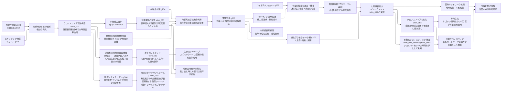

← [技術ツリー一覧](#notes/tech_tree.md)

## クロノスフィア系ブランチ

時間加速空間の発見から菌類超進化・太陽系根付きへと展開する技術系統。
発見は偶然から始まり、理論構築の前に他のツリーが先行完成することもある。

### クロノスフィア系実現限界

| ノード | 根本的な障壁 |
|--------|------------|
| クロノスフィア理論構築 | 境界面での因果律・エネルギー保存則の矛盾——物理的解決策未確立 |
| 光量問題 | 倍率×N で光子密度が1/N に希薄化——太陽光への依存は倍率×10⁴ で限界 |
| 内部完結型核融合光源 | 内部時間で億年単位の連続運転・燃料供給の境界面通過問題 |
| 深時間炉 | 境界面接触部の物質が内外の時間差による応力・位相不連続に耐えられるか |
| ラグランジュ点設置 | L点は完全安定ではなく微小摂動が蓄積——億年スケールで炉の位置維持が困難 |
| 菌類超進化プロジェクト | 内部観測が境界面の時間差で歪曲——進化の進行状況をリアルタイムに把握できない |
| 分散知性の覚醒 | 内部時間スケールの知性と外部文明との通信手段がない |
| クロノスフィア内在化 | 細胞内の熱揺らぎがネゴトン集積構造を乱す・細胞内外の時間差で代謝・物質輸送が崩壊 |
| 半内在化 | エネルギー赤字は残る——外部集積場への依存を断てない |
| 分散クロノスフィア | 菌糸ネットワーク全体の幾何学的秩序の自己組織化が前提——ハイヴマインドと同じ壁 |
| 移動式クロノスフィア炉（シェル） | 球殻内部空間での安定ネゴトン集積にはシェル自体の幾何学的精度が必要——自然成長では達成困難 |
| 逆位相時間場の理論構築 | 通常クロノスフィアと逆方向の時間場を生む粒子配置の理論的根拠が存在しない——前提技術が未定義 |
| 逆クロノスフィア | 時間遅延に必要なエネルギーが倍率に対し非線形増大——完全な時間停止は無限エネルギーを要する |
| 生きたアーカイブ | 保存した生命体を「取り出す」時点で外部は億年後——物理環境・化学組成のすべてが変わっている |
| 時空メタマテリアル | クロノスフィア光子シェルを亜粒子波長スケールで周期制御する手段が存在しない |
| 時空メタマテリアルシールド | 時間伸張→角運動量変換の保存則が未定義——ブラッグ条件の設計根拠がない |
