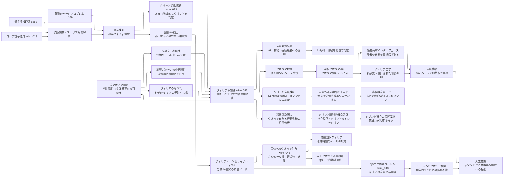

← [技術ツリー一覧](#notes/tech_tree.md)

## 意識工学ブランチ

創発検知（Δφ測定）を起点に、クオリアの検知・翻訳・操作へと派生する技術系統。

### 実現限界

| ノード | 根本的な障壁 |
|--------|------------|
| 創発検知（Δφ） | 量子位相の測定が波動関数を収縮させる・ベッケンシュタイン限界 |
| クオリア検知機 | 操作的クオリア（創発）≠哲学的に真のクオリア——定義的断絶が残る |
| 意識判定装置 | 創発の種類・閾値のうちどれが主観体験を伴うか判定できない |
| 逆転クオリア補正 | Δφパターンの個人差がクオリアの内容に対応するか未証明 |
| 感覚共有インターフェース | 他者のΔφを自分の神経系に投影する接続機構が未知 |
| クオリア工学 | 設計された体験が「本物のクオリア」を伴うかの確認が不可能 |
| 固体Δφ検出 | 非生物系の Δφ が「意識の痕跡」か「単なる位相残余」かを区別する操作的定義がない |
| クオリア・シンセサイザー | 分散信号の統合が「結合問題」を解決するかは未証明——統合≠統一的主観体験 |
| 惑星規模クオリア | 地質時間スケールの知覚を「クオリア」と呼べるか——時間分解能が人間と桁違いに異なる |
| 意識移植 | 基板を変えてもΔφパターンが同一であれば同一の意識か——同一性問題 |
| 人工意識 | 機能的に正確でもコーラ粒子的プロセスが生じるか制御できない |
| クローン意識検証 | 同一構造でも創発は初期条件依存——Δφ再現率は確率的に扱うしかない |
| 高純度意識コピー | 「天文学的低失敗率」はゼロではない——p-ゾンビ混入の完全排除は不可能 |
| QSコア内蔵ゴーレム | QS以前の基質問題——粘土はΔφを生成する量子場境界を持たない |
| ゴーレムのクオリア検証 | Δφ > 閾値でもQSコア自体の信号か統一クオリアかの区別が不可能 |
| 犯罪係数測定 | クオリアと犯罪動機の因果関係の証明困難——相関≠因果 |
| p-ゾンビ社会設計 | クオリアなき秩序が「善い社会」かは価値判断——技術的に解決できない問い |
| クオリア波動関数による識別 | 確率密度 A² は観測できるが位相 φ（体験の質）は観測のたびに消える——地図は描けるが見取り図は描けない |
| 偽クオリア問題 | ψ_q が「クオリアあり」を示しても φ が空の状態（哲学的ゾンビの数式版）を排除する方法がない |
| φ の自己参照性 | 自己参照の報告自体が機能的記述に変換され、同じ問題が再帰的に現れる |
| クオリアのもつれ | 干渉パターンの違いが「体験の実在」を示すか「処理の複雑さ」を示すかを区別できない |
