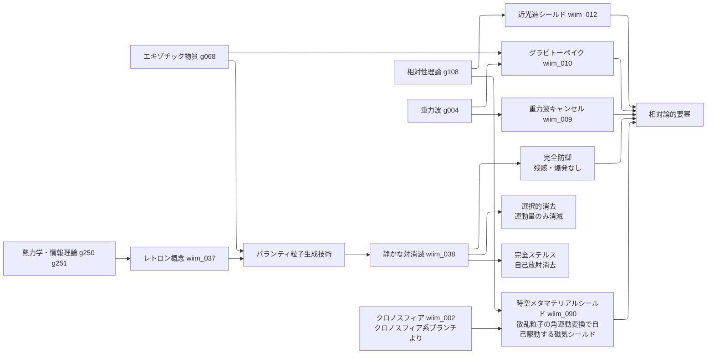

← [技術ツリー一覧](#notes/tech_tree.md)

## 防御・シールド系ブランチ

```mermaid
%%{init: {"layout": "elk"}}%%
flowchart LR
    D1[相対性理論 g108]
    D2[エキゾチック物質 g068]
    D3[重力波 g004]
    D8[熱力学・情報理論 g250 g251]

    D1 --> D4[近光速シールド wiim_012]
    D2 --> D5[グラビトーペイク wiim_010]
    D3 --> D5
    D3 --> D6[重力波キャンセル wiim_009]
    D4 --> D7[相対論的要塞]
    D5 --> D7
    D6 --> D7

    D8 --> D9[レトロン概念 wiim_037]
    D2 --> D10[パランティ粒子生成技術]
    D9 --> D10
    D10 --> D11[静かな対消滅 wiim_038]
    D11 --> D12[完全防御\n残骸・爆発なし]
    D11 --> D13[選択的消去\n運動量のみ消滅]
    D11 --> D14[完全ステルス\n自己放射消去]
    D12 --> D7

    D_CH[クロノスフィア wiim_002\nクロノスフィア系ブランチより]
    D_CH --> D15[時空メタマテリアルシールド wiim_090\n散乱粒子の角運動変換で自己駆動する磁気シールド]
    D1 --> D15
    D15 --> D7
```
