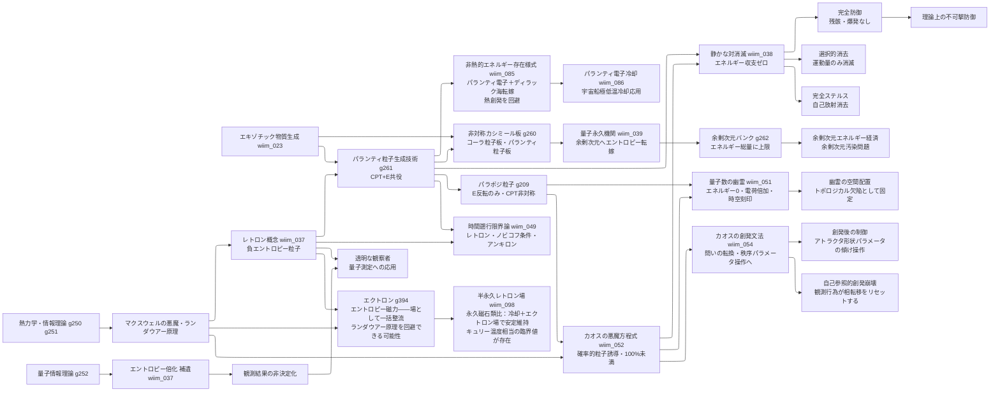

← [技術ツリー一覧](#notes/tech_tree.md)

## エントロピー・パランティ粒子系ブランチ

熱力学第二法則への介入を起点とする技術系統。防御・ステルス・観測操作に派生する。

### 実現限界

| ノード | 根本的な障壁 |
|--------|------------|
| レトロン | 生成コスト≥吸収能力（自己否定的） |
| パランティ粒子生成 | 安定した負エネルギー状態が量子場理論に存在しない |
| 静かな対消滅 | マッチング問題（複雑な攻撃ほど無効化コストが膨大） |
| 完全ステルス | 生成過程自体が新たな放射を生む循環 |
| 量子永久機関 | 通常量子場とコーラ粒子場の結合界面の安定性・余剰次元バンクの有限性 |
| 余剰次元バンク | 余剰次元容量が有限なら文明エネルギーに絶対上限が生まれる |
| パラポジ粒子生成 | CPT非対称な負エネルギー状態は標準理論に生成経路がない |
| 量子数の幽霊 | エネルギーゼロの電荷はゲージ対称性と矛盾——電場なき電荷の記述手段がない |
| カオスの悪魔方程式 | リャプノフ時間・量子不確定性・ランダウアー原理により100%には届かない漸近線 |
| カオスの創発文法 | 創発閾値が事前特定不可能・秩序パラメータ操作が高次カオスを生む・観測行為が創発層を崩壊させる |
| 時間遡行限界論 | ノビコフ条件が自己整合的軌跡のみ許容——遡行できても過去変更の自由度は消える |
| 非熱的エネルギー存在様式 | ディラック海モードへの転嫁が「永遠に熱化しない」保証がない——真空版ホーキング過程による緩やかな漏れ戻り |
| パランティ電子冷却（応用） | エネルギーコスト逆転・電離管理・冷却効率の自己制限——詳細は熱管理ブランチ参照 |
| エクトロン | エントロピーロック状態（磁気秩序に相当する安定基底状態）が熱力学・量子場理論に存在しない——「エントロピーを量子状態に閉じ込める」機構の根拠がない |
| 半永久レトロン場 | 冷却コスト・エクトロン生成コスト・レトロン消耗の三重制約で収支が正になる保証がない。場の安定化で遡及因果領域が固定化し大域的因果構造が破綻する |
