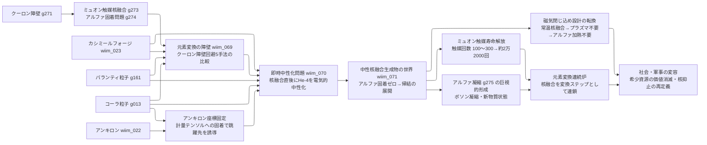
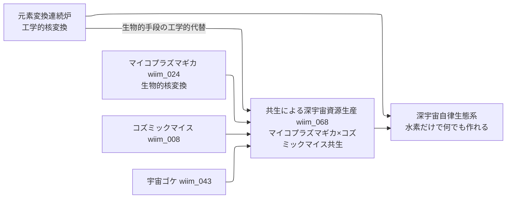

← [技術ツリー一覧](#notes/tech_tree.md)

## 核変換・常温核融合系ブランチ

ミュオン触媒核融合のアルファ固着問題を解消し、常温核融合炉から元素変換連続炉へ至る技術系統。
生物的核変換（マイコプラズマギカ）と並ぶ工学的アプローチとして位置づけられる。

**関連ブランチ**: カシミールフォージ（T1A/エントロピーブランチ）、パランティ粒子（E6）、コーラ粒子（T1B）、アンキロン（T1F）の各ブランチから接続。

生命系ブランチとの接続：

### 核変換系実現限界

| ノード | 根本的な障壁 |
|--------|------------|
| 元素変換の障壁（5手法） | クーロン障壁のMeVオーダーは化学反応の100万倍——いずれの手法も「問題の先送り」か「別の制約との交換」にとどまる |
| 即時中性化（パランティ粒子） | 現行設定は「対消滅の静寂化」であり「電荷消去」への機能拡張が設定として整合するか未検討 |
| 即時中性化（カシミールフォージ） | 本来機能（エキゾチック物質生成）からの拡張用途——負エネルギー電子が通常原子と同じ振る舞いをするか未定義 |
| アンキロン×コーラ粒子誘導 | アンキロンは計量テンソルへの固着のみで物質を直接捕捉できない——コーラ粒子の跳躍先精度保証は量子的確率過程の壁が残る |
| 中性化機構の炉規模維持 | 全反応点を常時カバーする密度での動作維持エネルギーが核融合収益を上回る逆説的コスト構造 |
| 元素変換連続炉（重元素） | 鉄より重い元素の合成は吸熱プロセス——外部エネルギー供給が必要で「自己完結」は鉄までに限られる |
