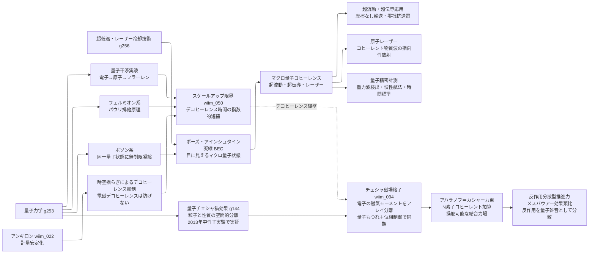

← [技術ツリー一覧](#notes/tech_tree.md)

## マクロ量子状態ブランチ

量子デコヒーレンスの限界と、ボソンによる回避経路を整理する技術系統。

### 実現限界

| ノード | 根本的な障壁 |
|--------|------------|
| スケールアップ限界 | デコヒーレンス時間は系のサイズに対して指数的に短縮——可視サイズでは原理的に不可能 |
| BEC | 「1個の粒子」ではなく多粒子の集団コヒーレンス——「巨大な1粒子」とは概念が異なる |
| アンキロンによる抑制 | 時空揺らぎ起源のデコヒーレンスのみ抑制——支配的な電磁デコヒーレンスには無効 |
| チェシャ磁場格子 | マクロスケールの量子コヒーレンス維持——室温ではコヒーレンス時間が10⁻¹³秒・推進力規模（10²³個のもつれ）との隔たりは桁外れ |
| アハラノフ＝カシャー力束 | アレイ全体の位相を揃える配置精度がナノメートル以下——量子制御の既知限界を大幅に超える |
| 反作用分散型推進力 | 運動量保存則は破れない——反作用の「量子雑音化」はN→∞が必要で、有限系では残留反作用が装置を内部から加熱し続ける |
