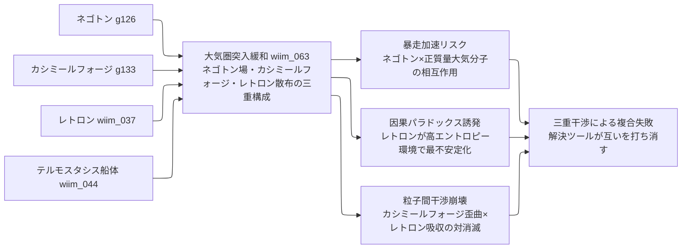

← [技術ツリー一覧](#notes/tech_tree.md)

## 宇宙輸送応用：複合粒子干渉ブランチ

架空粒子を複数組み合わせた実用技術の試みを整理する系統。各粒子が干渉し合う「複合失敗」のパターンが主題。

**関連ブランチ**: 実現限界で言及する「パランティレトロンとの対消滅リスク」はエントロピー・パランティ粒子系ブランチ（E6/E7ノード）で論じられる技術に依存する。レトロン（g163）の詳細もエントロピーブランチ E5 を参照。

### 実現限界

| ノード | 根本的な障壁 |
|--------|------------|
| 大気圏突入緩和（三粒子） | カシミールフォージ単独でカルダシェフII型文明相当のエネルギーを要する——突入のたびにダイソン球規模の消費 |
| 暴走加速リスク | 正質量大気分子とネゴトンの相互作用で暴走加速——大気という「高密度正質量環境」こそ最悪の運用条件 |
| 因果パラドックス誘発 | レトロンは高エントロピー環境で最も不安定——再突入の摩擦熱はレトロン制御に最悪の条件を作る |
| 粒子間干渉崩壊 | 空間歪曲とエントロピー勾配の急変が組み合わさり、パランティレトロンとの対消滅リスクが増大 |
