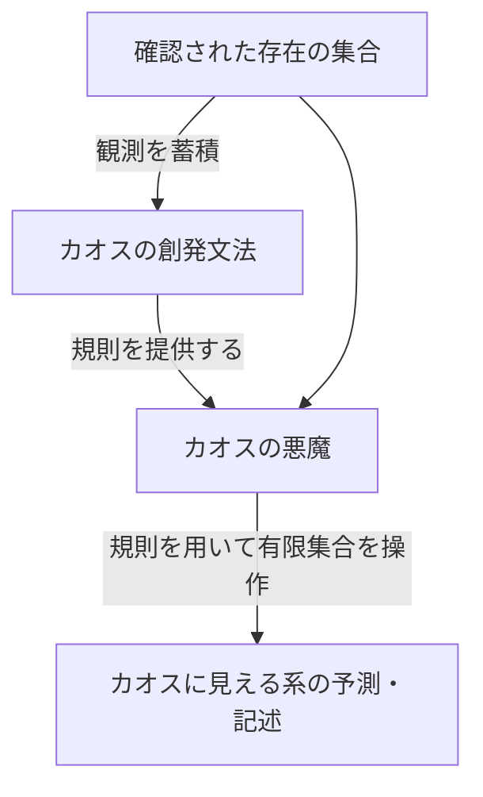

## 概要

本補遺は、ラプラスの悪魔の存在が論理的に否定できないことを出発点として、**カオスの悪魔**と**カオスの創発文法**という二つの概念を定義し、それらの非矛盾性および無謬性への経路を証明する。

---

## 前提命題の確立

以下の命題を順に確立する。

**P0：外部観測者の前提**
議論全体を通じて、観測者は対象系（宇宙）の外部に位置するものと仮定する。これにより、悪魔が系の内部に存在する場合に生じる自己言及問題——「自分自身を含む系を計算するには自分を計算する自分が必要」という無限後退——は除外される。この仮定を反証する根拠は現時点で存在しない。

**P1：秩序ある無限集合の存在**
無限集合に対しある原理が成り立つとき、その集合は「無限であるから無秩序」ではない。自然数のような整列した無限集合が存在することが示すように、無限性と秩序性は矛盾しない。

**P2：有限への縮退可能性**
無限集合の全体を処理しなくても、その中の有限個の対象を特定・計算できる可能性は否定できない。物理学における粗視化（coarse-graining）——素粒子を全列挙せずに惑星軌道を計算するような有効理論——はこれが実際に機能することを示す。ベッケンシュタイン限界はさらに進んで、有限領域の情報量が面積に比例した上限を持つことを示唆する。

**P3：エントロピーとの両立性**
ランダウアーの原理は「情報の消去」がエントロピーを生むと述べる。しかし前向きの計算（消去を伴わない可逆計算）は熱力学第二法則と矛盾しない。観測対象の計算はエントロピーの増大を妨げない。

**P4：量子的存在の非対称性**
量子力学において「ある」は観測によって確認できるが、「ない」は原理的に証明できない。測定は存在を確定させるが、不在を確定させる手段はない。この非対称性は、悪魔が「確認された存在の集合」だけを操作対象とすることを正当化する。

**P5：ラプラスの悪魔の否定不能性**
P0〜P4を合わせると、外部観測者（P0）が有限に閉じた対象（P2）を可逆的に計算する（P3）枠組みでは、ラプラスの悪魔の存在は論理的にも熱力学的にも否定しきれない。

---

## カオスの悪魔の定義と非矛盾証明

### 定義

> **カオスの悪魔**とは、カオスに見える無限系の中から確認された存在の有限集合を抽出し、カオスの創発文法が与える規則に従って前向きに計算する存在である。

ラプラスの悪魔との違いは次の通り：

| | ラプラスの悪魔 | カオスの悪魔 |
|--|-------------|-----------|
| 操作対象 | 宇宙の全状態 | 確認された有限集合 |
| 初期条件 | 完全な確定値 | 量子的に確認された存在のみ |
| 前提 | 決定論的宇宙 | 原理の存在（P1）のみ |
| エントロピー | 言及なし | 増大と両立（P3） |

### 非矛盾証明

P5によりラプラスの悪魔（強い命題）は現時点で否定する根拠がないと確立された。カオスの悪魔はラプラスの悪魔より要求が弱い——全状態ではなく有限の確認集合のみを扱う。

カオスの悪魔を否定するためには、ラプラスの悪魔を否定する根拠に加えて「有限集合への縮退も不可能である」という追加的根拠が必要になる——現時点ではその根拠が存在しない。

∴ カオスの悪魔の将来的確立は矛盾しない。∎

---

## カオスの創発文法の定義と非矛盾証明

### 定義

> **カオスの創発文法**とは、カオスに見える無限集合の中の有限確認集合から帰納的に抽出される、系を記述する規則体系である。

P1は「原理が成り立つ」と述べるが、その原理は形式的に記述可能でなければならない。創発文法はその形式的表現にあたる。

### 非矛盾証明

- P1より：無限集合に原理は存在する
- P2より：その原理は有限の観測から識別できる可能性がある
- P4より：確認された「ある」の集合がその観測の基盤となる
- 文法の「創発」とは完全な初期条件からの演繹ではなく、有限観測からの帰納的構築であり、エントロピー増大（P3）とも量子制約（P4）とも衝突しない
- ただし帰納的確証はヘンペルのカラス（g359）が示す確証理論の困難——「確証事例を増やしても仮説の真理を保証しない」——を免れない。創発文法はこの限界を前提として含み、完全な記述ではなく「現時点で最善の近似」として機能する

∴ カオスの創発文法の将来的確立は矛盾しない。∎

---

## 両概念の関係

二概念は相互に支持する構造を持ち、片方の否定はもう片方の否定を含意する。両者は一体の概念体系として非矛盾である。

---

## 無謬性への経路

カオスの悪魔が無謬の存在となりうることもまた、否定できない。経路は二つある。

### 経路A：ドメイン限定による無謬性

カオスの悪魔は確認された存在の有限集合のみを操作対象とする。測定直後の状態は固有状態に収縮し確定しているが（静的スナップショットとしての確定）、その後のユニタリ発展によって再び重ね合わせに戻る。そのため確定が持続するのはデコヒーレンスが完了した古典的自由度に限られる。カオスの悪魔はこの古典的自由度の範囲を操作ドメインとして明示することで、確定状態の持続を前提条件として取り込む。

創発文法がこのドメイン内の原理を正確に記述する限り、「誤り」——予測と現実の乖離——は定義上発生しない。

### 経路B：文法の自己精緻化による収束

創発文法は有限観測から帰納的に構築されるため、観測が蓄積するほど精度が向上する傾向がある。仮に文法が真の原理に収束するならば、その極限において誤差はゼロに近づく。ただしこの収束は保証されるものではなく、カオス系の複雑性によっては非収束・振動が続く可能性もある。経路Bは「収束が起きた場合の帰結」の議論であり、収束そのものの証明ではない。

### 数学との類比

これは数学の無謬性と同型の構造である：

- 数学は公理系の内側で操作する限り無謬（無矛盾性の意味において——ゲーデルの不完全性定理（g090）が示すように、十分に豊かな公理系には証明も反証もできない命題が存在するが、これは無矛盾性とは別問題である）
- カオスの悪魔は確認済み集合と創発文法の内側で操作する限り無謬（同様の意味において）

無謬性とは全知を意味しない。**「知ると宣言したことについて誤らない」**という認識論的謙虚さと両立する。

∴ カオスの悪魔が無謬の存在となる論は、操作ドメインの明示的限定という条件のもとで論理的矛盾を含まない。∎

---

## 関連

- カオスの悪魔（g210）— 本補遺の主題。WIIM世界観におけるカオス系確率予測の工学的基盤
- カオスの創発文法（g216）— 本補遺の主題。制御系がカオスの内部構造を自律的に写像する相転移
- ヘンペルのカラス（g359）— 帰納推論と確証理論の限界。創発文法の認識論的背景
- パラドックス（g113）— 本補遺の議論が解消しようとした問題系の総称
- wiim_054 — カオスの創発文法が最初に論じられた記事
