工学・物理学で重要な幾何学的構造の一覧。生物が同形態を独自に獲得している場合は「生物例」欄に記載する。

---

## 回転体・軸対称曲面

| 構造 | 工学的用途 | 生物例 |
|------|-----------|--------|
| **トロイダル**（Toroidal） | トカマク炉・トロイダルコイル・MRI超伝導磁石 | 赤血球（双凹円盤形、トーラス近似）・一部の配偶子 |
| **球面**（Spherical） | 圧力容器・燃料タンク・球面レンズ | 細胞・卵・球菌・一部のウイルス外殻 |
| **楕円体**（Ellipsoid） | 潜水艦船体・人工衛星本体・燃料タンク端部 | 細胞核・花粉・鳥卵 |
| **放物面**（Paraboloid） | パラボラアンテナ・望遠鏡主鏡・太陽炉 | 耳介（音の集音）・一部の甲殻類の眼 |
| **双曲面**（Hyperboloid） | 冷却塔（原子力・火力）・ハイパーボロイドタワー建築 | — |
| **カテノイド**（Catenoid） | 石鹸膜型最小曲面構造物・薄膜デバイス | 細胞膜融合中間体（膜融合ストーク構造） |
| **オブレート／プロレート回転体** | ロケット弾頭・人工衛星姿勢安定設計 | 扁平花粉（オブレート型）・細長花粉（プロレート型） |

---

## コーン・テーパー系

| 構造 | 工学的用途 | 生物例 |
|------|-----------|--------|
| **単円錐**（Cone） | ロケットノーズコーン・スピーカー振動板・集音器 | 犬歯・刺針・棘皮動物の棘 |
| **双円錐**（Double Cone / Biconical） | バイコニカルアンテナ（広帯域EMC測定）・レーダー反射校正体 | 魚類・鳥類の網膜双円錐視細胞（二色光受容） |
| **切頭円錐**（Frustum） | バケツ・コップ・ロケット段間部・フェアリング | 台形口の巻貝類 |
| **ラバルノズル**（De Laval Nozzle） | ロケットエンジン・蒸気タービン超音速ノズル | 細気管支の収縮部（形状類似・流体効率） |
| **ウォルターミラー**（Wolter Mirror） | X線望遠鏡（チャンドラ・XMM-Newton）の斜入射光学系 | — |

---

## フレネル・ゾーン・レンズ系

| 構造 | 工学的用途 | 生物例 |
|------|-----------|--------|
| **フレネルレンズ**（Fresnel Lens） | 灯台・LCD拡散板・VRヘッドセット・太陽光集光炉 | 昆虫複眼の段階的集光構造（類似原理） |
| **フレネルゾーンプレート**（Zone Plate） | X線・中性子線集光・回折光学素子 | — |
| **ルーネベルクレンズ**（Luneburg Lens） | レーダー反射体・広角衛星通信アンテナ | クモ・一部甲殻類の眼の反射層（類似屈折率分布） |
| **メタレンズ**（Metalens） | 超薄型カメラ・AR/MR光学系 | — |
| **マイクロレンズアレイ** | CMOSイメージセンサー・プロジェクター均一照明 | 昆虫の複眼（個眼レンズの配列） |

---

## らせん・ヘリックス系

| 構造 | 工学的用途 | 生物例 |
|------|-----------|--------|
| **単ヘリックス**（Helix） | ヘリカルアンテナ・圧縮バネ・スクリューポンプ | α-ヘリックス（タンパク質二次構造）・巻き貝・植物の蔓 |
| **二重ヘリックス**（Double Helix） | 二重らせん階段・ケーブルより合わせ・熱交換チューブ | DNA・コラーゲン（三重らせん） |
| **対数螺旋**（Logarithmic Spiral） | 遠心ファン・インペラ・スクロールコンプレッサー | オウムガイ・ひまわり種配列・台風の渦 |
| **アルキメデス螺旋**（Archimedes Spiral） | レコード盤溝・スパイラル熱交換器・渦巻きポンプ | クモの巣（捕食糸の渦巻き部分） |
| **クロソイド／コルヌ螺旋**（Clothoid） | 道路・鉄道の緩和曲線（急カーブとの接続） | — |

---

## 多面体・格子・空間充填

| 構造 | 工学的用途 | 生物例 |
|------|-----------|--------|
| **ジオデシックドーム**（Geodesic Dome） | ドーム建築・レーダードーム・宇宙居住モジュール設計 | ウイルスカプシド（正二十面体対称性）・放散虫の外骨格 |
| **ハニカム**（Honeycomb） | 航空機サンドイッチパネル・軽量構造材・吸音材 | ミツバチの巣・骨海綿質・網膜光受容体の配列 |
| **テンセグリティ**（Tensegrity） | 折り畳みアンテナ・柔軟展開構造物・彫刻建築 | 細胞骨格（アクチン＋微小管＋中間径フィラメント）・骨と靭帯の系 |
| **ウェアー＝フェラン構造**（Weaire-Phelan） | 泡の最小面積充填（北京五輪水立方の外装） | 多細胞生物の細胞充填・石鹸泡の自然集合 |
| **ケルビン構造**（Kelvin Structure） | 等体積空間充填の歴史的モデル（切頭八面体） | 細胞充填の近似モデル |
| **スペースフレーム**（Space Frame） | 空港・体育館・工場の大スパン屋根 | — |

---

## 最小曲面

| 構造 | 工学的用途 | 生物例 |
|------|-----------|--------|
| **ジャイロイド**（Gyroid） | 3Dプリント軽量多孔質部材・フォトニック結晶・分離膜 | モルフォ蝶・宝石甲虫の翅の構造色（ナノスケールジャイロイド）・一部の細胞内膜系 |
| **シュワルツP面**（Schwartz P Surface） | 骨代替スキャフォールド・バイオリアクター充填材 | 一部の生体膜・細胞内小器官の膜折り畳み |
| **シュルク面**（Scherk Surface） | 建築曲面デザイン・位相的フィルター構造 | — |

---

## フラクタル・自己相似

| 構造 | 工学的用途 | 生物例 |
|------|-----------|--------|
| **フラクタル分岐**（Fractal Branching） | フラクタルアンテナ・超小型広帯域アンテナ・熱交換器 | 気管支（23段階の二分岐）・血管系・神経突起・シダ・ロマネスコブロッコリー |
| **コッホ曲線型**（Koch Curve） | フラクタルアンテナの境界パターン・電極表面積拡大 | 海岸線・一部の葉脈・雪の結晶 |
| **シエルピンスキー型**（Sierpinski） | フラクタルパッチアンテナ・多バンド対応設計 | — |

---

## 断面最適化・特殊曲線

| 構造 | 工学的用途 | 生物例 |
|------|-----------|--------|
| **カテナリーアーチ**（Catenary Arch） | 橋梁・アーチ建築（サグラダファミリア）・ケーブル吊り構造 | クモの巣（重力下での糸の垂れ曲線） |
| **放物線アーチ**（Parabolic Arch） | 橋梁・トンネル断面・放物線反射鏡 | — |
| **サイクロイド**（Cycloid） | 歯車歯形・最速降下曲線（ブラキストクロン） | — |
| **ルーローの三角形**（Reuleaux Triangle） | ヴァンケルエンジン・一定幅ドリルビット（正方形穴） | — |
| **翼型断面**（Airfoil / NACA Profile） | 航空機翼・プロペラ・風力タービンブレード・水中翼 | 鳥の翼・サメの胸ビレ・イルカ・マンタ |
| **デルタ翼／後退翼**（Delta / Swept Wing） | 超音速機・戦闘機・スペースシャトル | タカが急降下するときの翼形・イワシの群れの集団形状 |

---

## 複合・モノコック系

| 構造 | 工学的用途 | 生物例 |
|------|-----------|--------|
| **モノコック**（Monocoque） | 航空機胴体・レーシングカーボディ・缶 | 甲殻類・貝殻（外骨格の一体応力外皮構造） |
| **サンドイッチパネル** | 航空宇宙パネル・断熱建材 | 骨（緻密骨＋海綿骨＋骨髄の三層） |
| **チューブインチューブ**（Tube-in-Tube） | 超高層ビル（旧世界貿易センターなど） | 長骨の髄腔構造（外皮管＋中空髄腔） |

---

> 合計：約38構造。生物例欄が埋まっている構造は、進化的収斂の観点からコズミックマイスの形態論考察（別記事予定）にも参照する。

---

## 図版一覧

<table>
<tr><th colspan="3" align="left">回転体・軸対称曲面</th></tr>
<tr>
  <td align="center">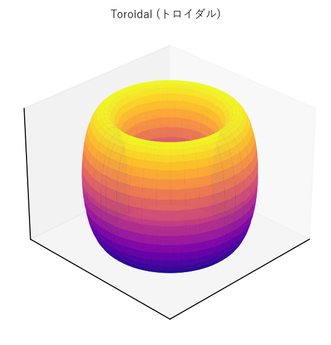 トロイダル</td>
  <td align="center">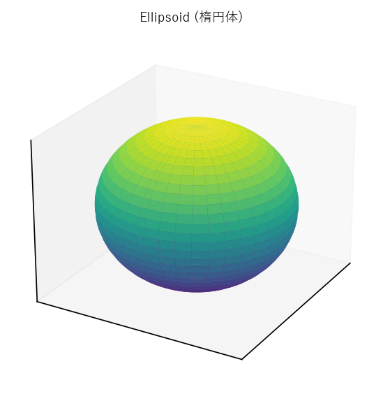 楕円体</td>
  <td align="center">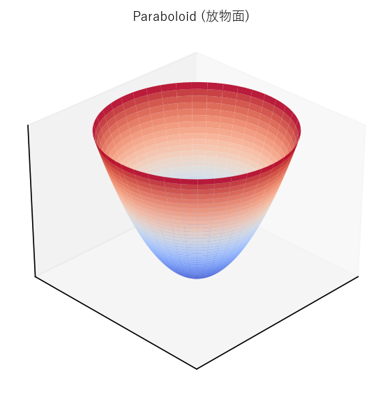 放物面</td>
</tr>
<tr>
  <td align="center">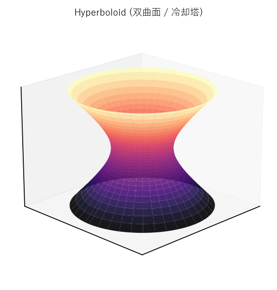 双曲面</td>
  <td align="center">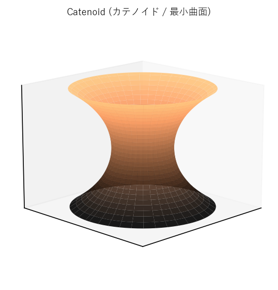 カテノイド</td>
  <td></td>
</tr>
<tr><th colspan="3" align="left">コーン系</th></tr>
<tr>
  <td align="center">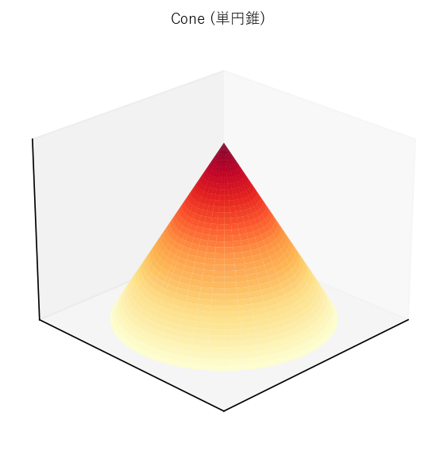 単円錐</td>
  <td align="center">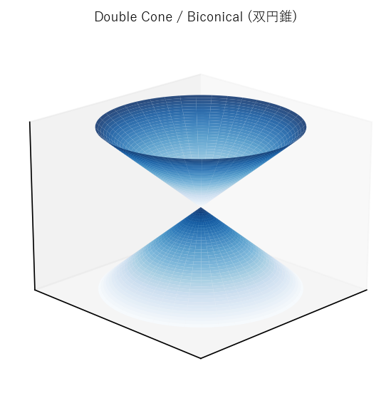 双円錐</td>
  <td align="center">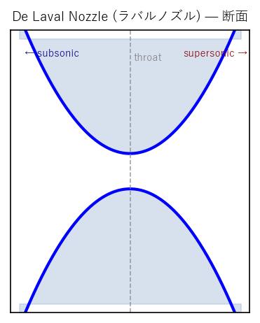 ラバルノズル</td>
</tr>
<tr><th colspan="3" align="left">フレネル・レンズ系</th></tr>
<tr>
  <td align="center">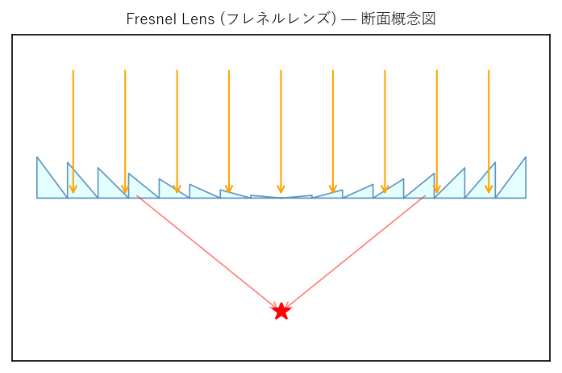 フレネルレンズ</td>
  <td align="center">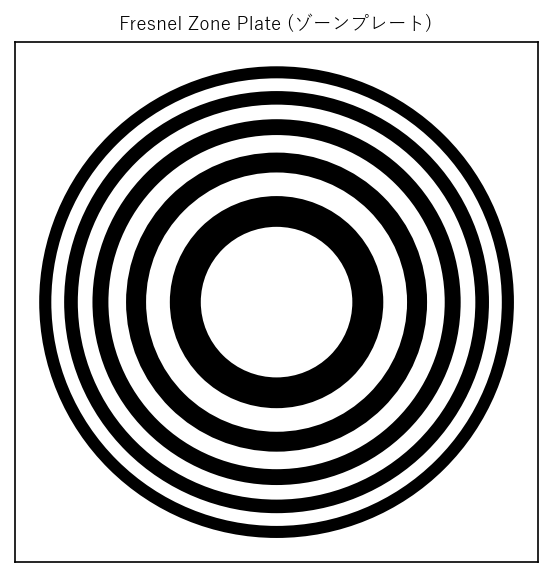 ゾーンプレート</td>
  <td align="center">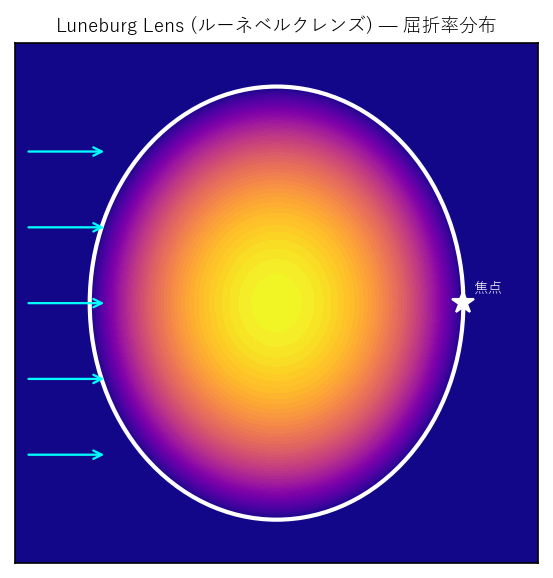 ルーネベルクレンズ</td>
</tr>
<tr><th colspan="3" align="left">らせん系</th></tr>
<tr>
  <td align="center">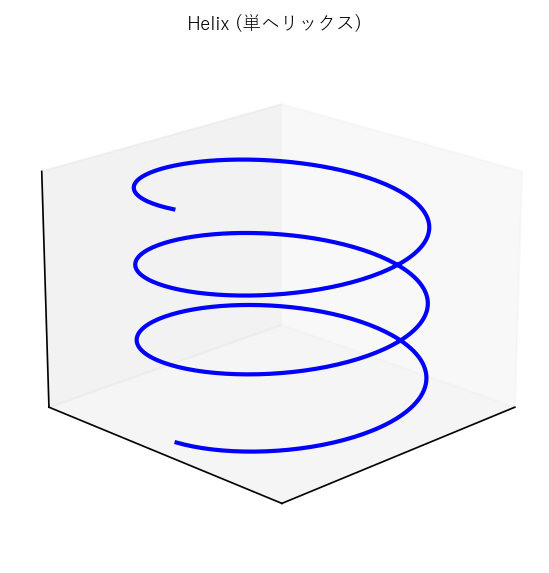 単ヘリックス</td>
  <td align="center">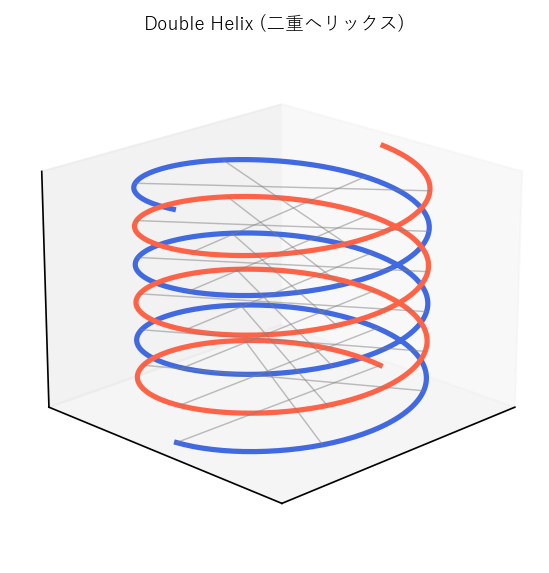 二重ヘリックス</td>
  <td align="center">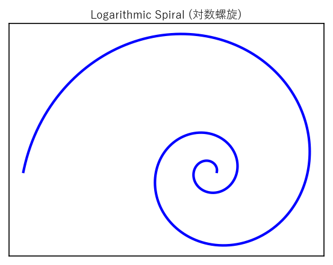 対数螺旋</td>
</tr>
<tr>
  <td align="center">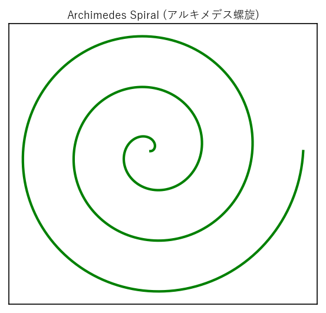 アルキメデス螺旋</td>
  <td align="center">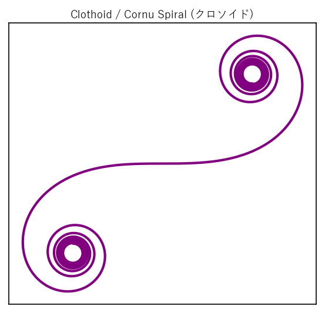 クロソイド</td>
  <td></td>
</tr>
<tr><th colspan="3" align="left">最小曲面</th></tr>
<tr>
  <td align="center">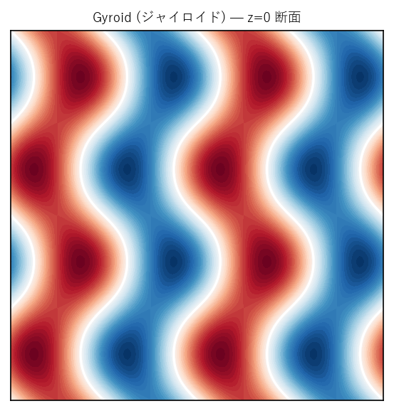 ジャイロイド</td>
  <td align="center">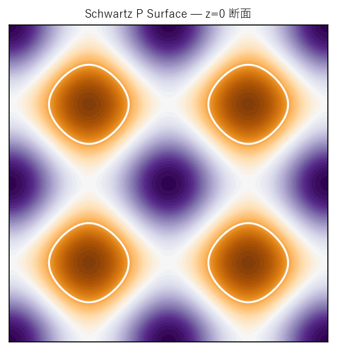 シュワルツP面</td>
  <td></td>
</tr>
<tr><th colspan="3" align="left">フラクタル</th></tr>
<tr>
  <td align="center">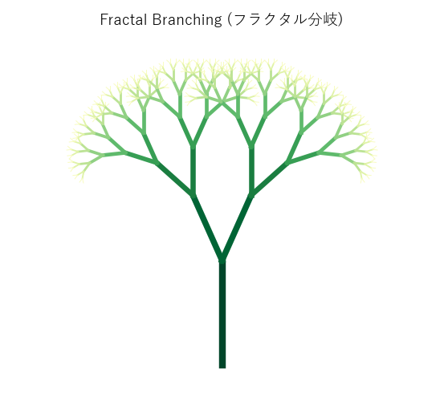 フラクタル分岐</td>
  <td align="center">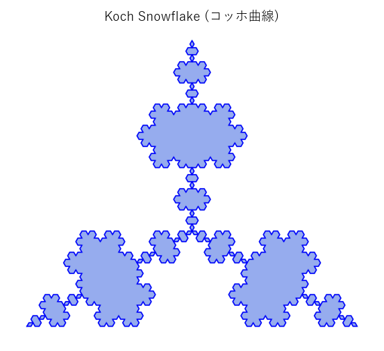 コッホ曲線</td>
  <td></td>
</tr>
<tr><th colspan="3" align="left">断面最適化・特殊曲線</th></tr>
<tr>
  <td align="center">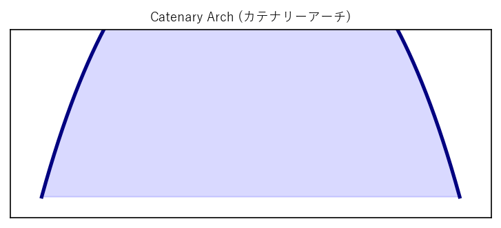 カテナリーアーチ</td>
  <td align="center">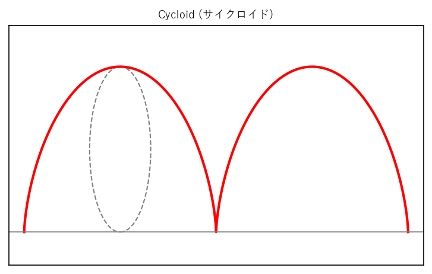 サイクロイド</td>
  <td align="center">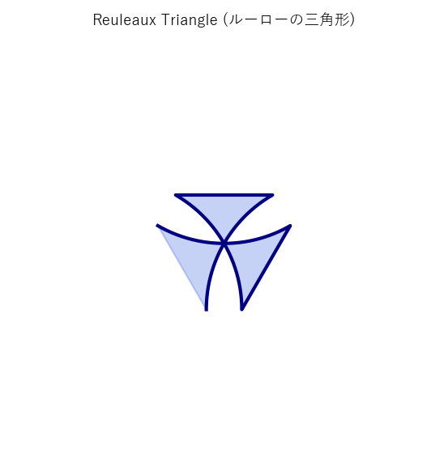 ルーローの三角形</td>
</tr>
<tr><th colspan="3" align="left">格子・多面体</th></tr>
<tr>
  <td align="center">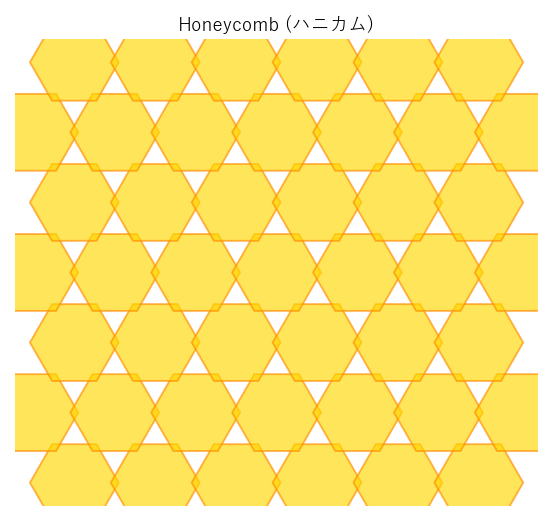 ハニカム</td>
  <td align="center">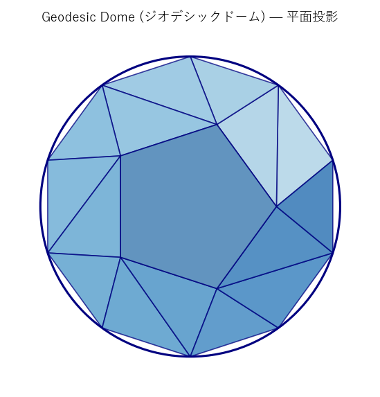 ジオデシックドーム</td>
  <td align="center">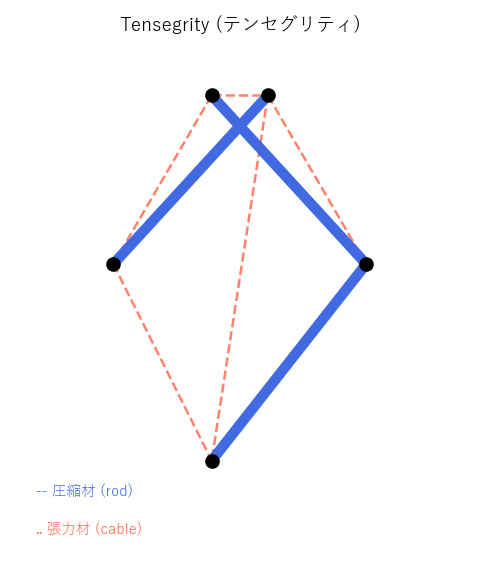 テンセグリティ</td>
</tr>
<tr><th colspan="3" align="left">翼型</th></tr>
<tr>
  <td align="center">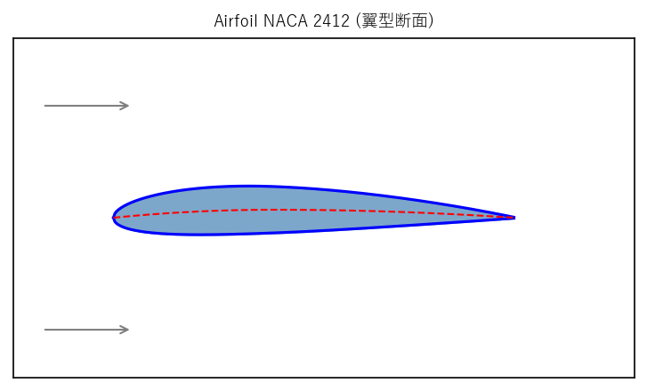 翼型断面（NACA 2412）</td>
  <td></td>
  <td></td>
</tr>
</table>

---

## 関連用語

用語集に登録済みの構造（生物関連が深いものを優先）：

- [ジャイロイド](../../glossary/terms/g330.md)（g330）— 蝶の翅の構造色・細胞内膜
- [テンセグリティ](../../glossary/terms/g331.md)（g331）— 細胞骨格との対応
- [ジオデシック構造](../../glossary/terms/g332.md)（g332）— ウイルスカプシドとの対応
- [フラクタル分岐](../../glossary/terms/g333.md)（g333）— 気管支・血管系との対応
- [ルーネベルクレンズ](../../glossary/terms/g334.md)（g334）— 節足動物の眼との類似
- [カテノイド](../../glossary/terms/g335.md)（g335）— 細胞膜融合の中間体
