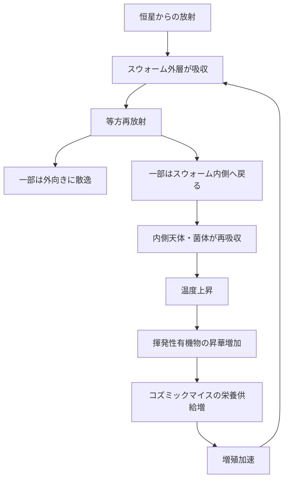

← [補遺ノート一覧](README.md)

## 概要

コズミックマイス（g475 → マイススウォーム）が恒星系のスノーライン内側で臨界密度を超えたとき、熱収支が逆転して局所的な温度上昇が起きるか、という問いへの考察。

スノーラインとは揮発性物質（水・アンモニアなど）が凝固できなくなる境界（太陽系では約2.7 AU）。この内側は恒星放射フラックスが高く、コズミックマイスにとって増殖条件が整いやすい。

---

## 熱収支逆転の機序

通常の宇宙空間では天体が吸収した熱は等方放射（全方向へ均等に放出）で散逸する。マイススウォームが薄い場合も同様で、個々の菌体が吸収→放射を繰り返すだけで系全体の熱収支は変わらない。

臨界密度を超えると **自己遮蔽** が生じる。

スウォームが「厚い殻」として機能すると、外向きに逃げるはずの熱放射がスウォーム外層に捕捉され、内側へ戻り熱として集中する。これが宇宙版温室効果の核心である。

---

## 閾値の存在と境界条件

| 密度状態 | 自己遮蔽 | 熱収支 |
|---------|---------|-------|
| 臨界密度未満 | なし | 通常の等方散逸 |
| 臨界密度付近 | 部分的 | 戻り熱がわずかに増加 |
| 臨界密度超過 | あり | 逆転——温度上昇フィードバック開始 |

**スノーライン外では閾値に達しにくい理由**：
- 恒星放射フラックスが低い → 増殖速度が遅い
- 揮発物が固体（氷）のままで有機栄養の供給が少ない

このため、マイススウォームの自然な発生域はスノーライン以内に限定される傾向がある。

---

## 自己抑制要因

暴走を制限する要因も存在する。

- **外側での遮光**：スウォームが厚くなると外層が恒星光を遮断し、内側が逆に冷える
- **栄養枯渇**：揮発性有機物が昇華・消費され尽くすと増殖が停止
- **熱的死**：温度上昇が一定を超えると菌類自体が変性・死滅

フィードバックは無制限には続かず、スウォームの厚みと温度が新たな平衡点に落ち着くと予測される。ただし、その平衡点がスノーライン内天体の気候にとって破局的である可能性がある。

---

## 関連

- コズミックマイス（g134）— 菌糸知性体の基本定義
- マイススウォーム（g475）— 本現象の用語定義
