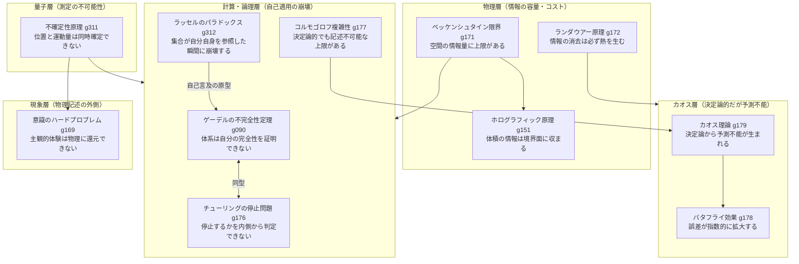
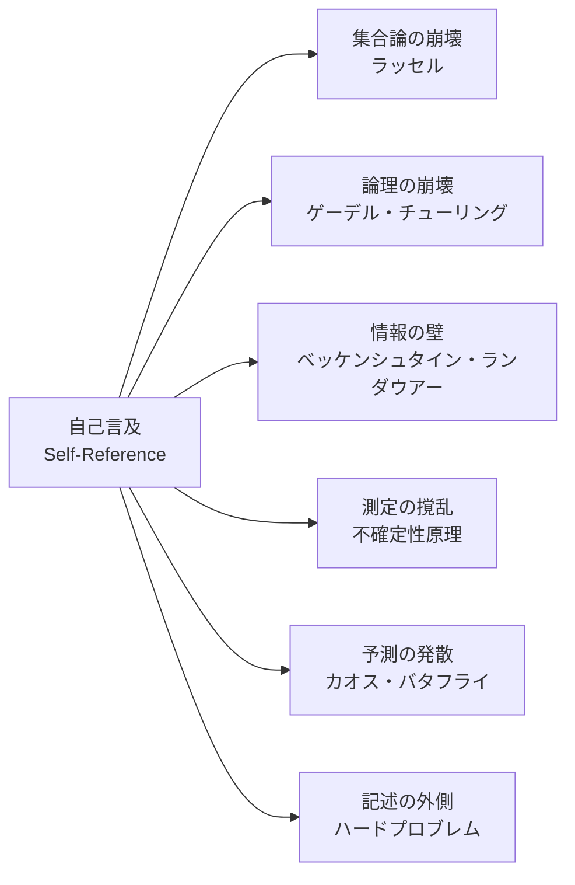

# 認識可能性の地平——自己言及が引き起こす原理的限界の地図

> 関連用語: [認識可能性の地平 g310](../../glossary/terms/g310.md)

---

## 概観

「記述する系が自分自身を完全に記述できない」という構造は、物理・計算・論理・現象の4つの層で独立に発見されている。それぞれ異なる言語で語られてきたが、根底には同じ「自己言及の崩壊」がある。

この補遺は、WIIMの思考実験群と関連する限界概念を一枚の地図として整理することを目的とする。

---

## 層別マップ

---

## 悪魔の系譜——思考実験が限界を照らす

歴史上、各層の限界を「超えようとする存在」として悪魔が召喚されてきた。悪魔は問いの鋭さゆえに登場し、そして封じられることで限界の輪郭を明確にした。

| 悪魔 | 何を試みたか | 何に封じられたか |
|---|---|---|
| **ラプラスの悪魔** g204 | 全粒子の位置・運動量を知り未来を完全予測する | 不確定性原理（量子層）/ バタフライ効果（カオス層）/ ベッケンシュタイン限界（物理層） |
| **マクスウェルの悪魔** g059 | 分子を選別しエントロピーを減らす | ランダウアー原理——観測記録の消去コストが仕事量を上回る |
| **カオスの悪魔** g210（WIIM） | カオス系の粒子を完全に制御する | 完全制御を断念し「確率分布の精密な予測」として再定義することで封印を回避した |

カオスの悪魔だけが封印を「再定義」によって乗り越えた点は示唆的だ。限界は問いの立て方に依存する。

---

## 共通構造：自己言及

6つの限界はいずれも「系が自分自身を対象とする」瞬間に崩壊する。

- ラッセル：「自分自身を含まない集合の集合」を定義しようとする
- ゲーデル：「この命題は証明できない」という命題を体系内に構築する
- チューリング：「自分自身を停止するか判定するプログラム」を構成しようとする
- ベッケンシュタイン：宇宙内の悪魔が宇宙全体の情報を格納しようとする
- 不確定性原理：測定器が測定対象に干渉することで測定そのものを乱す
- ハードプロブレム：物理を記述する意識が、自分の意識を物理に還元しようとする

「漏れ」は欠陥ではなく、構造の必然だ。系が十分に豊かであれば、自己言及は常に何かを外側へ押し出す。その「外側」こそが認識可能性の地平の向こう側にある。

---

## WIIMとの接続

これらの限界はWIIMの思考実験群の基盤として繰り返し登場する。

| 記事 | 関連する限界 |
|---|---|
| wiim_040・wiim_041 — 決定論と自由意志 | ラプラスの悪魔、ベッケンシュタイン限界、バタフライ効果 |
| wiim_042 — 意識のコピー | ハードプロブレム、量子測定 |
| wiim_047 — 宇宙外の知性 | ベッケンシュタイン限界（宇宙の外から内を記述する） |
| wiim_052 — マクスウェルの悪魔の工学応用 | ランダウアー原理、カオスの悪魔 |
| wiim_020 — アカシックレコード | ホログラフィック原理、情報の物理的実体性 |

---

*登録: 2026-04-18*
