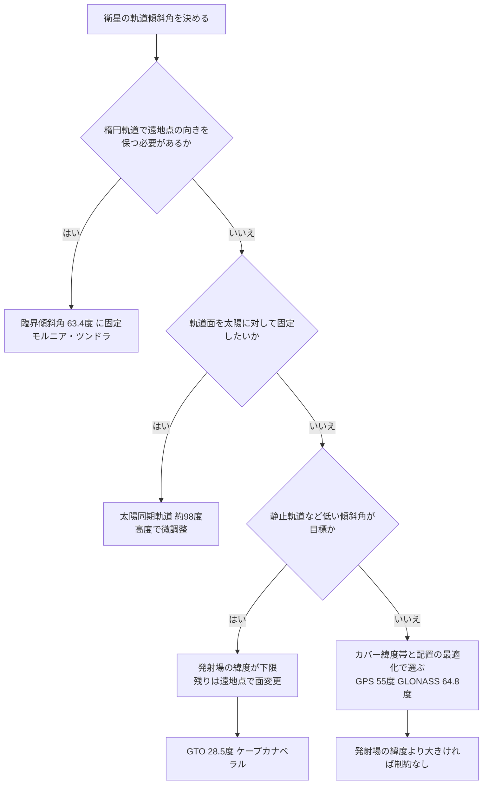

# 軌道傾斜角はどう決まるか——物理・発射場・運用の三つの制約

人工衛星の軌道傾斜角（赤道面に対する軌道面の角度）は、一見すると半端な数字が並んでいる。GPSは55°、モルニア軌道は63.4°、GTO（静止トランスファ軌道）は28.5°、ISSは51.6°、太陽同期軌道は約98°。これらは任意に選ばれた値ではなく、**どの制約に縛られているか**によって決まっていると考えられる。

名前付き軌道そのものの解説は [人工衛星の特殊軌道](satellite_orbits.md) を参照。本ノートは「なぜその角度なのか」に絞って整理する。

---

## 三つの制約

| 制約の種類 | 角度を決めるもの | 角度の自由度 | 代表例 |
|-----------|----------------|-------------|--------|
| **物理（摂動）** | 地球の扁平率による軌道の回転をゼロにする／特定の速度に合わせる | ほぼなし（一点に決まる） | モルニア 63.4°、太陽同期 約98° |
| **発射場の緯度** | 打ち上げ地点の緯度より小さい傾斜角には直接入れない | 下限が決まる | GTO 28.5°、ISS 51.6° |
| **運用・幾何** | カバーしたい緯度帯、衛星配置の最適化、打ち上げ手段 | 比較的大きい | GPS 55°、GLONASS 64.8°、Galileo 56° |

---

## 制約①：物理——地球の扁平率（J2項）

地球は赤道方向に膨らんでおり、この膨らみ（J2項と呼ばれる）が衛星の軌道を少しずつ回転させる。回転には二種類ある。

| 回転の種類 | 何が回るか | 傾斜角との関係 | ゼロになる角度 |
|-----------|-----------|---------------|---------------|
| 近地点の回転（近地点歳差） | 楕円軌道の向き（遠地点がどちらを向くか） | $5\cos^2 i - 1$ に比例 | **63.4°**／116.6°（臨界傾斜角） |
| 軌道面の回転（交点歳差） | 軌道面そのもの（宇宙空間に対する向き） | $\cos i$ に比例 | 90°（極軌道） |

- **モルニア軌道（63.4°）**：細長い楕円の遠地点を北半球上空に固定したい。近地点の回転をゼロにする角度は臨界傾斜角しかないため、角度は物理的に一点に決まる。同じ理由で、周期24時間の **ツンドラ軌道** も63.4°をとる。
- **太陽同期軌道（約98°）**：逆に、軌道面の回転を**地球の公転速度（1日約0.986°）にぴったり合わせる**ことを狙う。必要な傾斜角は高度によって少し変わり、600 km で約97.8°、800 km で約98.6°となる。
- **極軌道（90°）**：軌道面の回転がゼロになり、宇宙空間に対して軌道面が固定される。

ここで重要なのは、**近地点の回転を気にするのは楕円軌道だけ**という点である。円軌道には「向き」がないため、臨界傾斜角に合わせる必要がない。

---

## 制約②：発射場の緯度——GTOが28.5°である理由

軌道面は必ず地球の中心を通る。打ち上げの瞬間、ロケットは発射場の真上にいるので、軌道面は「地球の中心」と「発射場」の両方を含まなければならない。

このため、**発射場の緯度より小さい傾斜角には直接入れない**。真東に打ち上げたときに傾斜角は最小（＝発射場の緯度）となり、しかも地球の自転速度（赤道で約0.46 km/s）を最も効率よく利用できる。ケープカナベラル（北緯約28.5°）から打ち上げるGTOが28.5°なのはこのためである。

### 静止軌道までの最後の一手

静止軌道（GEO）は傾斜角0°なので、どこかで軌道面を傾け直す必要がある。軌道面の変更に必要なΔv（速度変化量）は**そのときの速度にほぼ比例する**ため、速度が最も遅いGTOの遠地点（約1.6 km/s）で、円軌道化の噴射と同時に行うのが最も安い。

| 発射場 | 緯度 | 典型的なGTO傾斜角 | GTOからGEOへの追加Δv（目安） |
|-------|------|-----------------|---------------------------|
| クールー（仏領ギアナ） | 北緯 約5° | 約6° | 約1.5 km/s |
| ケープカナベラル | 北緯 約28.5° | 約27〜28.5° | 約1.8 km/s |
| バイコヌール | 北緯 約46° | 約51.6°（射場安全上の方位制約） | 約2 km/s 超 |

赤道に近い発射場ほど静止衛星の打ち上げに有利であり、アリアンロケットのクールーが重宝されてきた理由と考えられる。赤道上の洋上から打ち上げたシーローンチは0°のGTOに直接入れることができた。高緯度の発射場では、遠地点を静止軌道より高くとる **スーパーシンクロナスGTO** を使い、さらに遅い速度のところで面を変えてΔvを節約する工夫もある。

### ISSの51.6°

ISSの51.6°も発射場の制約である。バイコヌール（北緯約46°）から打ち上げるソユーズは、ブースターの落下域が中国領や人口密集地にかからないよう打ち上げ方位が制限されており、その結果として51.6°が最小の実用的な傾斜角となる。ロシアの補給船・有人船が到達できる角度に、国際共同のステーションの方が合わせた形である。

---

## 制約③：運用・幾何——GPSの55°

GPS衛星はほぼ円軌道（離心率0.01以下）であるため、制約①の臨界傾斜角に縛られない。角度は主に**どの緯度帯で、何機の衛星が、どれだけ良い配置で見えるか**という幾何学的な最適化で選ばれていると考えられる。

| 測位システム | 傾斜角 | 軌道面の数 | 傾向 |
|-------------|-------|-----------|------|
| GPS（米） | 55° | 6 | 人口の多い中緯度を重視 |
| Galileo（欧） | 56° | 3 | GPSよりわずかに高緯度寄り |
| BeiDou MEO（中） | 55° | 3 | GPSに近い設計 |
| GLONASS（露） | 64.8° | 3 | 国土の多くが高緯度にあるロシアを重視 |

興味深いことに、GPSの初期の試験衛星（Block I）は**63°**で打ち上げられていた。運用機（Block II以降）が55°に変わった背景には、配置の最適化に加え、当時はスペースシャトルによる打ち上げを想定していたことがあったとされる。つまりGPSとモルニアの「わずかな角度のずれ」は、物理的な必然に縛られた軌道と、運用の都合で角度を選べる軌道の違いを表していると言える。

### 周期は同じ「半恒星日」

GPSもモルニアも周期は約11時間58分（半恒星日）で、地上軌跡（衛星の真下の点が描く線）が毎日ほぼ同じ場所を通る。角度の決め方は違っても、「毎日同じ空を通る」という周期側の設計思想は共通している。なおGPSでは摂動の影響により、同じ配置が見える時刻は毎日約4分ずつ早まる。

---

## 判断の流れ

---

## まとめ

| 軌道 | 傾斜角 | 主な制約 | 一言で |
|------|-------|---------|-------|
| 静止軌道（GEO） | 0° | 目的そのもの | 赤道上で止まって見えるため |
| GTO（米国打ち上げ） | 約28.5° | 発射場の緯度 | ケープカナベラルの緯度 |
| GPS | 55° | 運用・幾何 | 中緯度を重視した配置最適化 |
| ISS | 51.6° | 発射場の緯度＋射場の安全 | バイコヌールから届く最小角 |
| モルニア／ツンドラ | 63.4° | 物理（J2） | 遠地点の向きを固定する臨界傾斜角 |
| GLONASS | 64.8° | 運用・幾何 | 高緯度の国土を重視 |
| 極軌道 | 90° | 目的そのもの | 全緯度を通過、軌道面が回らない |
| 太陽同期軌道 | 約97〜99° | 物理（J2） | 軌道面の回転を地球の公転に同期 |

---

## 関連用語・ノート

- [人工衛星の特殊軌道](satellite_orbits.md)——太陽同期・モルニア・ハロー軌道と軌道選択の論理
- [衛星軌道高度・周期・可視時間リファレンス](satellite_orbit_visibility.md)
- [天体質量の測定手法と静止軌道パラメータの導出](kepler_geostationary_derivation.md)
- [軌道傾斜角](../../glossary/terms/g545.md)（g545）
- [臨界傾斜角](../../glossary/terms/g546.md)（g546）
- [静止トランスファ軌道](../../glossary/terms/g547.md)（g547）
- [地球周回軌道](../../glossary/terms/g077.md)（g077）
- [モルニア軌道](../../glossary/terms/g357.md)（g357）
- [太陽同期軌道](../../glossary/terms/g358.md)（g358）
- [墓場軌道](../../glossary/terms/g336.md)（g336）
