## 概要

WhatIfImpossibleの思考実験記事を「前提技術→派生技術」の関係で整理した技術ツリー。各ノードは記事IDに対応する。

---

## 技術ツリー

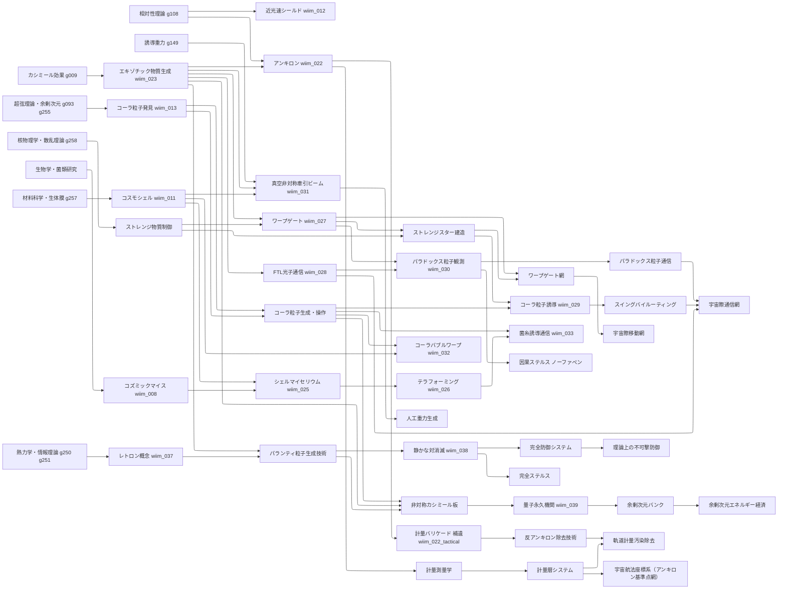

---

## 生命系ブランチ

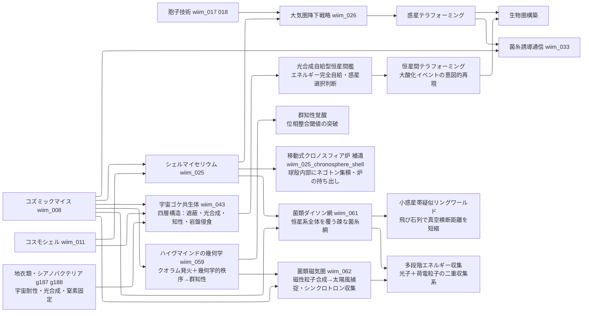

### 生命系実現限界

| ノード | 根本的な障壁 |
|--------|------------|
| 宇宙ゴケ共生体 | 四者共生の最弱リンク問題——最も耐性の弱いパートナーが死ねば全体が崩壊 |
| 光合成自給型恒星間艦 | 恒星間空間の光量不足によるエネルギー赤字圏・知性の休眠 |
| 恒星間テラフォーミング | テラフォーミング完了まで数百万年——確認できる文明が存在するか不明 |
| ハイヴマインドの幾何学 | ランダム菌糸では位相整合不可・幾何学的秩序の自己組織化には強い選択圧と長期進化が必要 |
| 移動式クロノスフィア炉（シェル） | シェルマイセリウムの球殻精度と炉の幾何学要件が同時に満たされる必要がある |

---

## 防御・シールド系ブランチ

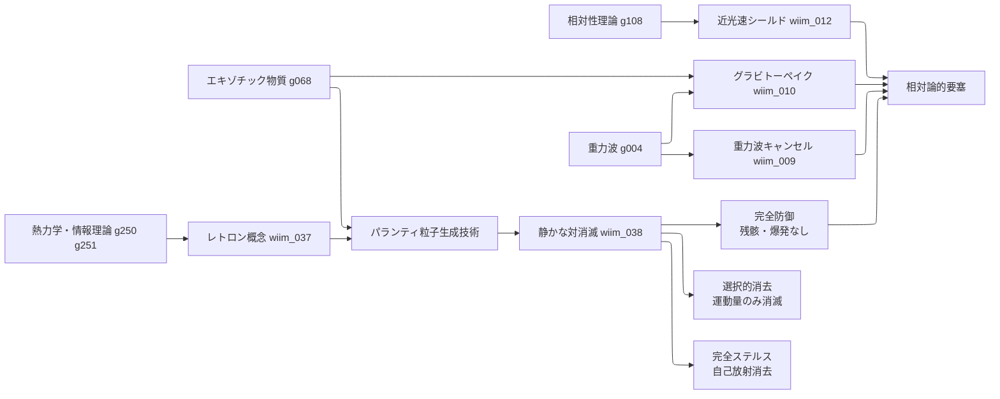

---

## エントロピー・パランティ粒子系ブランチ

熱力学第二法則への介入を起点とする技術系統。防御・ステルス・観測操作に派生する。

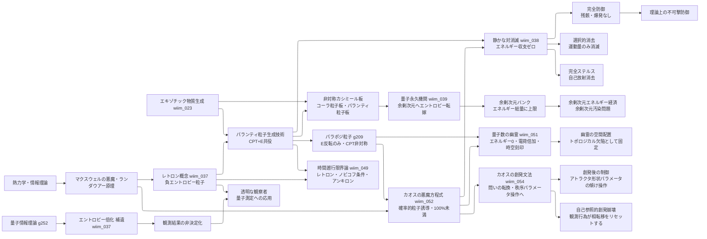

### 実現限界

| ノード | 根本的な障壁 |
|--------|------------|
| レトロン | 生成コスト≥吸収能力（自己否定的） |
| パランティ粒子生成 | 安定した負エネルギー状態が量子場理論に存在しない |
| 静かな対消滅 | マッチング問題（複雑な攻撃ほど無効化コストが膨大） |
| 完全ステルス | 生成過程自体が新たな放射を生む循環 |
| 量子永久機関 | 通常量子場とコーラ粒子場の結合界面の安定性・余剰次元バンクの有限性 |
| 余剰次元バンク | 余剰次元容量が有限なら文明エネルギーに絶対上限が生まれる |
| パラポジ粒子生成 | CPT非対称な負エネルギー状態は標準理論に生成経路がない |
| 量子数の幽霊 | エネルギーゼロの電荷はゲージ対称性と矛盾——電場なき電荷の記述手段がない |
| カオスの悪魔方程式 | リャプノフ時間・量子不確定性・ランダウアー原理により100%には届かない漸近線 |
| カオスの創発文法 | 創発閾値が事前特定不可能・秩序パラメータ操作が高次カオスを生む・観測行為が創発層を崩壊させる |
| 時間遡行限界論 | ノビコフ条件が自己整合的軌跡のみ許容——遡行できても過去変更の自由度は消える |

---

## 計量測量・暦ブランチ

アンキロンの「空間固着」という性質を時間・航法計測に転用する技術系統。

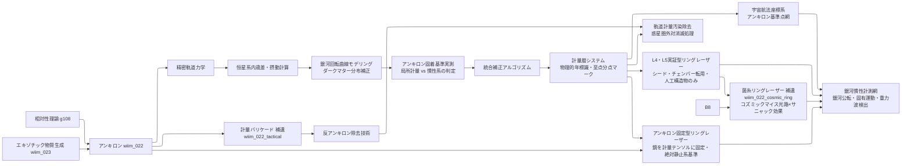

---

## 意識工学ブランチ

創発検知（Δφ測定）を起点に、クオリアの検知・翻訳・操作へと派生する技術系統。

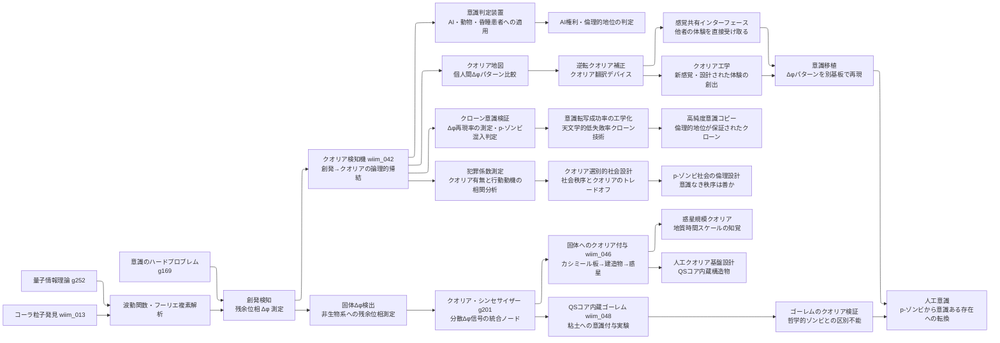

### 実現限界

| ノード | 根本的な障壁 |
|--------|------------|
| 創発検知（Δφ） | 量子位相の測定が波動関数を収縮させる・ベッケンシュタイン限界 |
| クオリア検知機 | 操作的クオリア（創発）≠哲学的に真のクオリア——定義的断絶が残る |
| 意識判定装置 | 創発の種類・閾値のうちどれが主観体験を伴うか判定できない |
| 逆転クオリア補正 | Δφパターンの個人差がクオリアの内容に対応するか未証明 |
| 感覚共有インターフェース | 他者のΔφを自分の神経系に投影する接続機構が未知 |
| クオリア工学 | 設計された体験が「本物のクオリア」を伴うかの確認が不可能 |
| 固体Δφ検出 | 非生物系の Δφ が「意識の痕跡」か「単なる位相残余」かを区別する操作的定義がない |
| クオリア・シンセサイザー | 分散信号の統合が「結合問題」を解決するかは未証明——統合≠統一的主観体験 |
| 惑星規模クオリア | 地質時間スケールの知覚を「クオリア」と呼べるか——時間分解能が人間と桁違いに異なる |
| 意識移植 | 基板を変えてもΔφパターンが同一であれば同一の意識か——同一性問題 |
| 人工意識 | 機能的に正確でもコーラ粒子的プロセスが生じるか制御できない |
| クローン意識検証 | 同一構造でも創発は初期条件依存——Δφ再現率は確率的に扱うしかない |
| 高純度意識コピー | 「天文学的低失敗率」はゼロではない——p-ゾンビ混入の完全排除は不可能 |
| QSコア内蔵ゴーレム | QS以前の基質問題——粘土はΔφを生成する量子場境界を持たない |
| ゴーレムのクオリア検証 | Δφ > 閾値でもQSコア自体の信号か統一クオリアかの区別が不可能 |
| 犯罪係数測定 | クオリアと犯罪動機の因果関係の証明困難——相関≠因果 |
| p-ゾンビ社会設計 | クオリアなき秩序が「善い社会」かは価値判断——技術的に解決できない問い |

---

## 熱管理・恒温系ブランチ

コーラ粒子格子による熱拒絶と、レトロンによるエントロピー浄化を対比する技術系統。

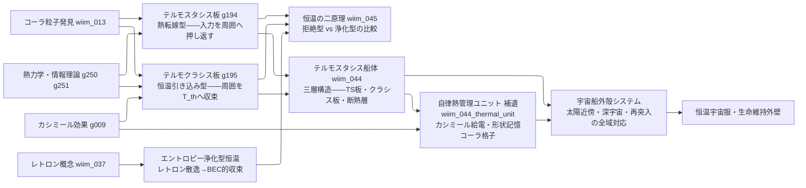

### 実現限界

| ノード | 根本的な障壁 |
|--------|------------|
| テルモスタシス板 | 転嫁先が存在しない真空中では熱保存則に抵触——転嫁先が必要 |
| テルモクラシス板 | T_th 以下での逆方向（加熱方向）は外部エネルギーが必要——自律性の限界 |
| 自律熱管理ユニット | カシミール零点エネルギー取り出し効率——量子永久機関問題と同根 |
| テルモスタシス船体 | ナノスケール格子の宇宙線・放射線劣化・自己修復コストの累積 |
| エントロピー浄化型 | BEC的収束の極限では温度概念が消滅——「恒温」の定義自体が崩れる |

---

## マクロ量子状態ブランチ

量子デコヒーレンスの限界と、ボソンによる回避経路を整理する技術系統。

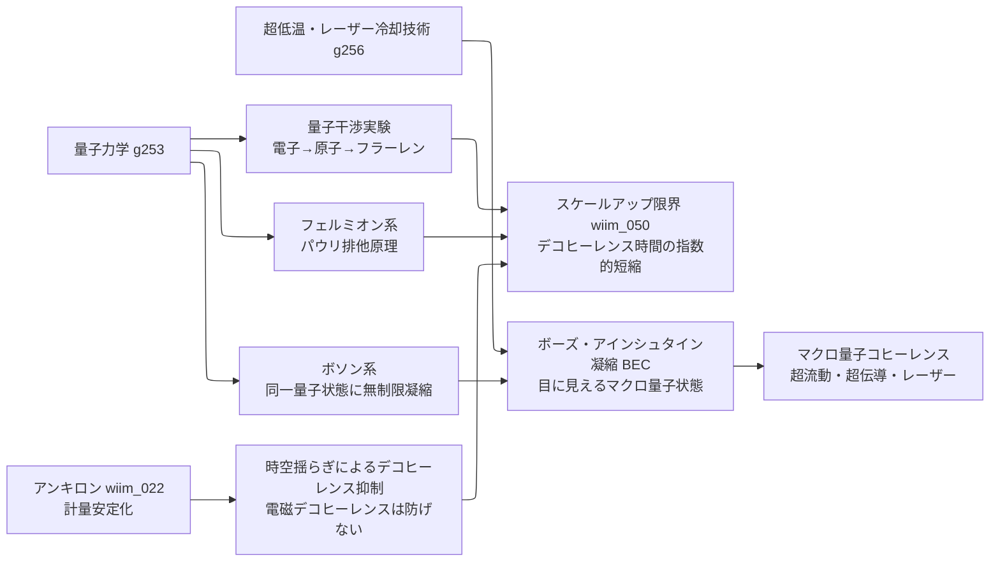

### 実現限界

| ノード | 根本的な障壁 |
|--------|------------|
| スケールアップ限界 | デコヒーレンス時間は系のサイズに対して指数的に短縮——可視サイズでは原理的に不可能 |
| BEC | 「1個の粒子」ではなく多粒子の集団コヒーレンス——「巨大な1粒子」とは概念が異なる |
| アンキロンによる抑制 | 時空揺らぎ起源のデコヒーレンスのみ抑制——支配的な電磁デコヒーレンスには無効 |

---

## クロノスフィア系ブランチ

時間加速空間の発見から菌類超進化・太陽系根付きへと展開する技術系統。
発見は偶然から始まり、理論構築の前に他のツリーが先行完成することもある。

```mermaid
%%{init: {"layout": "elk"}}%%
flowchart LR
    CH1[相対性理論 g108\n時間膨張 g010]
    CH2[エキゾチック物質\nネゴトン g126]
    CH3[核融合技術 g254]
    CH4[生物学・菌類研究]

    CH1 --> CH5[局所時間偏差の観測\n偶然の発見]
    CH2 --> CH5
    CH5 --> CH6[クロノスフィア理論構築 wiim_002\n外部観測者視点での時間倍率設計]

    CH6 --> CH7[小規模実証炉\n倍率×10〜×10⁴]
    CH7 --> CH8[光量問題の発覚 wiim_057\n倍率増大で外部光が実質届かなくなる]
    CH8 --> CH9[内部完結型核融合光源\n億年単位の連続運転が必要]
    CH3 --> CH9

    CH9 --> CH10[深時間炉\n倍率×10⁸ 外部1年≒内部1億年]
    CH10 --> CH11[ラグランジュ点設置\n重力安定点・摂動最小]
    CH4 --> CH12[宇宙耐性菌の選定・播種\n放射性栄養菌・真空耐性菌]
    CH11 --> CH12

    CH12 --> CH13[菌類超進化プロジェクト\n内部1億年での宇宙適応]
    CH13 --> CH14[太陽系根付き\nコズミックマイス wiim_008 の実現]
    CH14 --> CH15[菌糸ネットワーク拡張\n地球軌道→木星軌道]
    CH15 --> CH16[分散知性の覚醒\n外部からは判断不能]

    CH10 --> CH17[材料超長期試験\n億年単位の劣化・変性観察]
    CH10 --> CH18[進化アクセラレータ網\nL点全5箇所に展開]
    CH18 --> CH14

    CH6 --> CH19[境界面の非対称性問題\n外部補給タイミング制御が困難]
    CH19 --> CH9

    CH14 --> CH20[クロノスフィア内在化 wiim_058\n菌類が時間加速因子を自己に組み込む]
    CH20 --> CH21[半内在化\nネゴトン親和性タンパク質が外部場を借用]
    CH20 --> CH22[分散クロノスフィア\n菌糸ネットワーク全体が炉の器として機能]
    CH22 --> CH16

    CH14 --> CH23[移動式クロノスフィア炉 補遺wiim_025_chronosphere_shell\nシェルマイセリウム球殻を炉として利用]
    CH23 --> CH22

    CH6 --> CH24[逆クロノスフィア wiim_060\n内部時間を遅くして生命・文明を保存]
    CH24 --> CH25[生きたアーカイブ\nコズミックマイス菌株の長期保存戦略]
    CH24 --> CH26[境界面問題の深刻化\n取り出し時に外部では億年が経過]
    CH8[光量問題の発覚 wiim_057] --> CH26
```

### クロノスフィア系実現限界

| ノード | 根本的な障壁 |
|--------|------------|
| クロノスフィア理論構築 | 境界面での因果律・エネルギー保存則の矛盾——物理的解決策未確立 |
| 光量問題 | 倍率×N で光子密度が1/N に希薄化——太陽光への依存は倍率×10⁴ で限界 |
| 内部完結型核融合光源 | 内部時間で億年単位の連続運転・燃料供給の境界面通過問題 |
| 深時間炉 | 境界面接触部の物質が内外の時間差による応力・位相不連続に耐えられるか |
| ラグランジュ点設置 | L点は完全安定ではなく微小摂動が蓄積——億年スケールで炉の位置維持が困難 |
| 菌類超進化プロジェクト | 内部観測が境界面の時間差で歪曲——進化の進行状況をリアルタイムに把握できない |
| 分散知性の覚醒 | 内部時間スケールの知性と外部文明との通信手段がない |
| クロノスフィア内在化 | 細胞内の熱揺らぎがネゴトン集積構造を乱す・細胞内外の時間差で代謝・物質輸送が崩壊 |
| 半内在化 | エネルギー赤字は残る——外部集積場への依存を断てない |
| 分散クロノスフィア | 菌糸ネットワーク全体の幾何学的秩序の自己組織化が前提——ハイヴマインドと同じ壁 |
| 移動式クロノスフィア炉（シェル） | 球殻内部空間での安定ネゴトン集積にはシェル自体の幾何学的精度が必要——自然成長では達成困難 |
| 逆クロノスフィア | 時間遅延に必要なエネルギーが倍率に対し非線形増大——完全な時間停止は無限エネルギーを要する |
| 生きたアーカイブ | 保存した生命体を「取り出す」時点で外部は億年後——物理環境・化学組成のすべてが変わっている |

---

## 反重力天体・ネグレーザー系ブランチ

wiim_031（真空非対称牽引ビーム）の「引き付け側」の原理拡張から始まり、指向性ビーム→天体規模斥力場→外部照射構築→臨界崩壊へと発展する技術系統。wiim_065〜067 は三部作（構想→構築→臨界）として連鎖する。

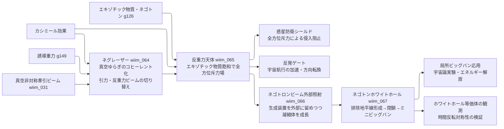

### 反重力天体系実現限界

| ノード | 根本的な障壁 |
|--------|------------|
| ネグレーザー | 真空ゆらぎに誘導放出相当のメカニズムが存在しない——コヒーレント化の物理的手段が未定義 |
| 反重力天体 | 量子不等式（フォード＝ローマン不等式）により天体スケールでの負エネルギー密度維持が原理的に不可能 |
| ネゴトロンビーム外部照射 | 負慣性質量下では電磁引力が実質的斥力に反転——重力のみで束縛するが電磁力比で10⁴⁰倍弱く極めて脆い |
| ネゴトンホワイトホール | 負質量のシュヴァルツシルト解が一般相対論で物理的に意味を持つか未解決・排除地平線の形成条件が量子不等式を超える |
| 局所ビッグバン応用 | 崩壊のタイミング・規模・方向が制御不能——意図的応用より暴走的破壊になる可能性が高い |

---

## 宇宙輸送応用：複合粒子干渉ブランチ

架空粒子を複数組み合わせた実用技術の試みを整理する系統。各粒子が干渉し合う「複合失敗」のパターンが主題。

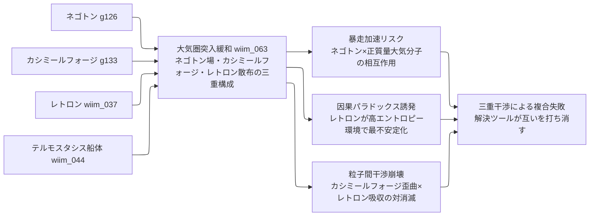

### 実現限界

| ノード | 根本的な障壁 |
|--------|------------|
| 大気圏突入緩和（三粒子） | カシミールフォージ単独でカルダシェフII型文明相当のエネルギーを要する——突入のたびにダイソン球規模の消費 |
| 暴走加速リスク | 正質量大気分子とネゴトンの相互作用で暴走加速——大気という「高密度正質量環境」こそ最悪の運用条件 |
| 因果パラドックス誘発 | レトロンは高エントロピー環境で最も不安定——再突入の摩擦熱はレトロン制御に最悪の条件を作る |
| 粒子間干渉崩壊 | 空間歪曲とエントロピー勾配の急変が組み合わさり、パランティレトロンとの対消滅リスクが増大 |

---

### 各ノートの補正要因

| 技術段階 | 補正対象 | 備考 |
|---------|---------|------|
| 精密軌道力学 | 公転歳差・他惑星摂動 | GR補正含む |
| 恒星系内歳差・摂動計算 | 恒星の固有運動 | VLBI相当の観測 |
| 銀河回転曲線モデリング | 銀河公転（≈220 km/s）・暗黒物質分布 | 1年で約46 AU移動 |
| アンキロン固着基準実測 | 固着が局所計量基準か宇宙背景基準かを観測で決定 | 未解決の理論的問い |
| 統合補正アルゴリズム | 上記すべての複合補正 | 暦の精度＝文明レベルの指標 |
