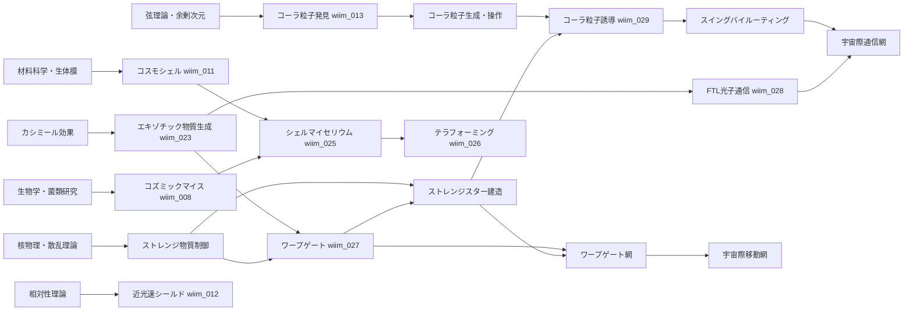
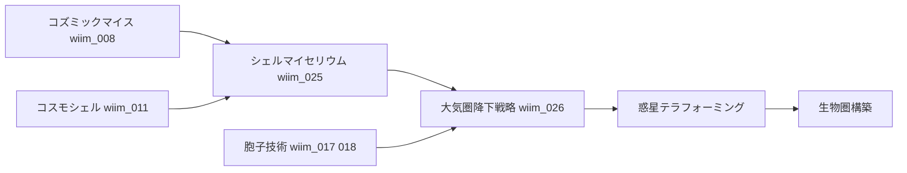
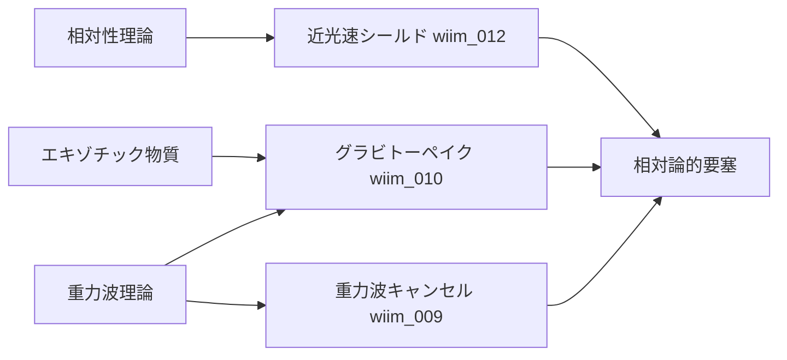

## 概要

WhatIfImpossibleの思考実験記事を「前提技術→派生技術」の関係で整理した技術ツリー。各ノードは記事IDに対応する。

---

## 技術ツリー

```mermaid
flowchart LR
    C0A[カシミール効果]
    C0B[弦理論・余剰次元]
    C0C[核物理・散乱理論]
    C0D[生物学・菌類研究]
    C0E[相対性理論]
    C0F[材料科学・生体膜]

    C0A --> T1A[エキゾチック物質生成 wiim_023]
    C0B --> T1B[コーラ粒子発見 wiim_013]
    C0F --> T1C[コスモシェル wiim_011]
    C0C --> T1D[ストレンジ物質制御]
    C0D --> T1E[コズミックマイス wiim_008]
    C0E --> T2F[近光速シールド wiim_012]

    T1A --> T2A[ワープゲート wiim_027]
    T1A --> T2B[FTL光子通信 wiim_028]
    T1B --> T2C[コーラ粒子生成・操作]
    T1C --> T2E[シェルマイセリウム wiim_025]
    T1D --> T2A
    T1D --> T2D[ストレンジスター建造]
    T1E --> T2E

    T2A --> T2D
    T2A --> T3A[ワープゲート網]
    T2C --> T3B[コーラ粒子誘導 wiim_029]
    T2D --> T3A
    T2D --> T3B
    T2E --> T3C[テラフォーミング wiim_026]

    T3B --> T3D[スイングバイルーティング]
    T3D --> T4B[宇宙際通信網]
    T3A --> T4A[宇宙際移動網]
    T2B --> T4B
```

---

## 生命系ブランチ

```mermaid
flowchart LR
    B1[コズミックマイス wiim_008]
    B2[コスモシェル wiim_011]
    B3[胞子技術 wiim_017 018]

    B1 --> B4[シェルマイセリウム wiim_025]
    B2 --> B4
    B4 --> B5[大気圏降下戦略 wiim_026]
    B3 --> B5
    B5 --> B6[惑星テラフォーミング]
    B6 --> B7[生物圏構築]
```

---

## 防御・シールド系ブランチ

```mermaid
flowchart LR
    D1[相対性理論]
    D2[エキゾチック物質]
    D3[重力波理論]

    D1 --> D4[近光速シールド wiim_012]
    D2 --> D5[グラビトーペイク wiim_010]
    D3 --> D5
    D3 --> D6[重力波キャンセル wiim_009]
    D4 --> D7[相対論的要塞]
    D5 --> D7
    D6 --> D7
```
