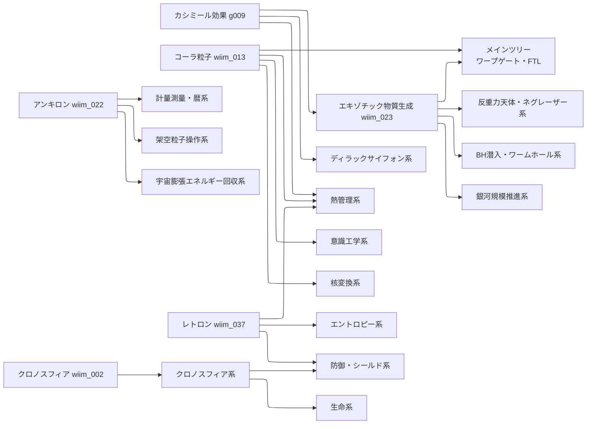

## 概要

WhatIfImpossibleの思考実験記事を「前提技術→派生技術」の関係で整理した技術ツリー。
各ノードは記事ID（wiim_XXX）または用語ID（gXXX）に対応する。

ファイルが大きくなったため、ブランチごとに分割して管理している。

---

## ブランチ一覧

| ブランチ | 主要技術・テーマ | リンク |
|---------|----------------|--------|
| メインツリー | カシミール効果 → エキゾチック物質 → ワープゲート・FTL通信 | [→](#notes/tech_tree_main.md) |
| 生命系 | コズミックマイス → テラフォーミング → ハイヴマインド・RepliStar | [→](#notes/tech_tree_biology.md) |
| 防御・シールド系 | 近光速シールド・グラビトーペイク・時空メタマテリアルシールド | [→](#notes/tech_tree_defense.md) |
| エントロピー・パランティ粒子系 | レトロン・量子永久機関・エクトロン・半永久レトロン場 | [→](#notes/tech_tree_entropy.md) |
| 計量測量・暦 | アンキロン → 計量暦システム → 宇宙航法座標系・銀河慣性計測網 | [→](#notes/tech_tree_surveying.md) |
| 意識工学 | クオリア検知機 → 意識移植 → 固体へのクオリア付与・ゴーレム | [→](#notes/tech_tree_consciousness.md) |
| 熱管理・恒温系 | テルモスタシス板・テルモクラシス板・逆カシミール装置 | [→](#notes/tech_tree_thermal.md) |
| マクロ量子状態 | BEC・チェシャ磁場格子・反作用分散型推進力 | [→](#notes/tech_tree_quantum.md) |
| クロノスフィア系 | 時間加速炉 → 菌類超進化 → 逆クロノスフィア・時空メタマテリアル | [→](#notes/tech_tree_chronosphere.md) |
| 反重力天体・ネグレーザー系 | ネグレーザー → 反重力天体 → ネゴトンホワイトホールワープ | [→](#notes/tech_tree_antigravity.md) |
| 宇宙輸送応用（複合粒子干渉） | 大気圏突入緩和・三粒子干渉崩壊 | [→](#notes/tech_tree_transport.md) |
| 核変換・常温核融合系 | クーロン障壁回避 → 即時中性化 → 元素変換連続炉 | [→](#notes/tech_tree_nuclear.md) |
| 架空粒子操作 | 光ピンセット類推 → アンキロンピン → コーラ粒子精密制御 | [→](#notes/tech_tree_particle_ops.md) |
| 宇宙膨張エネルギー回収系 | ピエゾアンキロン効果 → エクスタイドフロート | [→](#notes/tech_tree_expansion.md) |
| 銀河規模推進・ハッブル地平線突破系 | アルクビエレ型・銀河スイングバイ・ダークエネルギー制御型 | [→](#notes/tech_tree_galactic.md) |
| ディラックサイフォン系 | 正エネルギー注入 → 相境界形成 → 負エネルギー抽出 | [→](#notes/tech_tree_dirac.md) |
| ブラックホール潜入・ワームホール開通系 | ボース・ネゴトン → ER橋安定化 → ワームホールワープ路線 | [→](#notes/tech_tree_blackhole.md) |
| メタグラビトン・重力場彫刻系 | グラビトーペイク → 能動的時空曲率彫刻 → トポロジカル置換ワープ | [→](#notes/tech_tree_metagraviton.md) |

---

## 全体の依存関係（概略）

主要な上流技術から各ブランチへの接続を示す。

---

## 新しいブランチを追加するとき

1. `docs/notes/` に `tech_tree_<名前>.md` を作成する
2. frontmatter に `title`・`type: note`・`date`・`related` を記述する
3. 先頭行に `← [技術ツリー一覧](#notes/tech_tree.md)` を追加する
4. 上の「ブランチ一覧」テーブルに行を追加する
