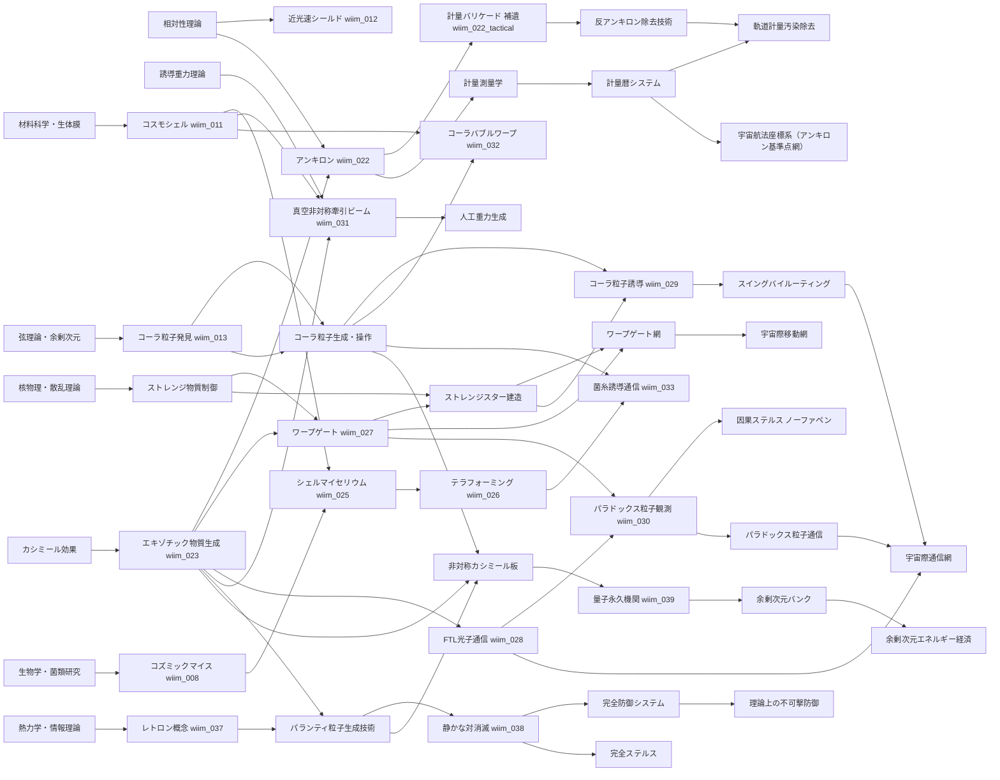
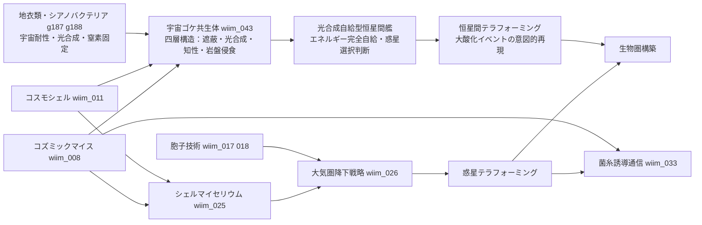
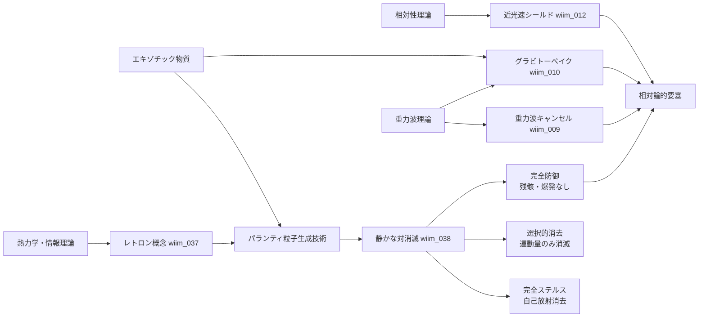
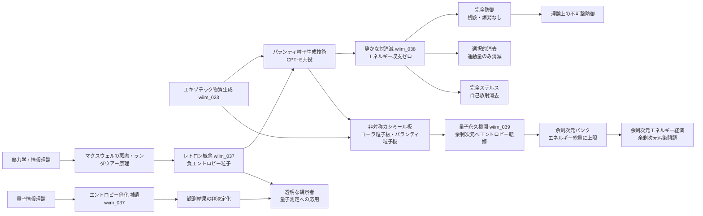
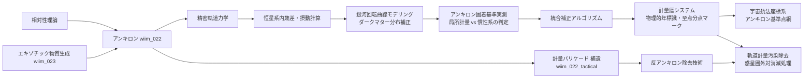
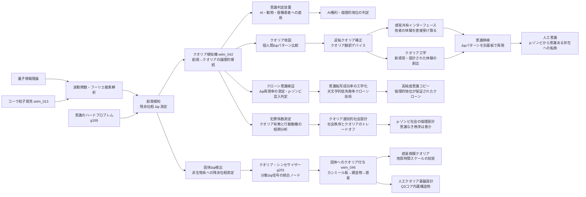
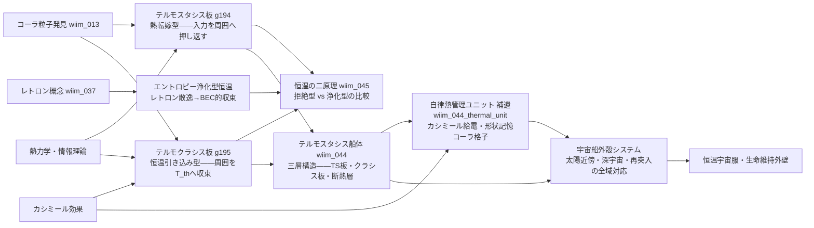

## 概要

WhatIfImpossibleの思考実験記事を「前提技術→派生技術」の関係で整理した技術ツリー。各ノードは記事IDに対応する。

---

## 技術ツリー

---

## 生命系ブランチ

### 生命系実現限界

| ノード | 根本的な障壁 |
|--------|------------|
| 宇宙ゴケ共生体 | 四者共生の最弱リンク問題——最も耐性の弱いパートナーが死ねば全体が崩壊 |
| 光合成自給型恒星間艦 | 恒星間空間の光量不足によるエネルギー赤字圏・知性の休眠 |
| 恒星間テラフォーミング | テラフォーミング完了まで数百万年——確認できる文明が存在するか不明 |

---

## 防御・シールド系ブランチ

---

## エントロピー・パランティ粒子系ブランチ

熱力学第二法則への介入を起点とする技術系統。防御・ステルス・観測操作に派生する。

### 実現限界

| ノード | 根本的な障壁 |
|--------|------------|
| レトロン | 生成コスト≥吸収能力（自己否定的） |
| パランティ粒子生成 | 安定した負エネルギー状態が量子場理論に存在しない |
| 静かな対消滅 | マッチング問題（複雑な攻撃ほど無効化コストが膨大） |
| 完全ステルス | 生成過程自体が新たな放射を生む循環 |
| 量子永久機関 | 通常量子場とコーラ粒子場の結合界面の安定性・余剰次元バンクの有限性 |
| 余剰次元バンク | 余剰次元容量が有限なら文明エネルギーに絶対上限が生まれる |

---

## 計量測量・暦ブランチ

アンキロンの「空間固着」という性質を時間・航法計測に転用する技術系統。

---

## 意識工学ブランチ

創発検知（Δφ測定）を起点に、クオリアの検知・翻訳・操作へと派生する技術系統。

### 実現限界

| ノード | 根本的な障壁 |
|--------|------------|
| 創発検知（Δφ） | 量子位相の測定が波動関数を収縮させる・ベッケンシュタイン限界 |
| クオリア検知機 | 操作的クオリア（創発）≠哲学的に真のクオリア——定義的断絶が残る |
| 意識判定装置 | 創発の種類・閾値のうちどれが主観体験を伴うか判定できない |
| 逆転クオリア補正 | Δφパターンの個人差がクオリアの内容に対応するか未証明 |
| 感覚共有インターフェース | 他者のΔφを自分の神経系に投影する接続機構が未知 |
| クオリア工学 | 設計された体験が「本物のクオリア」を伴うかの確認が不可能 |
| 固体Δφ検出 | 非生物系の Δφ が「意識の痕跡」か「単なる位相残余」かを区別する操作的定義がない |
| クオリア・シンセサイザー | 分散信号の統合が「結合問題」を解決するかは未証明——統合≠統一的主観体験 |
| 惑星規模クオリア | 地質時間スケールの知覚を「クオリア」と呼べるか——時間分解能が人間と桁違いに異なる |
| 意識移植 | 基板を変えてもΔφパターンが同一であれば同一の意識か——同一性問題 |
| 人工意識 | 機能的に正確でもコーラ粒子的プロセスが生じるか制御できない |
| クローン意識検証 | 同一構造でも創発は初期条件依存——Δφ再現率は確率的に扱うしかない |
| 高純度意識コピー | 「天文学的低失敗率」はゼロではない——p-ゾンビ混入の完全排除は不可能 |
| 犯罪係数測定 | クオリアと犯罪動機の因果関係の証明困難——相関≠因果 |
| p-ゾンビ社会設計 | クオリアなき秩序が「善い社会」かは価値判断——技術的に解決できない問い |

---

## 熱管理・恒温系ブランチ

コーラ粒子格子による熱拒絶と、レトロンによるエントロピー浄化を対比する技術系統。

### 実現限界

| ノード | 根本的な障壁 |
|--------|------------|
| テルモスタシス板 | 転嫁先が存在しない真空中では熱保存則に抵触——転嫁先が必要 |
| テルモクラシス板 | T_th 以下での逆方向（加熱方向）は外部エネルギーが必要——自律性の限界 |
| 自律熱管理ユニット | カシミール零点エネルギー取り出し効率——量子永久機関問題と同根 |
| テルモスタシス船体 | ナノスケール格子の宇宙線・放射線劣化・自己修復コストの累積 |
| エントロピー浄化型 | BEC的収束の極限では温度概念が消滅——「恒温」の定義自体が崩れる |

---

### 各ノートの補正要因

| 技術段階 | 補正対象 | 備考 |
|---------|---------|------|
| 精密軌道力学 | 公転歳差・他惑星摂動 | GR補正含む |
| 恒星系内歳差・摂動計算 | 恒星の固有運動 | VLBI相当の観測 |
| 銀河回転曲線モデリング | 銀河公転（≈220 km/s）・暗黒物質分布 | 1年で約46 AU移動 |
| アンキロン固着基準実測 | 固着が局所計量基準か宇宙背景基準かを観測で決定 | 未解決の理論的問い |
| 統合補正アルゴリズム | 上記すべての複合補正 | 暦の精度＝文明レベルの指標 |
