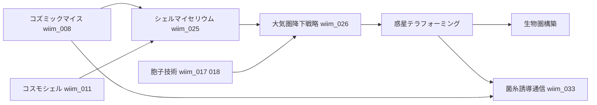
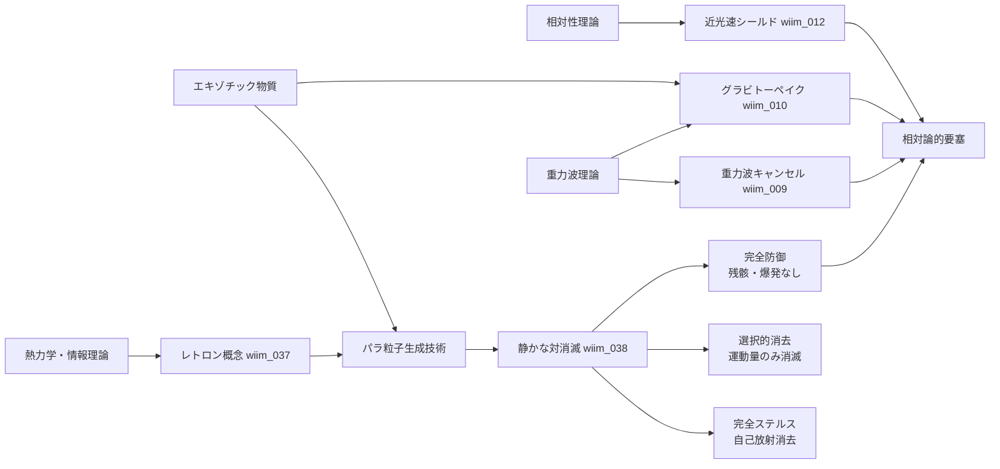
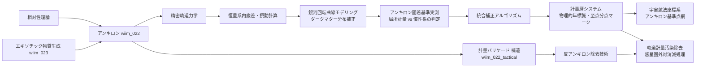

## 概要

WhatIfImpossibleの思考実験記事を「前提技術→派生技術」の関係で整理した技術ツリー。各ノードは記事IDに対応する。

---

## 技術ツリー

---

## 生命系ブランチ

---

## 防御・シールド系ブランチ

---

## エントロピー・パラ粒子系ブランチ

熱力学第二法則への介入を起点とする技術系統。防御・ステルス・観測操作に派生する。

### 実現限界

| ノード | 根本的な障壁 |
|--------|------------|
| レトロン | 生成コスト≥吸収能力（自己否定的） |
| パラ粒子生成 | 安定した負エネルギー状態が量子場理論に存在しない |
| 静かな対消滅 | マッチング問題（複雑な攻撃ほど無効化コストが膨大） |
| 完全ステルス | 生成過程自体が新たな放射を生む循環 |
| 量子永久機関 | コーラ粒子板のデコヒーレンス・余剰次元バンクの有限性 |
| 余剰次元バンク | 余剰次元容量が有限なら文明エネルギーに絶対上限が生まれる |

---

## 計量測量・暦ブランチ

アンキロンの「空間固着」という性質を時間・航法計測に転用する技術系統。

### 各ノートの補正要因

| 技術段階 | 補正対象 | 備考 |
|---------|---------|------|
| 精密軌道力学 | 公転歳差・他惑星摂動 | GR補正含む |
| 恒星系内歳差・摂動計算 | 恒星の固有運動 | VLBI相当の観測 |
| 銀河回転曲線モデリング | 銀河公転（≈220 km/s）・暗黒物質分布 | 1年で約46 AU移動 |
| アンキロン固着基準実測 | 固着が局所計量基準か宇宙背景基準かを観測で決定 | 未解決の理論的問い |
| 統合補正アルゴリズム | 上記すべての複合補正 | 暦の精度＝文明レベルの指標 |
