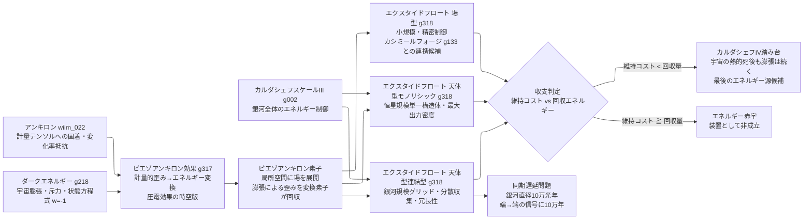

← [技術ツリー一覧](../tech_tree.md)

## 宇宙膨張エネルギー回収系ブランチ

ダークエネルギーによる宇宙膨張を潮汐に見立て、アンキロンの計量錨を利用してエネルギーを回収する技術系統。アンキロンの「計量変化への抵抗」を受動的検出から能動的エネルギー変換へ転用する試み。

**上流前提**: アンキロン（計量測量ブランチ M3・メインツリー T1F）およびダークエネルギーの理論（g218）から接続。カルダシェフスケールIII（g002）が文明前提。

### 実現限界

| ノード | 根本的な障壁 |
|--------|------------|
| ピエゾアンキロン効果 | 宇宙膨張（ハッブル流）は慣性系の分離であって圧力差ではない——装置に力を伝える差分が原理的に存在しない |
| ピエゾアンキロン素子 | 計量テンソルへの継続干渉コストが回収エネルギーを上回る可能性——現行物理では収支を見積もれない |
| 呼気操作（反転フェーズ） | 局所的空間収縮には真空相転移相当のエネルギーが必要——ダークエネルギーの状態方程式に逆らう行為 |
| 天体型連結型 | 銀河スケールの同期遅延（最大10万年）——位相を揃えたピストン運動の維持が原理的に困難 |
| カルダシェフIV踏み台 | 「作れる文明はすでに必要とせず、必要な文明には作れない」論理的パラドックス |
