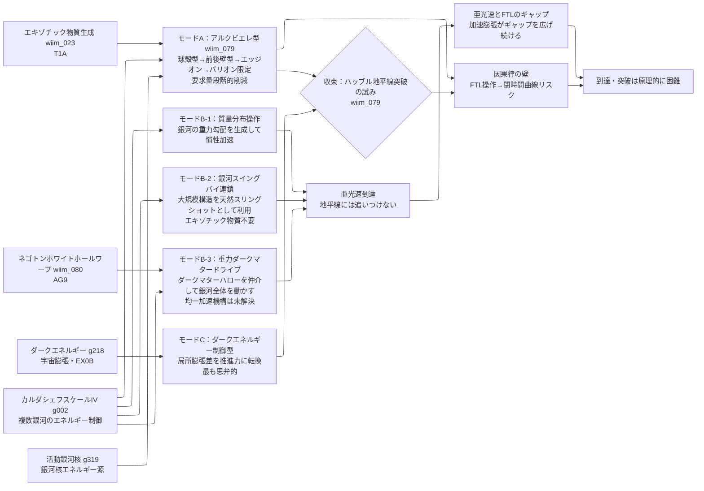

← [技術ツリー一覧](../tech_tree.md)

## 銀河規模推進・ハッブル地平線突破系ブランチ

複数ブランチの収束点。アルクビエレ型・重力操作型・ネゴトン推進型・ダークエネルギー型の4系統を統合し、ハッブル地平線突破を目標とする技術系統。

**上流前提**: エキゾチック物質生成（T1A）、ネゴトンホワイトホールワープ（AG9）、宇宙膨張エネルギー回収（EX0B）、カルダシェフスケールIV（g002）から接続。

### 実現限界

| ノード | 根本的な障壁 |
|--------|------------|
| モードA：球殻型 | 要求エキゾチック物質量が観測可能宇宙の総エネルギーを超える |
| モードA：最適化後（バリオン限定） | 惑星〜恒星質量スケールのエキゾチック物質が必要——既知の生成機構と桁違い |
| モードB-2：銀河スイングバイ | 経路が宇宙大規模構造に縛られる——任意方向への移動は保証されない |
| モードB-3：ダークマタードライブ | ダークマターハロー全体を均一に加速する具体的機構が未解決 |
| モードC：ダークエネルギー制御 | ダークエネルギーの正体未解明——操作手段の理論的根拠がない |
| ハッブル地平線突破 | 地平線は固定した壁でなく動的に後退し続ける——加速膨張がギャップを広げ続ける |
