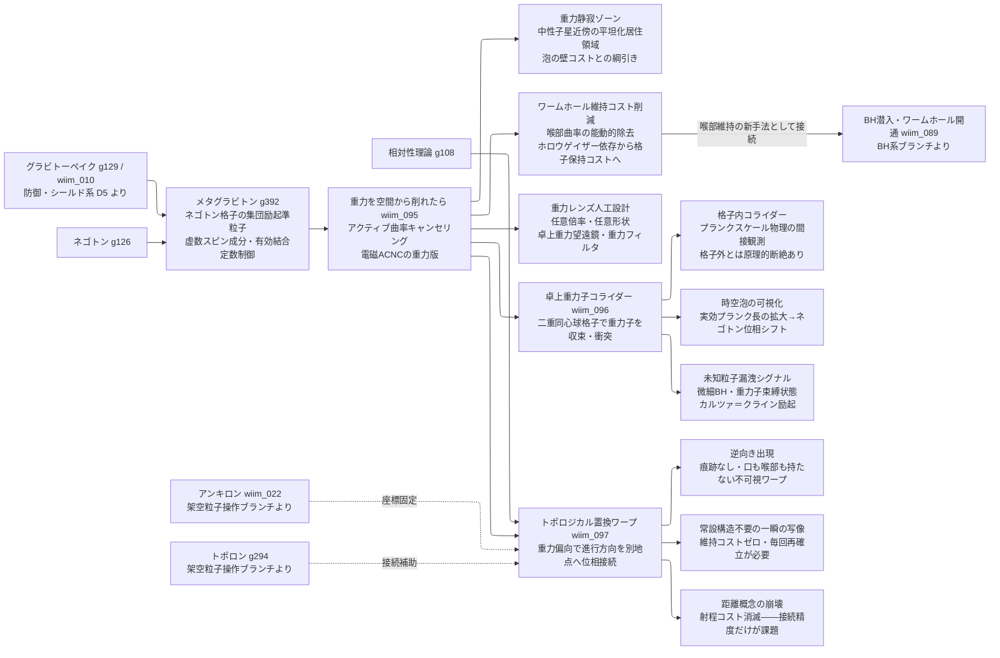

← [技術ツリー一覧](../tech_tree.md)

## メタグラビトン・重力場彫刻系ブランチ

グラビトーペイクの「受動遮断」から「能動的時空曲率彫刻」へと転換する技術系統。メタグラビトン（ネゴトン格子の集団励起準粒子）を核に、重力静寂ゾーン・卓上量子重力実験・トポロジカル置換ワープへと派生する。

**上流前提**: グラビトーペイク（防御・シールド系 D5/wiim_010）、ネゴトン（g126）、相対性理論（g108）、アンキロン（架空粒子操作ブランチ P2）、トポロン（架空粒子操作ブランチ P0F）から接続。

### 実現限界

| ノード | 根本的な障壁 |
|--------|------------|
| メタグラビトン | 格子内の有効結合定数引き上げは「有効描像」であり裸の重力子はプランクスケールに届かない——格子内と格子外の物理に原理的断絶がある |
| 重力を空間から削れたら | 重力場エネルギーは消滅しない——削った曲率は境界に濃縮されるだけで問題は移動するにとどまる |
| 重力静寂ゾーン | 泡の外縁に濃縮された曲率が強い潮汐力の壁を生む——泡を大きくすれば壁は弱まるが格子維持コストが体積比例で増大する |
| ワームホール維持コスト削減 | 静的曲率は光速で補充され続ける——動的重力波の低減は可能でも静的曲率の完全除去はいたちごっこになる |
| 卓上重力子コライダー | 重力子は電荷・色電荷を持たず電磁操作が一切使えない——収束・偏向のすべてを格子の重力操作だけで行うと自己干渉問題が避けられない |
| 時空泡の可視化 | 観測行為自体がプランクスケールの時空を乱す——「観測しようとする格子が観測対象の時空泡を生成する」自己参照的矛盾 |
| トポロジカル置換ワープ | ゲロッホの定理により古典GRでのトポロジー変化には特異点生成か因果構造破綻が必要——プランクスケール以下のエネルギーでは原理的に不可能 |
| 逆向き出現 | 「空間の逆転」と「時間の逆行」を事前に区別できない——CTC形成条件と重なる場合に自己矛盾的な情報伝達が生じる可能性 |
