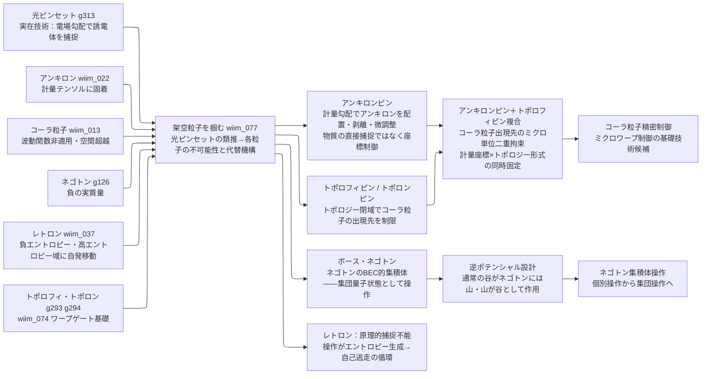

← [技術ツリー一覧](../tech_tree.md)

## 架空粒子操作ブランチ

光ピンセットの類推から架空粒子の操作可能性を問い、代替ピン機構を導出する技術系統。各粒子が「通常の物理前提を外す仕方」に応じて異なる操作機構が要求される。

**上流前提（各ブランチ参照）**: アンキロン（計量測量ブランチ M3）、コーラ粒子（メインツリー T2C）、ネゴトン（反重力天体ブランチ AG0C）、レトロン（エントロピーブランチ E5）、トポロフィ・トポロン（メインツリー wiim_074）から接続。

### 実現限界

| ノード | 根本的な障壁 |
|--------|------------|
| アンキロンピン | 計量変化率のゼロ強制は等価原理との既存矛盾を拡大する——「特権的操作点」を局所的に作ることになる |
| トポロフィピン / トポロンピン | トポロフィ自体が通常の量子化が成立しない場——励起（トポロン）の精密制御に必要な記述体系が未定義 |
| ボース・ネゴトン集積体 | 光子（制御レーザー）との相互作用が「正質量との暴走加速」条件に該当するかが未定義——集積前の個別操作段階で破綻する可能性 |
| コーラ粒子精密制御 | アンキロンピンで座標を固定してもコーラ粒子の出現は確率的——「確率を絞る」ことと「出現先を確定する」ことの間に量子的な壁が残る |
| レトロン閉じ込め | 「エントロピー勾配ゼロの維持」自体がレトロンを必要とする自己参照——マクスウェルの悪魔問題の一変奏 |
