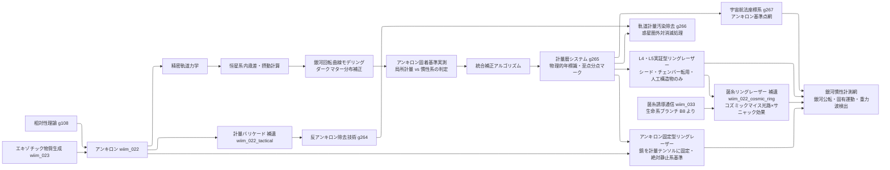

← [技術ツリー一覧](../tech_tree.md)

## 計量測量・暦ブランチ

アンキロンの「空間固着」という性質を時間・航法計測に転用する技術系統。

### 計量ブランチ補正要因

| 技術段階 | 補正対象 | 備考 |
|---------|---------|------|
| 精密軌道力学 | 公転歳差・他惑星摂動 | GR補正含む |
| 恒星系内歳差・摂動計算 | 恒星の固有運動 | VLBI相当の観測 |
| 銀河回転曲線モデリング | 銀河公転（≈220 km/s）・暗黒物質分布 | 1年で約46 AU移動 |
| アンキロン固着基準実測 | 固着が局所計量基準か宇宙背景基準かを観測で決定 | 未解決の理論的問い |
| 統合補正アルゴリズム | 上記すべての複合補正 | 暦の精度＝文明レベルの指標 |
