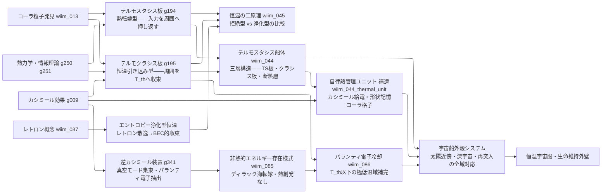

← [技術ツリー一覧](../tech_tree.md)

## 熱管理・恒温系ブランチ

コーラ粒子格子による熱拒絶と、レトロンによるエントロピー浄化を対比する技術系統。

### 実現限界

| ノード | 根本的な障壁 |
|--------|------------|
| テルモスタシス板 | 転嫁先が存在しない真空中では熱保存則に抵触——転嫁先が必要 |
| テルモクラシス板 | T_th 以下での逆方向（加熱方向）は外部エネルギーが必要——自律性の限界 |
| 自律熱管理ユニット | カシミール零点エネルギー取り出し効率——量子永久機関問題と同根 |
| テルモスタシス船体 | ナノスケール格子の宇宙線・放射線劣化・自己修復コストの累積 |
| エントロピー浄化型 | BEC的収束の極限では温度概念が消滅——「恒温」の定義自体が崩れる |
| 逆カシミール装置 | エネルギーコスト逆転——パランティ電子抽出の稼働エネルギーが冷却熱量を桁外れに上回る |
| パランティ電子冷却 | 電離進行（電子密度消耗）・冷却効率の自己制限（冷えるほど衝突頻度が下がる漸近限界） |
