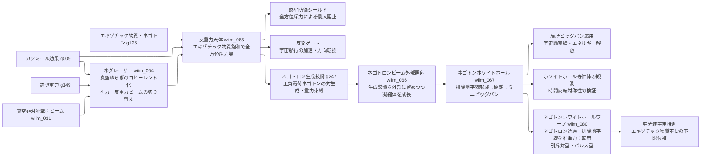

---
title: 技術ツリー — 反重力天体・ネグレーザー系ブランチ
type: note
date: 2026-04-09
related: [wiim_031, wiim_064, wiim_065, wiim_066, wiim_067, wiim_080]
---

← [技術ツリー一覧](tech_tree.md)

## 反重力天体・ネグレーザー系ブランチ

wiim_031（真空非対称牽引ビーム）の「引き付け側」の原理拡張から始まり、指向性ビーム→天体規模斥力場→外部照射構築→臨界崩壊へと発展する技術系統。wiim_065〜067 は三部作（構想→構築→臨界）として連鎖する。

**上流前提（メインツリー参照）**: wiim_031 の実現にはカシミール効果（g009）・コスモシェル（wiim_011）・エキゾチック物質生成（wiim_023）が必要。詳細はメインツリーの C0A/T1A/T1C/T2G ノードを参照。

### 反重力天体系実現限界

| ノード | 根本的な障壁 |
|--------|------------|
| ネグレーザー | 真空ゆらぎに誘導放出相当のメカニズムが存在しない——コヒーレント化の物理的手段が未定義 |
| 反重力天体 | 量子不等式（フォード＝ローマン不等式）により天体スケールでの負エネルギー密度維持が原理的に不可能 |
| ネゴトロンビーム外部照射 | 負慣性質量下では電磁引力が実質的斥力に反転——重力のみで束縛するが電磁力比で10⁴⁰倍弱く極めて脆い |
| ネゴトンホワイトホール | 負質量のシュヴァルツシルト解が一般相対論で物理的に意味を持つか未解決・排除地平線の形成条件が量子不等式を超える |
| 局所ビッグバン応用 | 崩壊のタイミング・規模・方向が制御不能——意図的応用より暴走的破壊になる可能性が高い |
