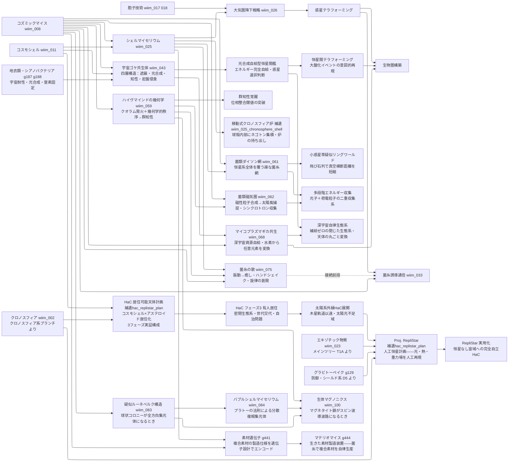

---
title: 技術ツリー — 生命系ブランチ
type: note
date: 2026-04-09
related: [wiim_008, wiim_011, wiim_025, wiim_026, wiim_033, wiim_043, wiim_059, wiim_061, wiim_062, wiim_068, wiim_075]
---

← [技術ツリー一覧](tech_tree.md)

## 生命系ブランチ

### 生命系実現限界

| ノード | 根本的な障壁 |
|--------|------------|
| 宇宙ゴケ共生体 | 四者共生の最弱リンク問題——最も耐性の弱いパートナーが死ねば全体が崩壊 |
| 光合成自給型恒星間艦 | 恒星間空間の光量不足によるエネルギー赤字圏・知性の休眠 |
| 恒星間テラフォーミング | テラフォーミング完了まで数百万年——確認できる文明が存在するか不明 |
| ハイヴマインドの幾何学 | ランダム菌糸では位相整合不可・幾何学的秩序の自己組織化には強い選択圧と長期進化が必要 |
| 移動式クロノスフィア炉（シェル） | シェルマイセリウムの球殻精度と炉の幾何学要件が同時に満たされる必要がある |
| 菌類ダイソン網 | 疎な菌糸網は太陽光の捕集効率が極めて低く、エネルギー収支が赤字になる——密度を上げると維持コストが急増する |
| 菌類磁気圏 | 磁性粒子の合成・維持に必要なエネルギーが太陽風から得られるエネルギーを上回る可能性が高い |
| 小惑星帯疑似リングワールド | 小惑星間の相対速度差と軌道摂動で飛び石列が数百万年以内に崩壊する——維持に継続的な軌道修正が必要 |
| 多段階エネルギー収集 | 光子収集と荷電粒子収集の装置が同一空間で干渉する——磁場が光学系を歪め光子収集効率が低下する |
| マイコプラズマギカ共生 | 核変換のエネルギー収支——鉄より重い元素の吸熱合成分を共生体内で自己賄いできるか未解決。コンタクトプローブ制約の深宇宙での代替手段も未定義 |
| 深宇宙自律生態系 | 知性体（コズミックマイス）との「共生」が交渉・契約を要するなら、対等でない利益配分は寄生・排除に転化しうる |
| HaC 実験フェーズ | バイオスフィア2型のO₂濃度崩壊・自己修復速度を超える損傷——「修復が間に合わない臨界点」の事前把握が不可能 |
| HaC 有人居住 | 世代交代後の法的地位・低重力暴露の長期影響——技術設計より政治・倫理設計が先行して必要 |
| Proj. RepliStar | 放射線管理（居住圏への照射リスク）・燃料調達ルートの確立・停止時に依存HaCが全滅する単一障害点問題 |
| 疑似ルーネベルク構造 | 胞子という離散単位では連続勾配を実現できない・コロニー半径が大きくなるほど信号遅延が深刻化 |
| バブルシェルマイセリウム | 生物膜はプラトー幾何の前提する均質性を満たせない・最適バブル数を代謝フィードバックで調節する機構が必要 |
| 生体マグノニクス | 宇宙線による磁気秩序のデコヒーレンス・スピン波を電気化学信号に変換するインターフェース分子の未進化 |
| 素材遺伝子（g441） | 位置情報読み取り精度——ナノスケールの素材遷移を細胞分化精度で再現できるか・外来環境変化に対する遺伝子発現の安定性 |
| マテリオマイス（g444） | 生物個体差による素材品質ばらつき——音響複層体の均質性要件を増殖ベースで満たせるか |
