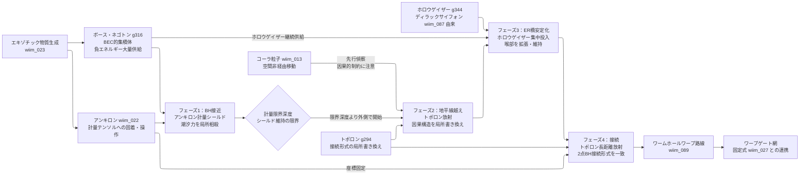

---
title: 技術ツリー — ブラックホール潜入・ワームホール開通系ブランチ
type: note
date: 2026-04-09
related: [wiim_013, wiim_022, wiim_023, wiim_027, wiim_087, wiim_089]
---

← [技術ツリー一覧](tech_tree.md)

## ブラックホール潜入・ワームホール開通系ブランチ

エキゾチック物質を出発点に、アンキロン・ボース・ネゴトン・トポロン・ホロウゲイザー・コーラ粒子を4フェーズで組み合わせ、ブラックホール内部のER橋を通行可能なワームホールへ転換する技術系統。ワープゲート（wiim_027）の能動的開通版として位置づけられる。

**上流前提**: エキゾチック物質生成（T1A/wiim_023）、アンキロン（T1F/wiim_022）、コーラ粒子（T1B/wiim_013）、ホロウゲイザー（ディラックサイフォンブランチ DS2）、ボース・ネゴトン（架空粒子操作ブランチ P4）、トポロン（架空粒子操作ブランチ P0F）から接続。

### 実現限界

| ノード | 根本的な障壁 |
|--------|------------|
| フェーズ1：潮汐力シールド | 潮汐力は特異点で発散——相殺に必要な負エネルギー量も発散し完全な打ち消しは原理的に不可能。フォード＝ローマン不等式が集中量と持続時間をさらに制限する |
| フェーズ2：地平線越え（コーラ粒子偵察） | 事象の地平線は空間的でなく因果的な境界——「空間非経由」の性質が因果的制約を回避できるかはWIIM内でも未定義 |
| フェーズ2：地平線越え（トポロン） | 接続形式の書き換えは多様体の大域構造に波及する可能性がある——意図しないCTC（閉じた時間的曲線）の生成リスクと精密制御の理論体系が未整備 |
| フェーズ3：ER橋安定化 | ER橋の喉部はプランク長さスケールの量子揺らぎが支配的——量子重力効果が橋を瞬時に破壊すると予想され、安定した喉部の存在自体が未解決 |
| フェーズ4：接続 | トポロンの長距離放射が2点間のトポロジーを「意図通りに」一致させる保証がない——誤接続（無関係な領域との接続）のリスクを制御する手段が未定義 |
| 路線の維持 | ホロウゲイザーの継続供給なしに喉部が収縮するため「維持コスト」が永続的に発生する——エネルギー収支がワープ利益を上回る可能性がある |
| ER＝EPR仮説との矛盾 | ER橋の物理的通過が量子もつれを通じた因果的情報伝達に相当するなら、通過そのものが量子力学の基本原理と衝突する可能性がある |
