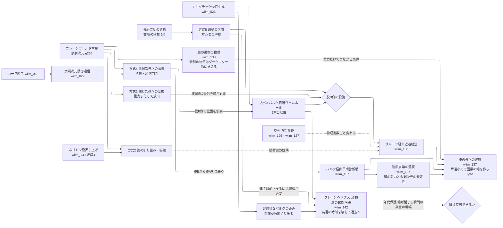

← [技術ツリー一覧](tech_tree.md)

## ブレーン宇宙移動系ブランチ

私たちの宇宙をバルクに浮かぶ膜（ブレーン）とみなし、隣の膜を経由して移動・近道する技術系統。この宇宙の空間を歪めるワープ系・ワームホール系と異なり、「他の宇宙の空間を借りる」方式として位置づけられる（[wiim_136](../cosmology/wiim_136.md)）。

**上流前提**: コーラ粒子（T1B/wiim_013）、余剰次元誘導通信（wiim_029）、エキゾチック物質生成（T1A/wiim_023）、ネゴトンによる膜の押し上げ（[wiim_130の補遺ノート](wiim_130_negoton_attraction_routes.md)経路3）から接続。

---

## 実現限界テーブル

| ノード | 記事・用語 | 主な限界 |
|---|---|---|
| 方式1 閉じた弦への変換 | wiim_136 | 静止質量すべてを弦のエネルギーに置き換える必要、膜B側の受信・再構成設備、分解と再構成による同一性の問題 |
| 方式2 膜の折り畳み・接触 | wiim_136 | 膜の張力に逆らう仕事がバルクに蓄積、膜衝突が局所的なビッグバンになりうる |
| 方式3 バルク貫通ワームホール | wiim_136 | エキゾチック物質による喉の維持、未到達の膜Bに出口を作れない |
| 方式4 余剰次元への誘導 | wiim_136・wiim_029 | コーラ粒子がバルクを通れるかが未定義、出現先が確率的、有人輸送に不向き |
| 方式5 遺構の借用 | wiim_136 | 機構の対応表を解読できるか、理由の分からない使用制限、依存の危険 |
| 参考 真空遷移 | wiim_125・wiim_127 | 泡の間は光より速く膨張し信号も届かない、物理定数の違いで渡航者が存続できない |
| 膜の外への避難 | wiim_137 | 膜Aの中では崩壊の警告が原理的に得られない、無の泡や対消滅では膜Bも巻き込まれうる、事後の大量避難は非現実的で常時分散が必要 |
| バルク経由早期警報網 | wiim_137 | 猶予は膜の曲がり方次第、警報網自体が超光速回線となり因果の条件が要る |
| 連鎖崩壊の監視 | wiim_137 | 膜の張力のつり合いや余剰次元の大きさを決める場を測る手段がない、連鎖が起きる規模の閾値が不明、連鎖が膜Bに届けば避難は時間稼ぎにとどまる |
| 膜の裏側の物理 | wiim_138 | 裏側は重力でしか観測できない、表の法則の破れと見えない物質を表のデータだけでは区別できない、弾丸銀河団と初期宇宙の制約により裏側がダークマターの全部を担うのは難しい |
| ブレーンヘリクス（膜の螺旋階段） | wiim_142・g535・[遺構説](wiim_142_brane_helix_relic.md) | 一段ごとにエキゾチック物質が要る（ガオ＝ウォルドの定理）、階段の完成より前の過去には戻れない、輪が閉じる瞬間の真空の増幅（年代保護仮説）、膜どうしの引き合いと衝突で配置を保てない、論理的な整合性の扱い |
| 全方式共通 | wiim_136 | 対応点と同時刻の定義、膜Aから見た超光速と因果律、縮尺の違う膜での渡航者の存続、膜Aから消えるエネルギーの帳尻 |
