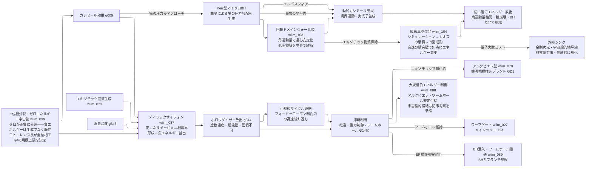

---
title: 技術ツリー — ディラックサイフォン系ブランチ
type: note
date: 2026-04-09
related: [wiim_023, wiim_027, wiim_087, wiim_088, wiim_089, wiim_099, wiim_103, wiim_104]
---

← [技術ツリー一覧](tech_tree.md)

## ディラックサイフォン系ブランチ

正エネルギー注入による相境界形成から負エネルギー抽出を試み、宇宙論的スケールの転換へと至る技術系統。wiim_087（抽出の試み）と wiim_088（制御が実現した帰結）の二部作で構成される。

**上流前提**: カシミール効果（C0A）、エキゾチック物質生成（T1A/wiim_023）から接続。熱管理ブランチ TH13（逆カシミール装置→パランティ電子抽出）とは方向が異なる——こちらは負エネルギーを「押し込む」のではなく「汲み出す」試みである。wiim_099（±位相分裂理論）がこのブランチ全体の宇宙論的根拠を与える。

### 実現限界

| ノード | 根本的な障壁 |
|--------|------------|
| ±位相分裂理論（理論基盤） | 痕跡なし振動は原理的に検出不能——「負エネルギーが－位相世界に存在する」ことは間接的推論にとどまり実証不可能。コヒーレンス長の実測手段が未定義 |
| ディラックサイフォン | フォード＝ローマン不等式が量×時間に上限を課す——マクロな蓄積は原理的に禁じられる |
| ホロウゲイザー容器問題 | 正エネルギー製容器で即座に中和・負エネルギー容器は循環論法——「汲んでも入れる器がない」 |
| 小規模サイクル運転 | 繰り返し周期をフォード＝ローマン制約内に収めると実効流束が微小——工学的応用の閾値に届かない |
| 大規模負エネルギー制御 | 宇宙論的スケールへの拡張は観測可能宇宙全体のエネルギースケールを要する——現在の宇宙に物理的基盤がない |
| Kerr型マイクロBH核生成 | プランクエネルギー（~10¹⁹ GeV）が必要——LHCの到達値10⁴ GeVとは15桁の開き。余剰次元仮説で閾値は下がるが未観測 |
| 回転ドメインウォール膜 | 角運動量抽出と膜寿命が反比例——エネルギーを取り出すほど早く崩壊するため「制御しながら使い続ける」設計が成立しない |
| 場の圧力差機関・収支 | 圧力差を作るコスト（核生成＋膜維持）が出力（ホーキング輻射＋動的カシミール）を上回る——カルノー効率的な上限の存在 |
| 成形真空爆発・時間競争 | フォード＝ローマン不等式が高密度整形ほど保持時間を短縮——「丁寧に整形する」低速フェーズと「蒸発前に撃つ」高速フェーズが原理的に矛盾する |
| 外部シンク（余剰次元） | 余剰次元は失敗コストの先送り先——余剰次元自身の熱容量は有限で最終的に熱化する。解消ではなく先送り |
