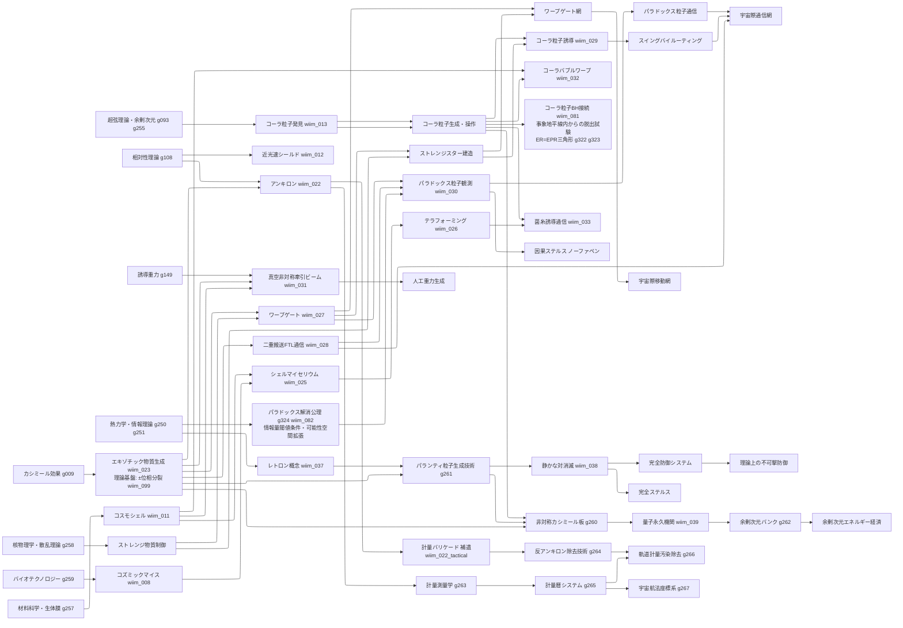

---
title: 技術ツリー — メインツリー
type: note
date: 2026-04-09
related: []
---

← [技術ツリー一覧](tech_tree.md)

## 技術ツリー

```mermaid
%%{init: {"layout": "elk"}}%%
flowchart LR
    C0A[カシミール効果 g009]
    C0B[超弦理論・余剰次元 g093 g255]
    C0C[核物理学・散乱理論 g258]
    C0D[バイオテクノロジー g259]
    C0E[相対性理論 g108]
    C0F[材料科学・生体膜 g257]
    C0G[誘導重力 g149]
    C0H[熱力学・情報理論 g250 g251]

    C0A --> T1A[エキゾチック物質生成 wiim_023\n理論基盤: ±位相分裂 wiim_099]
    C0B --> T1B[コーラ粒子発見 wiim_013]
    C0F --> T1C[コスモシェル wiim_011]
    C0C --> T1D[ストレンジ物質制御]
    C0D --> T1E[コズミックマイス wiim_008]
    C0E --> T2F[近光速シールド wiim_012]
    C0E --> T1F[アンキロン wiim_022]
    T1A --> T1F
    C0G --> T2G[真空非対称牽引ビーム wiim_031]

    T1A --> T2A[ワープゲート wiim_027]
    T1A --> T2B[二重搬送FTL通信 wiim_028]
    T1A --> T2G
    T1B --> T2C[コーラ粒子生成・操作]
    T1C --> T2E[シェルマイセリウム wiim_025]
    T1C --> T2G
    T1D --> T2A
    T1D --> T2D[ストレンジスター建造]
    T1E --> T2E

    T2A --> T2D
    T2A --> T3A[ワープゲート網]
    C0H --> T2H_theory[パラドックス解消公理 g324 wiim_082\n情報量閾値条件・可能性空間拡張]
    T2H_theory --> T2H[パラドックス粒子観測 wiim_030]
    T2A --> T2H
    T2B --> T2H
    T2C --> T3B[コーラ粒子誘導 wiim_029]
    T2C --> T3I[コーラバブルワープ wiim_032]
    T2C --> T3J[コーラ粒子BH接続 wiim_081\n事象地平線内からの脱出試験\nER=EPR三角形 g322 g323]
    T1C --> T3I
    T2D --> T3A
    T2D --> T3B
    T2E --> T3C[テラフォーミング wiim_026]
    T2C --> T3H[菌糸誘導通信 wiim_033]
    T3C --> T3H
    T2G --> T3E[人工重力生成]
    T2H --> T3F[因果ステルス ノーファペン]
    T2H --> T3G[パラドックス粒子通信]

    T3B --> T3D[スイングバイルーティング]
    T3D --> T4B[宇宙際通信網]
    T3A --> T4A[宇宙際移動網]
    T2B --> T4B
    T3G --> T4B

    C0H --> T1G[レトロン概念 wiim_037]
    T1A --> T1H[パランティ粒子生成技術 g261]
    T1G --> T1H
    T1H --> T2N[静かな対消滅 wiim_038]
    T2N --> T3M[完全防御システム]
    T2N --> T3N[完全ステルス]
    T3M --> T4D[理論上の不可撃防御]

    T1A --> T1I[非対称カシミール板 g260]
    T1B --> T2C
    T2C --> T1I
    T1I --> T2O[量子永久機関 wiim_039]
    T1H --> T1I
    T2O --> T3P[余剰次元バンク g262]
    T3P --> T4E[余剰次元エネルギー経済]

    T1F --> T2K[計量バリケード 補遺wiim_022_tactical]
    T1F --> T2L[計量測量学 g263]
    T2K --> T2M[反アンキロン除去技術 g264]
    T2L --> T3K[計量暦システム g265]
    T2M --> T3L[軌道計量汚染除去 g266]
    T3K --> T3L
    T3K --> T4C[宇宙航法座標系 g267]
```
