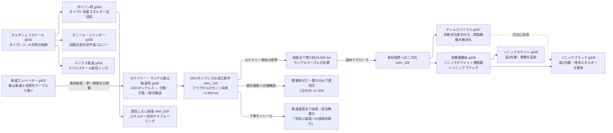

← [技術ツリー一覧](tech_tree.md)

## メガストラクチャー・宇宙インフラ系

文明スケールの宇宙構造物と宇宙アクセスインフラを整理する系統。カルダシェフスケールを縦軸に、「点から面・構造へ」の拡張を横軸に置く。

### 実現限界

| ノード | 根本的な障壁 |
|--------|------------|
| 軌道エレベーター（g433） | ケーブル素材の比引張強度が鋼鉄の約150倍必要——カーボンナノチューブでも未達 |
| カテナリーフラクタル（g436） | 角スパン半減ごとにたわみが1/4に収束——純粋フラクタルはGEO下約1,900 kmで打ち止め |
| GEO以下静止維持 | 連続維持で10トン機に年17トン推進剤——ラジアルケーブルの末端ステーション維持が律速 |
| GEOネックレス全体 | ラジアルケーブルの最下部は依然としてスペースエレベーター相当の素材強度が必要 |
| ディムスパイラル（g437） | 余剰次元の実在未実証・プランクスケール制御不能・量子トンネリングによる有限寿命 |
| 音響複層体（g438） | 静的荷重には無力・内層の熱蓄積限界・10⁷ mスケール均質製造の壁 |
| ダイソン球（g034） | タイプII文明相当のエネルギーと素材が必要——自己組立・自己修復なしには維持不可能 |
| オニール・シリンダー（g435） | 回転安定性の精密制御・宇宙線防護・大規模物資輸送が課題 |
