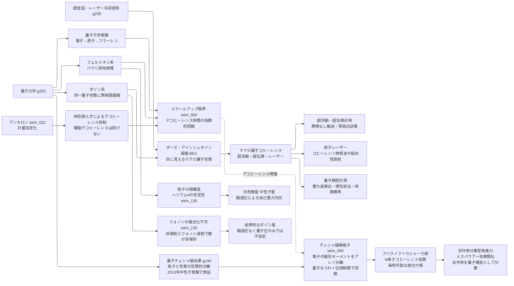

---
title: 技術ツリー — マクロ量子状態ブランチ
type: note
date: 2026-04-09
related: [wiim_022, wiim_050, wiim_094, wiim_135]
---

← [技術ツリー一覧](tech_tree.md)

## マクロ量子状態ブランチ

量子デコヒーレンスの限界と、ボソンによる回避経路を整理する技術系統。

### 実現限界

| ノード | 根本的な障壁 |
|--------|------------|
| スケールアップ限界 | デコヒーレンス時間は系のサイズに対して指数的に短縮——可視サイズでは原理的に不可能 |
| BEC | 「1個の粒子」ではなく多粒子の集団コヒーレンス——「巨大な1粒子」とは概念が異なる |
| アンキロンによる抑制 | 時空揺らぎ起源のデコヒーレンスのみ抑制——支配的な電磁デコヒーレンスには無効 |
| チェシャ磁場格子 | マクロスケールの量子コヒーレンス維持——室温ではコヒーレンス時間が10⁻¹³秒・推進力規模（10²³個のもつれ）との隔たりは桁外れ |
| アハラノフ＝カシャー力束 | アレイ全体の位相を揃える配置精度がナノメートル以下——量子制御の既知限界を大幅に超える |
| 反作用分散型推進力 | 運動量保存則は破れない——反作用の「量子雑音化」はN→∞が必要で、有限系では残留反作用が装置を内部から加熱し続ける |
| フォノンの複合粒子化 | フォノンはボース粒子でパウリ排他原理に従わず、非調和格子ではフォノン数自体が保存されない——ヘリウム4のような殻構造を持つ複合粒子にはなれず、引力を仮定しても同一モードへの凝縮にしかならない |
| 仮想的なボゾン星 | 縮退圧はフェルミオン特有の現象——ボース粒子だけの自己重力天体は反発的自己相互作用なしには安定しない |
