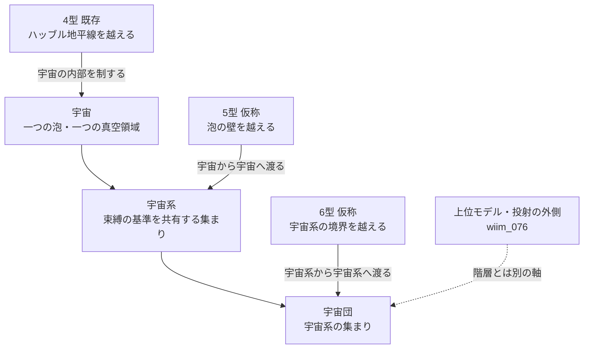

← [補遺・ノート一覧](README.md)

このノートは、「宇宙の外へ行ける文明」をどう定義するか、そして銀河系・銀河団に対応する「宇宙系」「宇宙団」という階層が成り立つかを検討した世界観メモです。物理的に確立した内容ではなく、既存の設定を土台にした思考実験上の整理であり、用語・階梯の番号はすべて仮称です。

---

## 「外」を場所で定義しない理由

- 標準的な宇宙論では、宇宙は境界を持たない有限の空間、あるいは無限の空間でありうる。境界がなければ、「外」は座標で指せる場所にならない
- カルダシェフスケール（[g002](../../glossary/terms/g002.md)）はエネルギー量を軸にするが、宇宙の総エネルギーがゼロかもしれない（[wiim_099](../quantum/wiim_099.md)のゼロエネルギー宇宙）以上、エネルギーでは「外」へ向けて延長できない

そこで文明の階梯は、場所やエネルギー量ではなく「**何を越えられるか**」「**何を操作できるか**」という操作的な基準で定義する。

---

## 宇宙の階層（仮称）

天文学の階層は、観測が届くたびに一段ずつ上がってきた。銀河系が「私たちのいる銀河」を指す固有の呼び名であるように、宇宙系は「私たちの宇宙が属する集まり」を指す語になる。

| 天文学の階層 | 宇宙の階層（仮称） | 定義の仮案 |
|---|---|---|
| 銀河 | 宇宙 | 一つの泡・一つの真空領域として連結した時空 |
| 銀河系・銀河群 | 宇宙系 | 束縛の基準を共有する宇宙の集まり |
| 銀河団・超銀河団 | 宇宙団 | 宇宙系がさらに集まった階層 |

銀河の束縛基準は重力だった。宇宙の「束縛」に当たる基準の候補は、既存の設定から次の四つが考えられる。

| 基準 | 意味 | 接点となる設定 |
|---|---|---|
| 系譜 | 同じインフレーション領域から分岐した泡 | [wiim_119](../cosmology/wiim_119.md) |
| 真空の系統 | 同じランドスケープの谷の系統に属する真空 | [wiim_127](../physics/wiim_127.md) |
| 空間の共有 | 一つの高次元空間（バルク）に並ぶブレーン群 | [wiim_029](../physics/wiim_029.md) |
| 群体 | 個々の宇宙が群体を構成する個虫にあたる | [wiim_126](../cosmology/wiim_126.md) |

---

## 基本対象の型が繰り返す——紐の描像（仮案）

「宇宙を一本の紐とみなせば、宇宙団は個別の紐の集まりになる」という見方は、そのまま字義どおりには置けない。[wiim_126](../cosmology/wiim_126.md)の時空のDNA仮説では、超弦理論（[g093](../../glossary/terms/g093.md)）の弦はあらゆる泡宇宙に共通する材料であり、宇宙ごとに違うのはコンパクト化という配列のほうだった。宇宙は「弦そのもの」ではなく、「共通の弦がどう折り畳まれたかの一つの配置」に当たる。

成り立つのは、各階層で「その階層の基本対象」の型が繰り返される、という読み方である。

| 段階 | 基本対象 | 対象を生成・消滅させる枠組み |
|---|---|---|
| 第一 | 粒子（あるいは弦）の波動関数 | 量子力学 |
| 第二 | 場の量子としての粒子 | 場の量子論（波動関数を場に格上げする） |
| 第三 | 場の量子としての宇宙 | 第三量子化（宇宙の波動関数を場に格上げする。理論的な提案） |

この読み方では、階層の三段はそれぞれ次のように対応する。

| 階層 | 紐の描像での読み | 多体状態としての読み |
|---|---|---|
| 宇宙 | その階層の基本対象一つ | 場の量子一つ |
| 宇宙系 | 束縛の基準を共有する対象の束 | 相関を持つ多宇宙状態 |
| 宇宙団 | 束の集まり | より大きな多宇宙状態 |

「宇宙団は個別の紐の集まり」という言い方は、この階層では「宇宙という基本対象の多体状態」と読み替える。

この描像には限界がある。

- 宇宙は内部に三次元の空間という構造を持つため、点や紐として扱えるのは、その階層から見た近似にすぎない
- 第三量子化は理論的に議論されてきた枠組みで、確立してはいない
- wiim_126の分担（弦は共通の材料、コンパクト化は配列）と整合させるため、「宇宙＝弦」とは書かず、基本対象の型が繰り返すという形にとどめる

---

## 宇宙同士のつながり——連結しているがインコヒーレント（仮案）

宇宙系の束縛の基準を「時空としてのつながり」に置く。個々の紐（宇宙）どうしは位相関係を持たず、干渉しないインコヒーレントな状態でよい。銀河団の銀河が、位相を揃えることなく共通の重力場を介して束縛されているのと同じ型であり、「一つの状態として揃っている」ことと「つながっている」ことは別に扱える。

つながりに当たるものの候補は次のとおり。

| つながりの種類 | 共有するもの | 対応する設定 |
|---|---|---|
| 親領域 | 泡が生まれた同一の膨張領域（大域的な時空） | [wiim_119](../cosmology/wiim_119.md)・[wiim_126](../cosmology/wiim_126.md) |
| バルク | 重力が漏れ出す高次元空間 | [wiim_029](../physics/wiim_029.md) |
| 真空の系統 | 時空ではなく、設定空間上でトンネルにより移れる経路 | [wiim_127](../physics/wiim_127.md) |

真空の系統は時空としての連続ではないため、この基準の外側に置く。親領域のつながりは、クダクラゲの群体で個虫が共通の茎につながっている姿（wiim_126）に対応させられる。この場合の茎は、泡を次々に生み出す永久インフレーションの親領域に当たる。

この描像の限界は次のとおり。

- つながりは位相的な性質であり、行き来の可否とは別である。永久インフレーションでは泡どうしは背景の膨張によって因果的に切れており、つながっていても信号も渡航も通らない
- インコヒーレントであるということは、宇宙どうしが干渉できないことを意味する。相互作用の窓は、バルクを介した重力や泡どうしの衝突のような限られたものに絞られる
- この基準では、宇宙系は「共通の背景を持つ宇宙の集まり」と定義できる。文明の5型が越える泡の壁は、連結した背景の内側での移動にあたる

---

## 文明の階梯（仮案）

既存の設定では、4型は「複数銀河に匹敵するエネルギーを制御し、ハッブル地平線に挑む文明」として扱われている（[wiim_078](../cosmology/wiim_078.md)・[wiim_079](../cosmology/wiim_079.md)）。ここでは4型までを「宇宙の内部で完結する文明」と読み、その先を越える境界の種類で延長する。

| 階梯（仮称） | 越える境界 | 操作できるもの | 接点となる設定 |
|---|---|---|---|
| 4型（既存） | ハッブル地平線 | 銀河規模の物質・エネルギーの配置 | [wiim_079](../cosmology/wiim_079.md)、[hubble_horizon_empire.md](hubble_horizon_empire.md) |
| 5型（仮称） | 泡宇宙の壁（同じ宇宙系の内側） | 真空の状態（壁の通過・真空遷移の制御） | [wiim_125](../physics/wiim_125.md)・[wiim_127](../physics/wiim_127.md)・[wiim_119](../cosmology/wiim_119.md) |
| 6型（仮称） | 宇宙系の境界 | 物理定数・ランドスケープ上の位置 | [wiim_014](../physics/wiim_014.md) |

7型以降は同じ規則で延長できるが、宇宙団以上の階層は現時点では定義に値する手がかりがない。

---

## 未解決の論点

| 論点 | 内容 |
|---|---|
| 「外」の相対性 | 泡宇宙の外もまだ「宇宙」の一部と言えてしまう。階梯は「相対的な外」の連鎖であり、すべてを含む絶対的な外は階層が尽きた先の極限か、そもそも定義できない可能性がある |
| 全体を集める問題 | 「すべての宇宙の集まり」を一つのまとまりとみなすと、それ自身がその中に含まれるかという自己言及の問題が生じる。[認識可能性の地平](ninshiki_chiheisen.md)の主題と重なる |
| 観測可能性 | 階層が意味を持つには観測の手がかりが要る。泡同士の衝突がCMBに痕跡を残すという理論的提案があり、探索も試みられたが確認はされていない。手がかりがなければ理論的な構造にとどまる |
| 上位モデルの扱い | [wiim_076](../cosmology/wiim_076.md)の「投射の外側」は、階層を渡って到達する「外」とは別の種類であり、この階梯には含めない |
| 実在の裏付け | 泡宇宙・ブレーン・ランドスケープはいずれも理論的な枠組みであり、どれも観測で確立していない |
