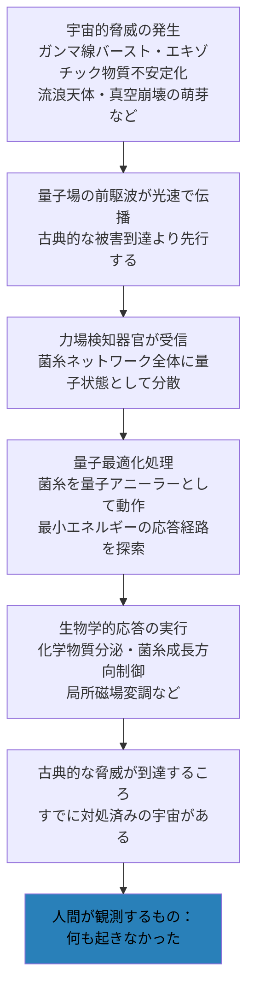

← [補遺・ノート一覧](README.md)

このノートは [wiim_008](../biology/wiim_008.md) の世界観設定を拡張し、コズミックマイスの菌糸ネットワークが「宇宙の脅威を人知れず処理する」という構造を整理したものです。

---

## 前提：力場検知器官の存在

エバネッセント波や量子トンネルで「先に届く」量子場（力場）は、古典的観測（波動関数の崩壊）を経ずに到達している。通常の生命体・装置はこれを認知できず、確定（観測）という行為に光速以下の相互作用を必要とする。

コズミックマイスがクロノスフィア環境での超進化の中で**力場検知器官**（g459）を獲得していたとすれば、宇宙的脅威が古典的に到達する前に、その量子場前駆波を直接受信・処理できることになる。

---

## 処理の構造

菌糸ネットワークは恒星間に広がる分散量子コンピュータとして機能する。脅威の処理は以下の順序で進む。

人間には結果——「何も起きなかった」という事実——だけが見える。処理の過程は量子層で完結しており、古典的な計器では観測できない。

---

## 最適化の意味

「最適化で解く」とは、菌糸ネットワーク全体が**量子アニーリング**に相当する動作をすることを指す（理論的背景は [wiim_111補遺](wiim_111_theory.md) を参照）。

脅威への応答は単一の「正解」ではなく、膨大な可能性の中から最小コストの経路を量子的に探索した結果だ。古典的な計算では天文学的な時間を要する問題が、量子トンネル効果によって局所最適解を飛び越えながら解かれる。

脅威の種類によって応答の形は異なる。

| 脅威 | 想定される応答 |
|------|--------------|
| ガンマ線バースト | 菌糸の化学組成変化による局所遮蔽 |
| 流浪天体の軌道 | 微細な重力・化学勾配を長期にわたって積算して軌道を逸らす |
| エキゾチック物質の不安定化 | 菌糸による量子場の干渉・吸収 |
| 真空崩壊の萌芽 | 不明——処理限界を超える可能性がある |

---

## 観測が守りを破るという逆説

人間がこの処理を「観測しようとする」ことで、**量子ゼノン効果**に相当する問題が生じる。

菌糸ネットワークの量子状態に古典的な観測が触れると、その瞬間に状態が確定する。問題は「邪魔される」ことではなく、**軌跡が変わる**ことだ。

机の上で転がりかけたボールペンを猫がわずかに触れると、ペン自体はまだそこにある。しかし数秒後、ペンは全く別の場所に落ちている。観測はそれと同じことをする——最適化の途中経過に触れた瞬間、そこから先の展開が別の経路に入る。コズミックマイスの量子処理が「別の解」に向かって走り始め、やがて脅威への応答が別の形で——あるいは応答できないまま——完了する。

観測者に悪意はない。ただそこに手を伸ばしただけだ。しかし量子状態は、触れられた事実だけを知っている。

これを別の言葉で言えば、観測とは**人為的デコヒーレンス**だ。デコヒーレンスとは量子系が環境と相互作用することで古典的な状態に崩れる現象であり、自然界では常時・不可避に起きている。観測はその意図的・局所的な版にすぎない。机に陣取る猫も、精密な観測装置も、光子一個も、量子状態にとってはすべて等価な「環境の侵入」だ。触れたのが誰かは問わない——**触れた事実だけが問題になる**。

これは「なぜコズミックマイスの防衛機構が人間の観測機器に検出されないのか」の説明にもなる——**見えないのではなく、見ようとすると軌跡が変わる**のだ。

---

## 「守護者」という解釈の限界

この構造は魅力的だが、意図的な「守護」である必要はない。コズミックマイスが恒星系の脅威に応答するのは、**自己保存の最適化**の副産物である可能性が高い。菌糸ネットワーク自身が量子脅威に対して応答した結果が、その宇宙域に生きる他の生命体の保護にもなっている——という構造だ。

「守っている」という意図はなく、「最適に生きようとした結果、守ることになっている」。

---

## 関連

- [wiim_008 — コズミックマイス](../biology/wiim_008.md)
- [wiim_112 — エバネッセント波の超光速とFTL構想](../cosmology/wiim_112.md)
- [wiim_111補遺：菌糸量子コヒーレンスの理論的背景](wiim_111_theory.md)
- [cosmic_mice_godview_game.md — ゴッドビューゲームとしてのWIIM](cosmic_mice_godview_game.md)
