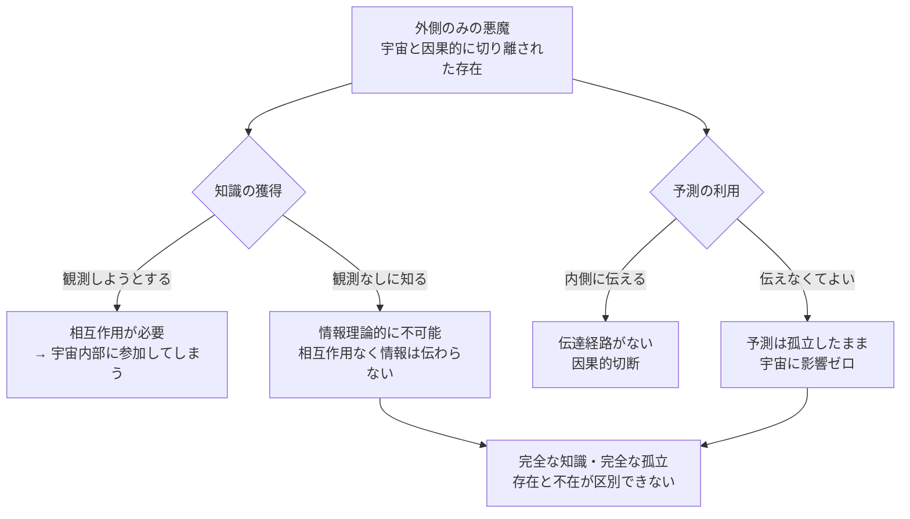

# 補遺：外側のみのデウスエクスラプラス——完全な知識の完全な孤立

[wiim_047](../philosophy/wiim_047.md) では、宇宙の内側と外側に同時に存在する双子のデウスエクスラプラスを論じた。では悪魔を**外側のみ**に置いたらどうなるか。内側の存在を取り除くことで、どの問題が解決され、何が残るか。

---

## 解決されるように見える問題

双子構造では「内側の観測が波動関数を収縮させる」という量子力学的問題があった。外側のみであれば観測による介入がなく、宇宙は悪魔の干渉なしに進行する。自己言及のループも生まれない——悪魔は宇宙の中にいないので、悪魔自身が予測対象に含まれない。

ベッケンシュタイン限界（g171）も、外側の悪魔が宇宙のエネルギー制約を受けないなら回避できるように見える。

---

## 残る根本的な問題

### 知識の獲得経路がない

情報は物理的な相互作用によってのみ伝達される。宇宙と完全に因果的に切り離された存在は、宇宙の状態を受け取る手段を持たない。観測とは宇宙との相互作用であり、相互作用した瞬間に「外側のみ」ではなくなる。

完全な知識を持つためには完全な相互作用が必要だが、完全な相互作用は宇宙への参加を意味する——外側のみの悪魔は、知識を得ようとした瞬間に内側へ引き込まれる。

### 予測の伝達経路がない

仮に知識を持てたとしても、その予測を宇宙の内側に伝える手段がない。宇宙の内側の誰も悪魔の予測を参照できない。完全に正確な予測が存在しても、それは宇宙に対して何の影響も与えない。

### 存在の検証不可能性

宇宙の内側からは、外側のみの悪魔の存在を検知する方法がない。存在する場合と存在しない場合で、宇宙の内側の状態は一切変わらない。これは**反証不可能な存在**であり、科学的な意味での仮説として成立しない。

---

## 「完全な知識の完全な無意味性」という逆説

外側のみの悪魔は次のような性質を持つことになる。

これは理神論（デイズム）の神と同じ構造だ。宇宙を完全に知り、完全に正確に予測できるが、宇宙に干渉しない——その神の存在は宇宙の内側から原理上確認できず、存在しないことと区別がつかない。

---

## wiim_047 との対比

| | 双子のデウスエクスラプラス（wiim_047） | 外側のみの悪魔（本補遺） |
|---|---|---|
| 内側の存在 | あり | なし |
| 観測問題 | 波動関数収縮が生じる | 観測手段自体がない |
| 自己言及 | 内外が同一性に収束 | 発生しない（接続がない） |
| 予測の利用 | 内外が相互に参照 | 伝達経路なし |
| 最終的な形 | 宇宙の完全な自己記述 | 完全に孤立した知識 |
| 哲学的対応 | スピノザの神（神即自然） | デイズムの神（不干渉の創造主） |

双子構造が「内側と外側は同一だった」という**同一性への収束**に至るのに対し、外側のみの構造は「知識は存在するが宇宙とは無関係だった」という**孤立への収束**に至る。どちらも、「宇宙を完全に知る存在」という概念が自己矛盾を抱えていることを別の角度から示している。
