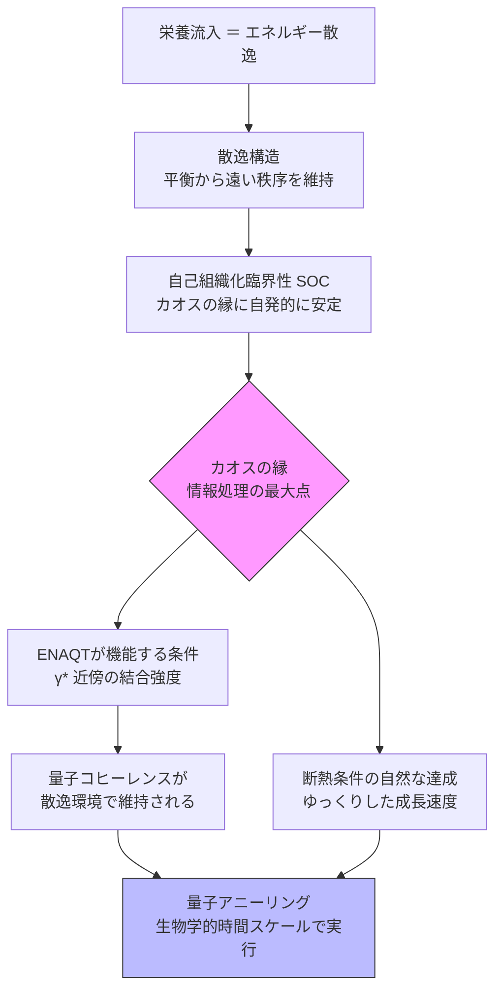

← [補遺・ノート一覧](README.md)

このノートは [wiim_111](../quantum/wiim_111.md) の思考実験を支える理論的基盤を科学的に整理したものです。

---

## 量子アニーリングのジレンマ

量子アニーリングは最適化問題を量子力学的に解く手法で、D-Wave等の実機が存在する。核心的なアイデアは「量子トンネル効果によって古典的な局所最適解をすり抜けて大域的最適解に到達する」ことだ。

しかし根本的なジレンマがある。断熱定理が要求する「ゆっくり変化すること（断熱条件）」と、時間が経つほど量子状態が壊れる「デコヒーレンス」が矛盾する。

| 要件 | 要求する方向 |
|------|------------|
| 断熱条件 | 長い時間をかける |
| デコヒーレンス抑制 | 短時間で完了させる |

この二律背反が量子アニーリングの中心的な工学的課題になっている。

---

## 散逸構造（プリゴジン）

1977年ノーベル化学賞を受賞したイリヤ・プリゴジンの概念。**開放系**がエネルギーを環境に散逸しながら、平衡から遠い状態に自己組織化された秩序を維持する系を指す。

代表例：ベナール対流（加熱された流体の規則的な渦）、ベロウソフ-ジャボチンスキー反応（化学振動）、**生命体そのもの**。

菌糸ネットワークは典型的な散逸構造だ。栄養（化学エネルギー）を継続的に消費することで、ランダムな拡散ではなく最適化されたネットワーク構造を維持する。

---

## カオスの縁（Edge of Chaos）と自己組織化臨界性

クリス・ラングトン（1990年代）が提唱した複雑系の概念。

```
完全な秩序 → 情報が伝わらない（結晶）
カオスの縁  → 情報の保存と伝達が共存・計算能力が最大
完全なカオス → 情報が消える（熱雑音）
```

パー・バックの**自己組織化臨界性（SOC）**は、一部の系が外部制御なしに自発的にこの縁へ引き寄せられることを示す。砂山モデルが典型で、脳の神経発火・地震の頻度分布・菌糸ネットワークの成長パターンがべき乗則に従うことがSOCの証拠として議論される。

---

## 環境援助量子輸送（ENAQT）

Environment-Assisted Quantum Transport の略。フレミングら（2007年）が光合成複合体の量子コヒーレンスを観察したことで注目された概念（古典的振動との区別は現在も議論中）。

通常の直感では、環境との結合はデコヒーレンスを引き起こす「敵」だ。ENAQTはこれを覆す。

$$\eta = \eta(\gamma), \quad \text{最大値は} \; \gamma = \gamma^* \; \text{で達成}$$

エネルギー転送効率 $\eta$ は環境結合強度 $\gamma$ の関数として単調ではなく、**最適な乱雑さ** $\gamma^*$ で最大化される。完全な孤立（$\gamma=0$）でも完全な散逸（$\gamma\to\infty$）でもなく、中間点が最も効率が高い。

---

## 三層構造の接続



三つの概念は独立した理論ではなく、「散逸構造がカオスの縁を生み出し、カオスの縁がENAQTの成立条件を整え、ENAQTが量子アニーリングを可能にする」という連鎖を形成する可能性がある。

---

## 主な批判と限界

| 論点 | 問題 |
|------|------|
| 時間スケールの乖離 | デコヒーレンス（fs〜ps）と生物応答（分〜時間）の差は12桁 |
| SOCと量子の断絶 | SOCはマクロな統計現象であり、ナノスケールの量子効果と共存する直接証拠がない |
| 断熱定理と開放系の矛盾 | 断熱定理は孤立系が前提。散逸構造は開放系であり論理的に矛盾する |
| ENAQTの観察状況 | 光合成でのコヒーレンス観察は古典的振動との混同が指摘されており確立した事実ではない |

この三層構造が**宇宙環境のコズミックマイスで成立するかどうか**は [wiim_111](../quantum/wiim_111.md) で論じている。
