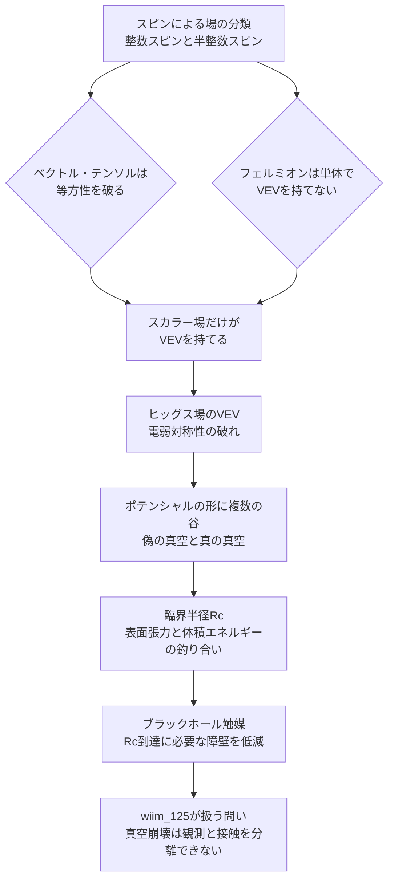

← [補遺・ノート一覧](README.md)

このノートは [wiim_125](../physics/wiim_125.md) が前提としている物理概念——スピンによる場の分類、真空期待値（VEV）の正体、そしてヒッグス場がなぜスカラーでなければならないか——を整理したものです。

---

## スピンとは何か——回転群の下での振る舞い

スピン $s$ とは、ある対象を回転させたときに内部の"向き"の情報が何成分あるかを表す数で、$2s+1$ 個の成分（状態）を持つ。これは電子の「スピン1/2」も、光子の「スピン1」も、ヒッグス粒子の「スピン0」も同じものさしの上にある。

さらに、スピン $s$ の対象は $360°/s$ 回転させるごとに元の状態へ戻るという幾何学的な性質を持つ。

| スピン | 元に戻る周期 | 具体例 |
|---|---|---|
| $s=0$（スカラー） | どんな角度でも常に同じ | ヒッグス粒子 |
| $s=1$（ベクトル） | $360°$ | 光子・W/Zボゾン |
| $s=2$（テンソル） | $180°$（1回転で2回戻る） | 重力子（未観測）・重力波の偏極パターン |
| $s=1/2$（スピノル） | $720°$（2回転でようやく戻る） | 電子・クォーク |

整数スピン（0, 1, 2, …）は**ボソン**、半整数スピン（1/2, 3/2, …）は**フェルミオン**と呼ばれ、統計的な性質が根本的に異なる（→ g064）。この整数・半整数の境界線が、次節の「誰が真空期待値を持てるか」を決める分水嶺になる。

---

## なぜスカラー場だけが真空期待値を持てるか

真空期待値（VEV）——真空中でもゼロでない値に落ち着く場の値——を持てる資格は、あらゆる場に平等に与えられているわけではない。

- **ベクトル・テンソル場（$s\geq1$）**：ゼロでない値を持つと、空間に特定の向きが刻まれ、宇宙の等方性（どの方向を見ても同じという性質）を破ってしまう。CMB（宇宙背景放射）は10万分の1のレベルで等方的であることが確認されており、この種の理論は強く制約される
- **フェルミオン場（半整数スピン）**：反交換関係（グラスマン数的な性質）に従うため、単体では $\langle 0|\hat\psi|0\rangle$ が恒等的にゼロになる。真空の構造に関与できるのは、2つのフェルミオン場を掛け合わせた複合的なスカラー量（クォーク凝縮 $\langle\bar q q\rangle$ など）としてのみ
- **スカラー場（$s=0$）**：ローレンツ群の自明表現であり、回転・ブーストに対して不変。時空対称性を一切破らずにゼロでない値を持てる、唯一の型

つまりヒッグス場がスカラーであることは慣習ではなく、「時空の等方性を破らず、かつ単体で非ゼロになれる」という条件をクリアできる唯一の生き残りという、消去法の結果である。

> **余談**：質量を持つベクトル場（W/Zボゾン）の縦波成分は、質量のないベクトル場を1次元多い時空に置いたときの余剰次元方向の運動量と自由度の数が一致する（$D-2$ の関係）。この対応関係を文字通り「余剰次元が折り畳まれている」と解釈する理論が**ゲージ・ヒッグス統一**だが、これは有力な仮説の一つであって実証された事実ではない。

---

## 真空期待値（VEV）とは——ヒッグス機構と「ゼロ」の相対性

ヒッグス場が非ゼロのVEVを持つと、電弱ゲージ対称性 $SU(2)\times U(1)$ が破れ、スカラーの実自由度4つのうち3つがW/Zボゾン（ベクトル場）の縦波成分として吸収される。残る1自由度が観測されたヒッグス粒子である。LHC（ATLAS・CMS）はこの粒子のスピン・パリティを実測し、$J^{PC}=0^{++}$（真のスカラー）と確認している——理論的要請ではなく実測結果である。

「真空期待値がゼロ」という言明は、実は以下の4つの前提に暗黙に依存しており、どれか一つを変えると非ゼロとして立ち現れうる。

1. **基底・ゲージの選び方**：対称性が破れた場のポテンシャルの谷底は単一の点でなく縮退した円・球面。「どの方向をゼロと呼ぶか」は人為的な選択であり、不変なのは大きさ（半径）のみ
2. **エネルギースケール（くりこみ群の走り）**：ポテンシャルの形自体が観測するエネルギースケールに依存する。身近なエネルギー領域では安定に見えても、はるかに高い場の値まで理論を延長すると、より深い谷（真の真空）が現れうる——これが次節の真空崩壊の数学的正体
3. **統計平均としてのゼロ**：$\langle 0|\hat\phi|0\rangle=0$ でも $\langle 0|\hat\phi^2|0\rangle\neq0$。ゼロは無数の量子ゆらぎを均した平均値にすぎず、瞬間瞬間の場は常にゼロ以外の値を取る（カシミール効果の起源）
4. **観測者依存性**：ウンルー効果のように、等速観測者が「真空（粒子ゼロ）」と判定する状態を、加速する観測者は熱浴として観測する。「ここは真空だ」という判定自体が運動状態に依存しうる

---

## 真空崩壊の力学——臨界半径という一線

偽の真空から真の真空への転移は、単純にエネルギーの低い方へ転がり落ちるだけでは起きない。転移領域とまだ転移していない周囲との境界（壁）自体にエネルギーコスト（表面張力に相当する量 $\sigma$）がかかるためだ。

転移領域（泡）の半径 $R$ に対し、体積エネルギーの得（$\propto R^3 \Delta\rho$）と表面エネルギーの損（$\propto R^2\sigma$）がせめぎ合う。小さい $R$ では表面コストが勝り、泡は自発的に潰れて周囲の偽の真空に飲み込まれる。この釣り合いから決まる臨界半径

$$
R_c = \frac{2\sigma}{\Delta\rho\, c^2}
$$

を超えて初めて、体積の得が表面コストに勝ち、泡は際限なく成長する。$R_c$未満は埋め戻される運命、$R_c$以上は不可逆に成長する運命——中間はない。

wiim_125が前提とする「ブラックホール触媒」（Gregory・Moss・Withersらの理論的示唆）は、この $R_c$ に到達するのに必要な活性化エネルギー（ユークリッド作用 $S_E$）を、地平面近傍の強い時空曲率が肩代わりして下げる、という主張である。過冷却水に不純物を入れると均一核形成よりずっと簡単に凍結が始まるのと同じ構造だ。

---

## ブラックホール以外の触媒環境

同じ数学的枠組み——核形成障壁を下げる、あるいは場の値を直接押し上げる——に分類できる環境は、ブラックホール以外にも理論的に議論されている。

| 環境 | 機構 | 備考 |
|---|---|---|
| 中性子星 | 湯川結合を介してヒッグス場の有効ポテンシャルの形そのものを局所的に歪める。地平面という幾何学的トリックなしに障壁が消失しうる | ブラックホールより直接的。老いた中性子星が崩壊せず存在する事実が、不安定スケールへの経験的な下限を与える |
| 高温プラズマ | 量子トンネルでなく熱ゆらぎによる古典的な障壁越え（スファレロン的過程、$\sim e^{-E_{sph}/T}$）が支配的になる | 初期宇宙の再加熱期で特に重要 |
| 宇宙論的地平面（ドジッター温度） | ギボンズ・ホーキング効果。急膨張する時空の地平線自体が対応する温度を持ち、ブラックホール地平面と同じ論理でトンネルを助ける | 現在のハッブル温度は無視できるほど低いが、インフレーション期は重要 |
| プレヒーティング | インフラトン場の急激な振動が特定モードへ共鳴的にエネルギーを注ぎ込み、障壁を下げずに場の値を直接励起する | 曲率を使わない、質的に異なるルート |

いずれも「曲率・物質による障壁の低減」（ブラックホール・中性子星・宇宙論的地平面）と「熱・共鳴による場の直接的な励起」（高温プラズマ・プレヒーティング）の2系統に大別できる。なお、宇宙線同士が加速器実験よりずっと高いエネルギーで日常的に衝突しているにもかかわらず崩壊が観測されていないという事実も、崩壊しやすさへの数少ない経験的な制約の一つとして使われる。

---

## 三者の接続

---

## 主な限定・注意点

| 論点 | 限定 |
|------|------|
| 場の型が動的に変わるという誤解 | スピン・表現は場の定義そのものであり、時間発展で別の型に転じることはない。変わりうるのは真空期待値（状態）の方 |
| 「構造だから崩壊しない」という直感 | 構造実在論は変化そのものを否定しない。場（演算子）と真空状態（配置）の混同から生じる誤解である可能性が高い |
| ゲージ・ヒッグス統一 | 自由度の勘定が一致するという数学的事実は確かだが、実在の余剰次元を要求する証拠は現時点でない |
| ベクトル・テンソル型ダークエネルギー | 理論的に排除されてはいないが、等方性の観測制約（CMB）により強く不利 |
| 中性子星による触媒 | 機構自体は湯川結合による有効ポテンシャルの歪みとして妥当だが、具体的な論文の著者・出典は本ノート作成時点で未確認。引用する場合は裏取りが必要 |
| 「起こるか」「起こったらどう振る舞うか」の検証可能性 | いずれも実測ではなく理論的外挿にとどまる。崩壊が予測通り不可逆・光速漸近的に広がるという挙動は、実際に起きた場合に観測者自身が巻き込まれるため原理的に確認できない。宇宙の年齢（存続期間）から平均寿命の統計的下限を得られるのみ |

このノートで整理した「なぜスカラー場が真空崩壊の主役たりうるか」という基礎は、[wiim_125](../physics/wiim_125.md) が論じる「真空崩壊を人為的に実験・観測できるか」という問いの前提を支えている。
