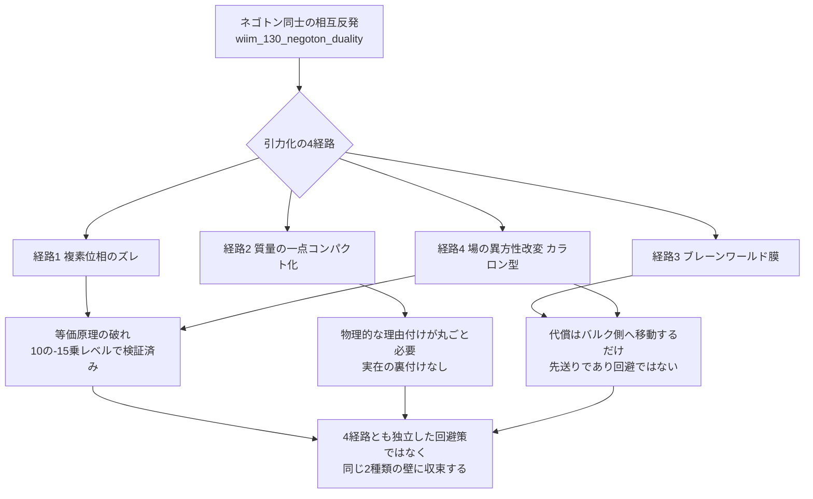

← [補遺・ノート一覧](README.md)

[wiim_130_negoton_duality.md](wiim_130_negoton_duality.md)で整理した通り、ネゴトン（[g126](../../glossary/terms/g126.md)）同士は等価原理のもとで単純な相互反発になる。このノートは、この相互反発を引力へ転じさせる4つの思考実験的な経路を検討し、どれも既存の壁のどれかに帰着することを整理したものです。

---

## 経路1：複素位相のズレ

重力質量と慣性質量の位相を意図的にずらし、等価原理による符号キャンセルを回避する経路。

- **着想の裏付け**：虚数温度（ホロウゲイザー・[g344](../../glossary/terms/g344.md)、[wiim_087](../physics/wiim_087.md)）や複素エネルギー（パランティ粒子・[g161](../../glossary/terms/g161.md)、[wiim_076](../cosmology/wiim_076.md)）など、複素数を使った例外処理はこの世界観の既存の道具立てと親和性が高い
- **新たに生じる代償**：重力質量と慣性質量の等価性は10⁻¹⁵レベルで実験検証されている——これを破ること自体が、ネゴトンの「負の実質量」という仮定よりもさらに一段深い追加の仮定になる
- **実在理論との距離**：虚数温度は有限温度場の理論（マツバラ形式）という実在の解析接続技法に土台があるが、「等価原理を複素位相でずらす」に対応する実在の技法は見当たらない——ほぼ完全にWIIM独自の発明

---

## 経路2：質量の一点コンパクト化

質量の値域を実数直線ではなく輪（実射影直線・リーマン球面のような一点コンパクト化）とみなし、極端に負の質量が"裏側"で極端に正の質量と地続きになる、とする経路。

- **着想の裏付け**：射影幾何学・リーマン球面という数学的に確立した構造そのものは実在する
- **新たに生じる代償**：質量という物理量の値域がなぜ輪の位相を持つのか、物理的な理由付けが丸ごと必要になる
- **世界観内の系譜**：[wiim_067](../physics/wiim_067.md)の排除地平線（ネゴトン凝縮体が臨界規模に達すると斥力が光速相当になり崩壊してミニ・ビッグバンを起こす）と同じ「極端な負質量が質的に別の何かへ転じる」という主題の延長線上にある

---

## 経路3：ブレーンワールド膜（埋め込み方向の実体化）

[wiim_130](../physics/wiim_130.md)で「ただの可視化」と退けた埋め込み図の"上方向"を、実在する余剰次元として立てる経路。二つのネゴトンが作る「盛り上がり」が、直接の4次元重力とは別に、共有するバルク（余剰次元側の場）を介して引き合う。

- **着想の裏付け**：重力だけが余剰次元へ漏れ出すブレーンワールド理論は、[wiim_029](../physics/wiim_029.md)・[wiim_032](../physics/wiim_032.md)がすでに採用しているコーラ粒子の余剰次元と同系統の枠組み
- **新たに生じる代償**：膜を押し上げるエネルギーはバルク側のどこかに蓄積される——[wiim_095](../physics/wiim_095.md)の彫刻アプローチが抱えていた「境界に濃縮される」問題の、次元を一つ増やした再来になる（CLAUDE.mdが定める「余剰次元は問題の先送りであり完全な回避ではない」という原則そのもの）

---

## 経路4：場の異方性改変（カラロン型）

粒子やエネルギーを足すのではなく、時空の"硬さ"（アインシュタイン方程式の結合係数）そのものを局所的・方向依存的に変える経路。

- **着想の裏付け**：[wiim_123](../physics/wiim_123.md)のカラロンがすでに同じ土俵——スカラー・テンソル重力理論（ブランス=ディッケ理論・カメレオン場）——を扱っている
- **新たに生じる代償**：
  1. スカラー・テンソル理論は共形変換（ジョルダン系↔アインシュタイン系）により「通常のGR＋実効的なスカラー場のエネルギー運動量テンソル」と数学的に等価であることが知られている。つまり「場を変える」は見かけ上の回避であり、負エネルギー問題を粒子から場へ付け替えているにすぎない
  2. 太陽系規模の精密観測により局所的な変動はすでに強く制限されている（[wiim_123](../physics/wiim_123.md)既出の壁）
  3. 「特定方向に引く」という異方性を持たせるなら局所ローレンツ不変性を破ることになり、等方的な偏差よりもさらに厳しい実験的制約を受ける

---

## 4経路の収束先

4つの経路は見た目こそ異なるが、最終的には次のいずれかに帰着する。

1. **等価原理（あるいはその類似物）を直接破る**必要が生じる（経路1・経路4後半）
2. **代償を別の場所へ移すだけ**で、消滅させてはいない（経路3・経路4前半）
3. **物理的な裏付けを欠いた、値域の位相構造という追加の公理そのものが必要**になる（経路2）

---

## 主な限定・注意点

| 論点 | 限定 |
|------|------|
| 網羅性 | この4経路は本スレッドの議論から出たものであり、理論的に考えうる全ての経路を尽くしたわけではない |
| 経路4の「共形等価」 | ジョルダン系とアインシュタイン系の等価性は標準的なスカラー・テンソル理論の枠組みでの話であり、カラロンのような架空の符号反転粒子がこの等価性を厳密に保つかどうかは未検証 |
| 経路1・2の実在裏付けの弱さ | 経路3・4が実在の理論的枠組み（ブレーンワールド・スカラー-テンソル理論）を土台にしているのに対し、経路1・2はWIIM独自の発明に近く、検証可能性という点で性質が異なる |

現時点ではいずれの経路も記事化には値しないと判断し、このノートに留める。将来的に一つの経路を選んで深掘りする場合は、[wiim_130](../physics/wiim_130.md)・[wiim_131](../physics/wiim_131.md)に続く三部作の完結編として位置づけられる。
