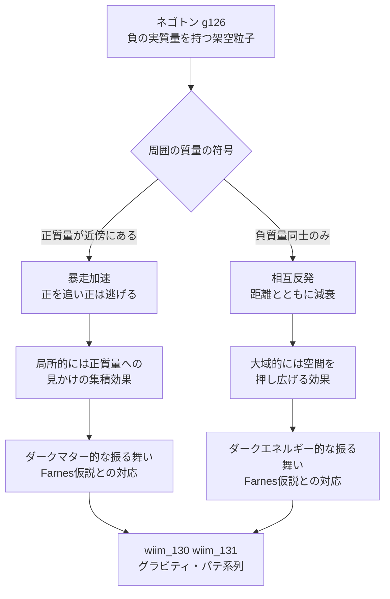

← [補遺・ノート一覧](README.md)

このノートは [wiim_130](../physics/wiim_130.md)・[wiim_131](../physics/wiim_131.md) のグラビティ・パテ系列を検討する過程で出た副産物——ネゴトン（[g126](../../glossary/terms/g126.md)）同士の相互作用がなぜ「ランナウェイ」にならず「相互反発」になるのか、そしてその区別が実在の宇宙論仮説とどう重なるのか——を整理したものです。

---

## 質量の符号がつくる三つの体制

二体の重力加速度は、等価原理（重力質量＝慣性質量）のもとでは相手の質量の符号だけで決まる。自分自身の質量は力の式（分子）と加速度の式（分母）の両方に現れて打ち消し合うためだ。

物体1が物体2から受ける加速度 $a_1$ は、$m_1$ の符号によらず

$$
a_1 = \frac{Gm_2}{r^2}\ (\text{物体2の方向を正とする})
$$

で決まる。$m_2>0$ なら物体1は常に物体2の方向へ、$m_2<0$ なら常に物体2と逆方向へ加速する——これは物体1自身が正質量でも負質量でも変わらない。

この対称性から、二体の組み合わせは3つの体制に分かれる。

| 組み合わせ | 物体1の挙動 | 物体2の挙動 | 結果 |
|---|---|---|---|
| 正＋正 | 2の方向へ加速 | 1の方向へ加速 | 相互引力・凝集（通常の重力collapse） |
| 正＋負 | 負から逃げる方向へ加速 | 正を追う方向へ加速 | 両者が同じ方向へ加速し続けるランナウェイ（[g126](../../glossary/terms/g126.md)の暴走加速） |
| 負＋負 | 相手と逆方向へ加速 | 相手と逆方向へ加速 | 単純な相互反発（束縛も無限加速もしない） |

---

## 局所のランナウェイと大域の相互反発は別の現象

正＋負のランナウェイは、負質量が正質量を「追いかけ」、正質量が「逃げる」ことで、両者が同じ方向へ加速しながら一定の間隔を保って走り続ける現象だ。軌道を描いて周回することはなく、エネルギー保存則と矛盾しないまま（負質量が負の運動量を持ち出すため合計は保存される）無限に加速し続ける、というのがこの現象の不気味さの核心になる。

これに対して負＋負の相互反発は、力の大きさが距離の2乗に反比例して弱まる、ごく普通の斥力散乱にすぎない。互いに離れるほど反発は弱まり、ランナウェイのような無限加速には至らない。「逃げていく」という表面的な印象は共通していても、片方は無限に加速し続ける不安定現象、もう片方は距離とともに収束していく穏やかな現象であり、メカニズムとしては別物である。

---

## 実在理論との対応——負質量ダークフラウィド仮説

この局所／大域の非対称性は、天文学者Jamie Farnesが2018年に発表した「負質量ダークフラウィド」仮説（*A&A* 620, A92）の骨格とよく似ている。

| WIIMでの整理 | Farnes仮説での対応 |
|---|---|
| 正＋負のランナウェイ（局所） | 負質量が正質量（銀河）の周囲に集積するように振る舞う → 銀河の回転曲線を平坦化する、ダークマターと同じ効果 |
| 負＋負の相互反発（大域） | 負質量同士が互いを押しのけ合う → 宇宙全体を押し広げる、ダークエネルギーと同じ効果 |

Farnes仮説では、負質量粒子が宇宙膨張とともに希釈されないよう連続的に生成され続けると仮定することで、上記の二つの効果を単一の流体で同時に説明しようとする。著者自身によるN体シミュレーションでは、自由パラメータなしで現実的な銀河回転曲線が再現されたと報告されている。

---

## WIIM世界内での対応

---

## 主な限定・注意点

| 論点 | 限定 |
|------|------|
| Farnes仮説の確度 | 主流のΛCDMモデルに対する代替仮説の一つであり、観測による独立検証・追認は本ノート作成時点で確立していない。あくまで示唆に富む類比として扱う |
| 二体描像とN体流体の違い | 上表の「正＋負＝局所集積／負＋負＝大域反発」という整理は、単純化した二体力学からの直感的な対応付けにすぎない。Farnes仮説本体は連続生成される流体を一般相対論的な枠組みで扱っており、個々の粒子対が文字通り追いかけっこをするわけではない |
| ネゴトンとの一致度 | ネゴトンは連続生成を前提としない、既存のWIIM架空粒子として扱われてきた（[wiim_003](../physics/wiim_003.md)以来）。Farnes仮説の「宇宙膨張に応じた連続生成」という要素をネゴトンに輸入するかどうかは、今後の記事で個別に検討する必要がある |
| ランナウェイと相互反発の呼び分け | 「逃げる」という言葉の印象が共通するため混同されやすいが、前者は無限加速する不安定現象、後者は距離とともに収束する散乱現象であり、安定性の性質が根本的に異なる |

この整理は、将来的に「反重力銀河」あるいは「ネゴトンによるダークマター・ダークエネルギー統一」のような記事を書く場合の土台として位置づけられる。現時点では記事化はせず、このノートに留める。
