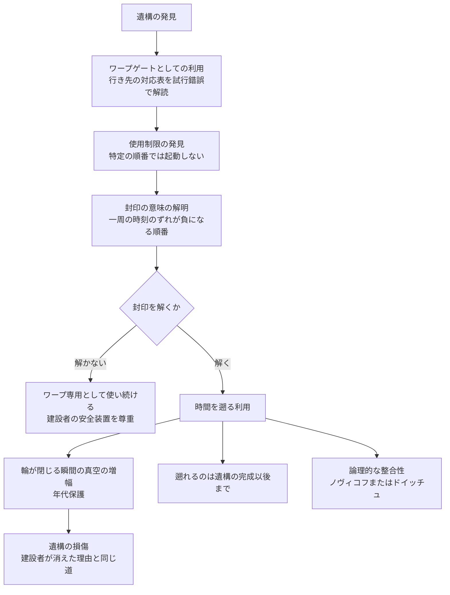

← [補遺・ノート一覧](README.md)

このノートは、[wiim_136](../cosmology/wiim_136.md)の方式⑤「先行文明の遺構の借用」で想定した渡航機構の正体について、[wiim_142](../cosmology/wiim_142.md)で構想したブレーンヘリクス（[g535](../../glossary/terms/g535.md)、和名「膜の螺旋階段」）を当てはめる一説を整理した世界観メモです。不可能性の根拠はwiim_142で論じたため、ここでは「もし遺構がブレーンヘリクスだったら、世界観の中で何が説明でき、どんな痕跡が残るか」に絞ります。

---

## ブレーンヘリクスの二つの顔

ブレーンヘリクスは、複数の膜をらせん状に巡る機構だ。同じ機構が、経路の選び方だけでワープにもタイムマシンにもなる。

| 経路 | 結果 | 用途 |
|---|---|---|
| 膜を巡って**別の場所**に出る | 空間の近道 | ワープゲート |
| 膜を巡って**同じ場所**に戻り、一周の時刻のずれの合計が0以上 | 出発後の同じ場所に戻る | 実用上の意味は薄い（点検・試験用の周回） |
| 膜を巡って**同じ場所**に戻り、一周の時刻のずれの合計が負 | 出発前の同じ場所に戻る | タイムマシン |

人類が遺構を「ワープゲート」として見つけ、使い始めたとしても、その機構がタイムマシンでもあることに気付くとは限らない。遺構説の核心はここにある。**ワープ装置とタイムマシンは別々の発明ではなく、一つの機構の二つの使い方**だという点だ。

---

## 遺構説が説明するもの

### 1. 遺構が古いこと自体が、建設者の時代を示す

ブレーンヘリクスは、完成より前の過去には通じない（wiim_142）。この制約から、次の連鎖が導かれる。

- 遺構を経由して到着できるのは、遺構が完成した時刻より後だけである
- → 過去のある時代に遺構が存在するなら、それはその時代以前に建設されたものである
- → 「未来の人類が作って過去に残した」という説は成り立たない。建設者は、遺構の年代と同じかそれより古い文明である
- → **遺構が古いほど、遡れる過去も深い**。最古の遺構は、最も深い過去へ通じる唯一の階段になる

世界観の中では、遺構の価値が「どこへ行けるか」ではなく「いつまで遡れるか」で決まる、という独特の評価軸が生まれる。恐竜の時代を訪れたい者は、その時代より古い遺構を探すしかない。

### 2. 「理由の分からない使用制限」の正体

wiim_136は、建設者が因果の問題を解決済みなら、人類にはそれが**理由の分からない使用制限**として現れるはずだとした。遺構説では、この制限の正体を具体的に説明できる。

- 一周の時刻のずれが負になる経路の組み合わせが、封印されている
- 個々のゲートはどれも使えるが、**特定の順番で巡ることだけができない**
- 封印は、建設者が年代保護を工学的に組み込んだもの、つまり自然に任せず自分たちで時間の輪を防いだ仕組みにあたる

人類にとって、封印は最初は意味の分からない故障や誤作動に見えるだろう。ゲートの使用記録を集め、「この順番で通ろうとすると必ず起動しない」という規則性に気付いたとき、初めて封印の存在が浮かび上がる。そして封印が守っている順番を一周たどると、時刻のずれの合計が負になることを計算で確かめたとき、遺構の正体が明らかになる。

### 3. 遺構の損傷は、輪が閉じた瞬間の傷跡かもしれない

年代保護仮説（[g531](../../glossary/terms/g531.md)）によれば、時間の輪が閉じる瞬間、真空のゆらぎが輪を周回するたびに増幅され、輪を作る構造を壊すと考えられる。

遺構の一部が壊れている理由として、「かつて誰かが封印を解いて輪を閉じた瞬間の爆発の跡」という読み方ができる。封印を解いたのが建設者自身なら、建設者が姿を消した理由もこれで説明できるかもしれない。遺構の損傷の分布を調べれば、どの順番の輪が閉じかけたのかを逆算できる可能性もある。

この読み方は、遺構を使う人類への警告にもなる。封印は単なる規則ではなく、建設者が自らの失敗から学んだ安全装置だったのかもしれない。

### 4. 建設者は文明の階梯のどこにいるか

[宇宙の階層と文明の階梯](universe_hierarchy_civilization_ladder.md)の仮案では、宇宙から宇宙へ渡る文明を5型（仮称）としている。同じバルクに並ぶ膜を巡るブレーンヘリクスの建設者は、この5型にあたる。

ただし、ブレーンヘリクスには5型の定義にない要素が一つ加わる。膜と膜の間の**時刻の継ぎ目**を操作する能力だ。空間の境界を越えるだけでなく、宇宙ごとの時刻の貼り合わせ方を設計できる文明は、5型の中でも特に進んだ段階か、階梯とは別の軸の能力と位置づけるのが自然だと考えられる。

---

## 遺構を見分ける痕跡

遺構がブレーンヘリクスであるかどうかは、直接分解して調べなくても、時間の食い違いから推定できる。

| 痕跡 | 内容 |
|---|---|
| 航行記録の順序の逆転 | 遺構に残された記録の中に、到着の記録が出発の記録より先に刻まれたものがある |
| 年代測定の不一致 | 同じ遺物を、遺構の中と外で年代測定すると合わない。周回中に過去へ戻った物体が混ざっている |
| 一時的な質量の出現 | 出発前に到着した渡航者や物体の分だけ、遺構の周辺で質量が一時的に増え、出発の時刻にまた元に戻る（wiim_142のエネルギー収支の食い違い） |
| 重力の乱れ | 膜の間の近道を保つエキゾチック物質が、周囲の時空にわずかな歪みを残す |

特に3つ目は、遺構を使わずに外から観測できる痕跡として重要だ。遺構の周りで、原因の分からない質量の増減が起きていれば、誰かが（あるいは何かが）今もそれを使って時間を遡っている可能性がある。

---

## 人類が遺構を使い始めたら

遺構説を前提にすると、人類と遺構の関係は次の段階をたどると考えられる。

封印を解くかどうかは、技術ではなく判断の問題になる。建設者の安全装置を尊重してワープ専用として使い続けるか、建設者と同じ失敗をする危険を承知で時間の利用に踏み込むか。フレデリック・ポール『ゲイトウェイ』の人類が「行き先の分からない宇宙船」に命を預けたように、遺構説の人類は「**行き先も、到着する時代も分からないゲート**」に向き合うことになる。

---

## 関連

- [wiim_136](../cosmology/wiim_136.md) — ブレーン宇宙の移動（方式⑤「先行文明の遺構の借用」、理由の分からない使用制限）
- [wiim_142](../cosmology/wiim_142.md) — 膜の螺旋階段（ブレーンヘリクスの構想と不可能性の根拠）
- [wiim_137](../cosmology/wiim_137.md) — 膜の外への避難（時間の矢が逆向きの膜）
- [宇宙の階層と文明の階梯](universe_hierarchy_civilization_ladder.md) — 5型文明の定義
- [技術ツリー — ブレーン宇宙移動系ブランチ](tech_tree_brane.md)
- [g535](../../glossary/terms/g535.md) — ブレーンヘリクス
- [g531](../../glossary/terms/g531.md) — 年代保護仮説
