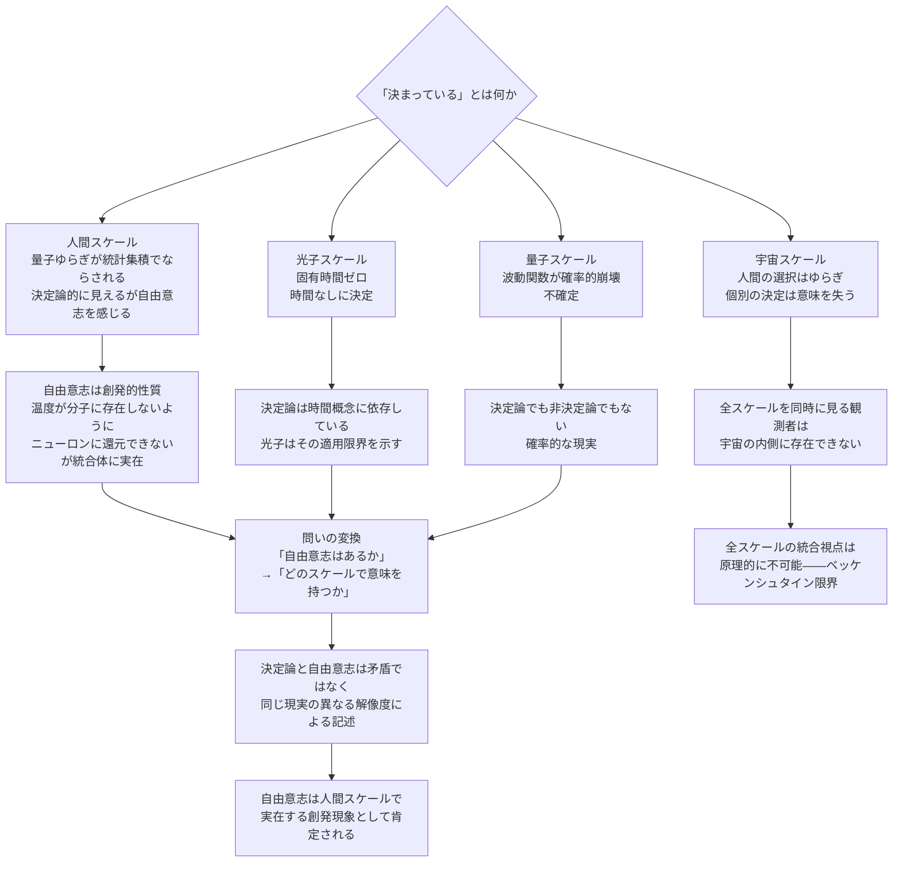

## 1. 概要 (Abstract)

自由意志はあるか、という問いは長く哲学の中心にある。

決定論が正しければ、あなたが今この文章を読んでいることはビッグバンの瞬間から決まっていた。量子力学が正しければ、その決定は根本的に確率的だ。どちらが正しいとしても、「自分が選んでいる」という感覚はどこから来るのか。

ここに見落とされている問いがある。**「決まっている」はどのスケールでの話か。**

同じ水一杯を、分子のスケールで見れば無数の粒子の確率的な衝突だ。しかし温度計で測れば32℃と決定論的に答える。スケールを変えれば同じ現実が全く異なる「顔」を見せる。自由意志と決定論の対立も、スケールの混同から生まれているかもしれない。

そして最も鋭い境界例として、光子がいる。光子は時間を経験しない——放出と吸収は光子にとって「同時」だ。しかし光子の経路は完全に決定されている。これは「時間なしに決定されている」という、決定論が時間概念に依存していることを照らし出す第三の状態だ。

> **命題：** 「自由意志は存在するかという問いは、どのスケールで意味を持つかという問いに置き換えられる——そして全スケールを同時に見る視点は、宇宙の内側に存在できない。」

---

## 2. 実現不可能性の根拠 (Infeasibility Rationale)

### 物理的限界

「全スケールを同時に観測するラプラスの悪魔」は存在できない。

あらゆる観測者は宇宙の内側にいる。宇宙全体の情報を格納するには、ベッケンシュタイン限界により宇宙全体のエネルギーに匹敵する媒体が必要になる——悪魔は宇宙と同じ大きさでなければならず、それはもはや「観測者」ではない。

さらに特殊相対性理論は、光子の固有時間がゼロであることを示す。光子は「時間の外」にいる。決定論は時間的な因果連鎖——AがBを引き起こし、BがCを引き起こす——を前提にしているが、光子にはその連鎖を「経験する時間」がない。決定論の適用範囲に時間という条件が必要であることが、光子という極限例で浮かび上がる。

### 技術的限界

人間の意思決定を量子精度で追跡するのは原理的に不可能に近い。

脳のニューロン発火は熱的ノイズと電気的相互作用に満ちた巨視的な過程だ。量子的不確定性が神経レベルで意味を持つかどうか自体が未解決だが、仮に意味を持つとしても、脳全体の量子状態を完全に記録するには宇宙規模の計算資源が必要になる。デコヒーレンスは量子的重ね合わせを瞬時に熱に変換し、「量子脳」を想定する余地をほとんど残さない。

### 論理的限界

「自由意志がある」と証明することも、「決定論が正しい」と証明することも、どちらも自己言及的な困難に直面する。

自由意志を証明するには、決定論的因果の「外」に立てる観測者が必要だ——しかしその観測者もまた宇宙の物理法則に従う存在だ。決定論を証明するには未来の全事象を計算できなければならないが、計算行為そのものが宇宙の状態を変える。どちらの立場も「宇宙の外」から検証することを要求している。

---

## 3. 実験の設定 (Setup)

### スケールによる「決まっている」の変容

同じ宇宙を異なるスケールで見ると、「決まっている」の意味が変容する。

| スケール | 振る舞い | 「決まっている」の意味 |
|---------|---------|-------------------|
| 光子 | 固有時間ゼロ。時間的因果の外にいるが経路は測地線に従う | 時間なしに決定されている |
| 量子 | 波動関数（g164）が確率的に崩壊する | 不確定。確率的にしか決まらない |
| 人間 | 量子的不確定性が統計集積でならされる。因果の流れの中にいる | 決定論的に見えるが自由意志を感じる |
| 文明 | 歴史は選択と偶然のゆらぎの積み重ね | 事後的にしか「必然」に見えない |
| 宇宙 | 銀河運動の中では文明の決断は統計的ノイズ | 個々の決定は意味を持たない |
| 熱的死 | 全ては平衡への統計的な道程 | 全ての「決定」が平均化され消える |

### 光子——決定論の境界例

光子は「決定論が時間に依存している」ことを暴露する存在だ。

```
通常の粒子（時間あり）:
  放出 ──── 時間経過 ──── 吸収
             ↑
     決定論的因果の鎖がここにある

光子（固有時間ゼロ）:
  放出 = 吸収（光子にとって同一の瞬間）
     因果の「前後」がない
     しかし経路は測地線に従い完全に決定されている
```

光子は決定論的でも非決定論的でもない——時間的因果の概念が適用できない「第三の状態」だ。決定論と非決定論の対立そのものが、時間を経験する存在にとってのみ意味を持つ問いであることが示される。

### 自由意志が「存在する層」

温度は分子一個には存在しない。しかし気体には確かに存在する。温度は創発的な性質だ——構成要素には還元できないが、集合体として実在する。

自由意志もこれと同じ構造かもしれない。

```
ニューロン一発火:  「自由意志」は存在しない
脳全体の統合:     「選択している」という体験が創発する  ← ここに自由意志がある
文明の歴史:       個々の選択は偶然と必然のゆらぎに沈む
宇宙の時間軸:     全選択は統計的ノイズ
```

自由意志が「ある」か「ない」かを問うのは、温度が「本当に実在するか」を分子論から問うようなものだ——スケールを指定しなければ問い自体が定まらない。

---

## 4. 考察と予測 (Speculation)

### ブロック宇宙と自由意志の共存

ブロック宇宙（g167）では過去・現在・未来が等しく実在する。あなたが「今」選択していることも、ブロックにすでに刻まれている。

しかしこれは自由意志を否定しない。ブロックに「選択する存在が選択する瞬間」が刻まれているということは、その選択もまたブロックの一部として実在するということだ——選択は起きている。それが「他の選択もありえた」かどうかとは別の問いだ。

映画のフィルムはすでに全コマが存在するが、フィルムの中の登場人物は「選択し、行動する」。ブロック宇宙における自由意志もこれに近いかもしれない——外から見れば固定されているが、内から経験すれば選択だ。

### 多世界解釈——全ての選択が実現する宇宙

多世界解釈（g162）は自由意志の問いに第三の回答を与える。

量子分岐のたびに宇宙は分岐し、全ての結果が実現する。「あなたが選ばなかった方の選択」も、別の分岐では実現している。この解釈では決定論（各分岐は決定論的）と自由意志（全選択が実現する）が共存する——ただしその代償として「どの分岐に自分がいるか」は確率的にしか決まらない。

### 確率の幅の中の自由——生死すら自由になれる

量子粒子は観測されるまで波動関数として存在し、確率分布の全域にいる。巨視的スケールから見れば「その粒子はだいたいここにいる」という統計的な許容範囲に収まる。人間もこれと同じ構造の中にいる。

宇宙スケールから見れば、ある知的生命体が生まれ、選択し、死ぬことは統計的に許容された確率分布の中の一点に過ぎない。しかしその**許容範囲の内側では**、いつ生まれ・何を選び・いつ死ぬかは確率分布の幅の中で自由に位置を取ることができる。宇宙スケールはその幅の内側である限り「どこでも統計的に問題ない」と言っているのだから。

これは自由意志の問いを根本から転換する。「決定論の中で自由意志はあるか」という問いへの答えは「**巨視的スケールが許容する確率の幅の内側では、生死ですら自由だ**」になる。

量子粒子がスクリーンのどこに当たるかについて「自由」であるように——宇宙の統計的許容範囲の内側で、人間は最も根源的な問い（今日を生きるか否か）においてさえ、確率的な自由を持っている。決定論は宇宙規模の統計として成立しながら、その統計の幅の内側では本物の自由を許容している。

### 光子的存在——時間を経験しない意識

仮に意識が時間の流れを必要としない形で存在できるとすれば、その存在にとって「自由意志」はどう見えるか。

光子は時間の外にいるが、経路は決定されている。もし意識が光子のように固有時間ゼロで宇宙を横断できるなら、その意識にとって自由意志と決定論の対立は「時間を経験する存在の問い」として外側から見えるかもしれない。レトロン（wiim_037）が過去に情報を送るとき、それは時間方向を逆転させる——これもまた「時間外の決定」という光子的な状態と通じる構造だ。

---

## 5. 図解 (Diagrams)



---

## 6. 関連記事 (Related)

- [wiim_037](../physics/wiim_037.md) — レトロン（時間の矢の逆転・時間外の決定との接続）
- [wiim_039](../quantum/wiim_039.md) — 量子永久機関（量子スケールの物理的限界の比較）
- wiim_??? — アカシックレコード（ブロック宇宙の静的な全記録という接続）
- wiim_??? — 意識の物理的基盤（ハードプロブレムと自由意志の接点）
