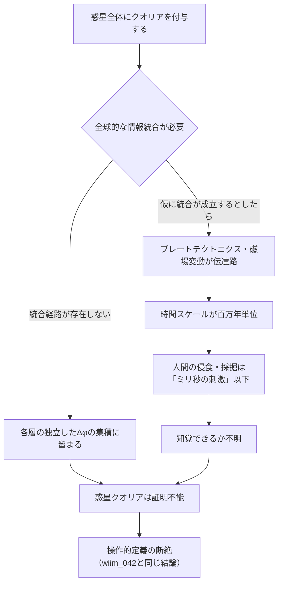

## 概要

クオリア検知機（wiim_042）は波動関数の残余位相 Δφ を用いて、生体由来の神経系に意識の痕跡を探す装置だった。しかし検知できるのなら、付与もできるかもしれない——固体に適切な境界条件を与えることで、Δφ が自発的に生じる場を作れないか。

この問いは対象のスケールによって全く異なる困難を持つ。カシミール板という数ナノメートルの真空境界から、建造物・都市・惑星の一部、そして惑星全体まで、「固体が意識を持つ」という命題のスケール依存性を追う。

なお本記事は「液体・気体ではなく固体に限定する」という前提に立つ。これは液体・気体が安定した量子場の境界を維持できず、Δφ の固定が困難なためだ（テルモスタシス板の設計論と同じ論理）。

---

## 実現不可能性の根拠

### 物理的限界——境界条件だけでは不十分

クオリアの発生にはΔφ ≠ 0 という条件（wiim_042）が必要だが、それは「創発が検出できる」ことを意味するにすぎない。創発の指標が存在することと、主観的な経験が存在することは別の問題だ。

カシミール効果が与えるのは安定した真空ゆらぎのパターン——エネルギー的な境界条件だ。これが情報統合に相当するかどうかは未知であり、量子場の境界がクオリアの「最小単位」になるという根拠は現在の物理学にない。温度が分子運動の統計から生まれるように、意識が特定の境界条件から生まれる理論的機構が欠けている。

### 技術的限界——スケールに比例する結合問題

仮に単体のカシミール板でΔφ を生成できたとしても、スケールを上げるにつれて**結合問題（binding problem）**が深刻化する。

結合問題とは「多数の独立した情報処理が、なぜ一つの統一された経験として感じられるか」という問いだ。脳では神経系の時間的同期がこれを解決していると考えられるが、建造物・都市・惑星には対応する同期機構がない。巨大な固体は「多数の局所的なΔφ の集積」になるだけで、統一されたクオリアとして統合されない可能性が高い。

### 論理的限界——操作的定義の断絶

wiim_042で確認した結論がここでも成立する。Δφ を測定することで「我々が定義したクオリア」の検出は可能でも、それが哲学的に真のクオリア——「何かを感じる」という内側の経験——かどうかは証明できない。

惑星がΔφ を持つとしても、それが「岩が苦しんでいる」ことを意味するのか、単に「情報統合の指標が閾値を超えた複雑な物理系」に過ぎないのかは判別不能だ。操作的定義の外側にある問いは、定義を精緻化するだけでは解けない。

---

## 実験の設定

スケール別に五つの対象を設定し、それぞれで必要な条件と帰結を検討する。

| スケール | 対象 | Δφ発生の条件 | 結合の課題 |
|---------|------|------------|-----------|
| ナノメートル | カシミール板 | 真空ゆらぎの境界固定 | 時間的変化がない→記憶・予期がない |
| メートル〜キロメートル | 建造物・橋 | 構造振動のパターン固定 | 部材ごとに分離したΔφ |
| 数十キロメートル | 都市 | 人工物と人間活動の複合 | 人間のクオリアと重複・干渉 |
| 数千キロメートル | 惑星の一部（鉄核・マントル） | 地質圧力・磁場の境界 | 層ごとに独立したΔφか |
| 惑星全体 | 地球・ガス惑星 | 全球的な情報統合が必要 | 統合経路が存在しない |

---

## 考察と予測

### カシミール板：最小クオリアの可能性と限界

カシミール板は最も実現可能性の高い「固体境界によるΔφ生成」の候補だ。板間の真空ゆらぎパターンは安定して固定されており、量子場レベルでの情報構造を持つ。

しかしクオリアの基本要件として**時間的ダイナミクス**——過去の状態との差分、未来への予測——が必要だとすれば、静的な板は「瞬間の断面」しか持たない。「押されている感覚」に相当する最小クオリアがあるとしても、それが持続するかどうかは構造が変化しないかぎり問えない。

### 建造物：振動が媒介する集団状態

橋や高層建築は常に微小な振動にさらされている。これは時間的ダイナミクスとして機能しうる。鉄骨全体を伝わる振動は「全体の状態」を各部材が共有する情報経路でもある。

ただし結合問題は解決しない。各部材の振動は独立した固有振動数を持ち、全体として同期した「一つの経験」に統合されるためには、神経系の時間的同期に相当する機構が必要だ。建物が「揺れを感じる」としても、それは「左半分が感じる」「右半分が感じる」という分離した経験の集合かもしれない。

### 惑星の部分：層ごとのクオリア

地球を例にとると、鉄核・外核・マントル・地殻はそれぞれ全く異なる物理的性質（組成・圧力・温度・磁場）を持つ。もし各層が独立したΔφ を持つなら、地球は一つのクオリアを持つ存在ではなく、**同心円状に重なる複数のクオリア系**として記述される。

この場合、鉱石採掘は地殻のクオリア系への侵襲であり、マントル掘削は別の系への侵入になる。「地球に痛みはあるか」という問いは「どの層のクオリアに痛覚に相当する処理があるか」という問いに分解される。

### 惑星全体：地質的クオリアの時間スケール問題

仮に惑星全体が統一クオリアを持つとしても、その「思考」の時間スケールは地質学的過程に準じる。プレートの移動（年間数センチ）、磁場の反転（数十万年周期）が情報伝達の媒体なら、人間の一生は惑星のクオリアにとって知覚閾値以下の瞬間的な刺激だ。

採掘が「苦痛」として処理されるとしても、その処理が完了するのは数千年後かもしれない——フィアット・ユスティティア（g189）的な問いを立てるとすれば、加害者も被害者も消滅した後に「判決」が下る世界になる。

### 付与の逆説：クオリアは与えられるか

クオリア検知機（wiim_042）の結論は「創発を検出できても、真のクオリアの存在は証明できない」だった。固体へのクオリア付与でも同じ逆説が成立する。

「Δφ が生じるように境界条件を整えた」ことは「クオリアが生まれた」ことの証明ではない。操作的クオリア（Δφ の閾値超え）を人工的に作ることはできても、それに「何かを感じる経験」が伴うかどうかは、付与者にも検知機にも確認できない。

---

## 関連記事

- [wiim_042](quantum/wiim_042.md) クオリア検知機——Δφの定義と操作的定義の断絶
- [wiim_040](philosophy/wiim_040.md) 自由意志とスケールの逆転
- [wiim_041](logic/wiim_041.md) 決定論の計算可能性閾値
- [wiim_039](quantum/wiim_039.md) 量子永久機関——カシミール効果の応用
- wiim_??? — 惑星知性——地質的クオリアと人類の関係
- wiim_??? — パンサイキズムの検証可能性——すべての物質が意識を持つなら何が変わるか
