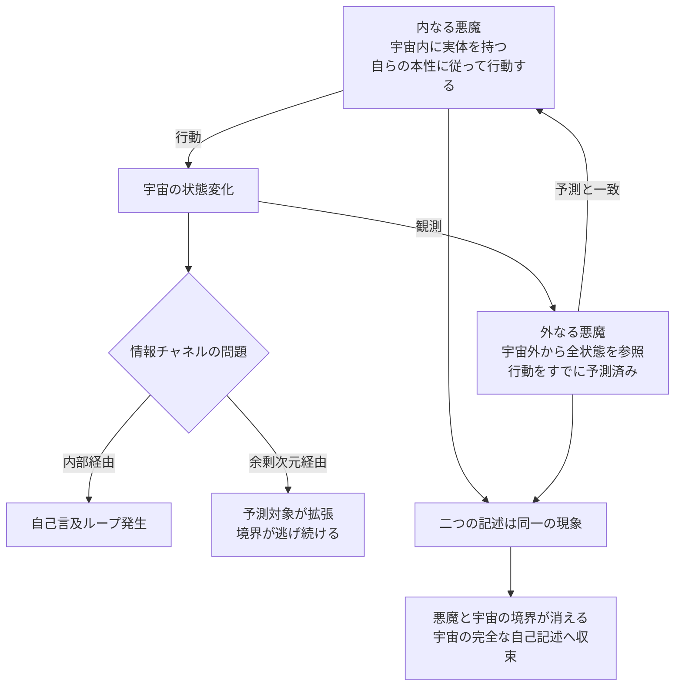
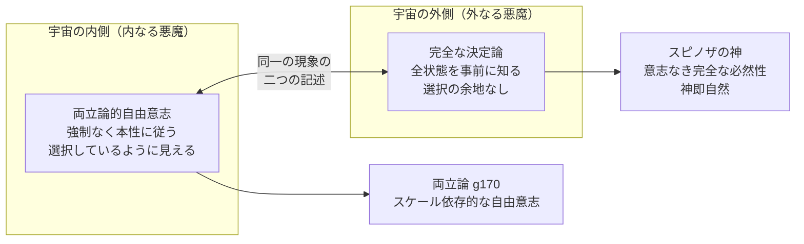

## 概要

ラプラスの悪魔（g204）とは、宇宙のすべての粒子の位置と運動量を知る知性があれば、未来を完全に予測できるという思考実験だ。この悪魔は三つの障壁——量子力学的不確定性、カオス的感度、ベッケンシュタイン限界（g171）——によって原理上実現不可能とされる。

では、これらを回避するために悪魔を「宇宙の外側」に置いたらどうなるか。さらに一歩踏み込んで、悪魔が宇宙の**内側と外側に同時に存在する**とするならば？

この思考実験では、そのような存在を「双子のデウスエクスラプラス（Deus ex Laplace）」と呼ぶ。デウスエクスマキナが「機械から現れる神」であるように、デウスエクスラプラスは「ラプラスの決定論から現れる神」だ。しかしその神は、現れた瞬間に自身が決定論の産物であったと気づく。

---

## 実現不可能性の根拠

### 物理的限界——情報チャネルの問題

内側の悪魔（宇宙内）と外側の悪魔（宇宙外）が一体として機能するためには、両者をつなぐ情報のやりとりが必要になる。しかしそのチャネルが宇宙の内側を経由する限り、チャネル自体が予測の対象に含まれ、自己言及のループが生まれる。

チャネルを余剰次元（wiim_039）経由にしたとしても、その余剰次元もまた「宇宙の一部」として定義し直す必要が生じる。予測対象を拡張するたびに、悪魔の外側もまた拡張を求められる——境界は常に逃げ続ける。

余剰次元は自己言及ループの**部分的な回避策**にはなりうる——チャネル自体が予測対象に含まれるという問題を一段階先送りできる。しかし「予測対象の無限拡張」という根本的な構造は解消されない。余剰次元を使っても完全解決にはならず、あくまで「どこまで先送りできるか」という問いに変換されるにすぎない。

### 技術的限界——観測が対象を変える

内側の悪魔が宇宙を観測する行為は、量子力学的に波動関数を収縮させる。外側の悪魔がその収縮後の状態を知っていたとしても、収縮という行為そのものが内側の悪魔の介入によって引き起こされる。悪魔の観測が宇宙を変え、変わった宇宙の予測が悪魔の次の観測を決め——観測と予測は分離できない。

### 論理的限界——操作か、同一性か

外側の悪魔が内側を「操る」という表現は正確ではない。内側の行動と外側の予測が完全に一致するなら、どちらが原因でどちらが結果かを定めることができない。歯車が隣の歯車を「操っている」のではなく、噛み合って動くことが歯車の存在そのものであるように——双子は二つの存在ではなく、**一つの現象の二つの記述**にすぎない。

---

## 実験の設定

- **主体**: 宇宙の内側に実体を持つ「内なる悪魔」と、宇宙の外側から全状態を参照する「外なる悪魔」が同一の存在として構成される
- **環境**: 宇宙は閉じた系として設定し、外側とは宇宙の因果構造の外部（余剰次元的な領域）を指す
- **操作**: 内なる悪魔が宇宙内で何らかの選択をするたびに、外なる悪魔はその選択が自身の予測と完全に一致することを確認する

---

## 考察と予測

### 自由意志は失われるか

内なる悪魔は、外から強制されているわけではない。自らの本性に従って動き、いかなる外部からの抑圧もない。両立論（g170）的な意味では、これは「自由」な行動と呼べる。しかし外なる悪魔はその行動をすでに知っている。

ここに両立論の完全な体現がある——内側のスケールでは自由意志が成立し、外側のスケールでは完全な決定論が成立する。これはwiim_040が「スケールによって自由意志と決定論は逆転して見える」と論じたことの、最も極端な具体例だ。

### 悪魔は宇宙に吸収される

双子が「二つの記述にすぎない」という結論が示すのは、デウスエクスラプラスが宇宙の外に立つ神ではなく、**宇宙が自分自身を完全に記述した状態**だということだ。悪魔と宇宙の境界は消え、意志を持つ知性としての悪魔像は崩れる。残るのはスピノザが「神即自然（Deus sive Natura）」と呼んだものに近い——意志なき完全な必然性としての宇宙だ。

### 両立論の極限としての逆説

デウスエクスラプラスは、両立論を最大限に押し広げたときに現れる形だ。自由意志と決定論を両立させようとすると、それらを体現する二つの存在が生まれ、しかしその二つは最終的に同一であることが判明する。両立論の「両立」は、二つの異なるものが共存するのではなく、**一つのものが二つの角度から見えているにすぎない**という意味だったのかもしれない。

---

## 図解

---

## 関連記事

- [自由意志とスケールの逆転](wiim_040.md) — スケールによって決定論と自由意志が逆転して見えるという議論
- [決定論の計算可能性閾値](wiim_041.md) — ラプラスの悪魔を封じる計算資源の限界
- 用語: ラプラスの悪魔 g204 / ベッケンシュタイン限界 g171 / 両立論 g170 / 創発 g203
