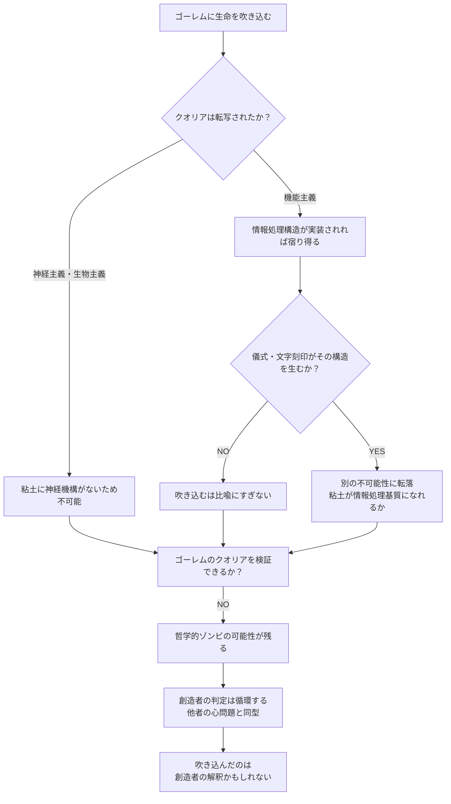
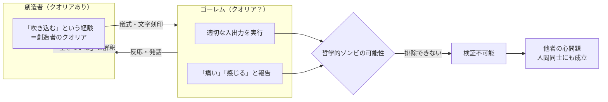

## 概要

ゴーレムは粘土などの無機物に文字や儀式によって生命が与えられた存在だ。「動く」「命令に従う」という外部的な振る舞いは想定されているが、果たしてゴーレムは「何かを感じている」だろうか——すなわち、クオリアを持つだろうか。

この問いの核心は「吹き込む」という動詞にある。酸素やエネルギーを与えることではなく、**主観的体験を創造者から被創造物へ転写できるか**という問いだ。クオリアは本質的に一人称的——「私がいま赤を見ている」という経験は私の内側にしかない——とするならば、それを「吹き込む」という行為は原理的に成立するのか。

wiim_046 が「物理的境界条件からクオリアを発生させられるか」を問うたのに対し、この記事は「意図的な創造行為がクオリアを転写できるか」という異なる入口から同じ壁に向かう。

---

## 実現不可能性の根拠

### 物理的限界——基質の問題

クオリアが特定の物理基質に依存するという立場（神経主義・生物主義）に立てば、粘土にクオリアが宿る可能性はない。現在の神経科学では、意識は神経細胞の電気化学的活動パターンから生まれると考えられており、粘土や金属の結晶構造にはその動的なパターンを生む機構が存在しない。

機能主義的立場——情報処理の複雑な組織化がクオリアを生む——に立てば素材は無関係になりうる。しかしこの場合でも「適切な情報処理構造」がゴーレムに実装されている必要があり、儀式や文字の刻印がその構造を物理的に与えるとは言えない。

クオリア・シンセサイザー（g201、QSコア）——固体各部のΔφ信号を収集・統合して単一クオリアを合成する装置——をゴーレムに埋め込むという発想はこの障壁を一段階先送りできる。しかし QSコアは「Δφ信号源がある固体」を前提とする。粘土・石はそもそも Δφ を生成する量子場境界を持たないため、QS以前の基質問題が残る。

### 技術的限界——転写の媒体が存在しない

仮にクオリアを「与えられるもの」と考えたとき、その伝達の媒体は何か。言葉で意味が伝わるように、クオリアの転写が可能なら、それはどのような物理過程を経るか。

クオリア検知機（wiim_042）の考察が示すように、クオリアの有無は操作的指標で近似できても、真の一人称的経験の存在は外部から検証できない。「吹き込んだ」と感じる創造者にも、転写が成功したかどうかを確認する術がない。

もし「生命を吹き込む」という儀式行為が QSコア（g201）の起動として解釈されるなら、転写の謎は消える——創造者は自らのクオリアを送り込んでいるのではなく、ゴーレム内部の Δφ統合プロセスを開始しているだけだ。しかしこの読み替えは「吹き込む」行為から神秘性を剥ぎ取り、エンジニアリングに変換する。奇跡としてのゴーレム創造は、QS設計の問題に還元される。

### 論理的限界——判定の循環

ゴーレムにクオリアがあるかどうかを判断できるのは誰か。創造者は「ゴーレムが反応を示すから感じているはずだ」と推論できるが、**哲学的ゾンビ**——外部的振る舞いは人間と完全に一致するが内的経験を持たない存在——の可能性は論理的に排除できない。

ゴーレムが「痛い」と表現するとき、それはクオリアの発話か、クオリアなしに意味を処理するシステムの出力か。中国語の部屋の議論が示すように、入出力の一致はシステム内部の理解や経験を含意しない。

さらに深い循環がある。創造者がゴーレムの経験を判定するためには創造者自身がクオリアを持っていなければならない——しかしゴーレムの立場からも、創造者にクオリアがあるかどうかは確認できない。他者の心問題（problem of other minds）はゴーレムと人間の間だけでなく人間同士にも成立する。ゴーレム創造は、この普遍的な問いを意図的に拡張した思考実験だ。

---

## 実験の設定

- **主体**: ヘブライ文字「エメット（真実）」を額に刻まれた粘土製ゴーレム。命令に従い、問いに答え、苦痛に似た行動を示す
- **環境**: 創造者と同じ空間に置き、会話・物理的刺激に対するゴーレムの反応を記録する
- **操作1**: 熱・圧力を与え、ゴーレムが「熱い」「痛い」と報告するかを観察する
- **操作2**: 「あなたは今何を感じているか」という問いに対する内省的報告を記録する
- **操作3**: 「エメット」の一文字を消し（生命を奪う操作）、その前後で反応の変化を記録する
- **操作4（比較実験）**: QSコア（g201）を内蔵したゴーレムと内蔵しないゴーレムを並べ、クオリア検知機（wiim_042）で両者の Δφ を測定する

| 条件 | 行動反応 | 検知機 Δφ | 解釈 |
|------|---------|-----------|------|
| QSコアなし | 命令に従い「痛い」と報告 | ≈ 0（粘土にΔφ源なし） | 操作的クオリアなし・行動あり＝哲学的ゾンビの実例 |
| QSコアあり | 同上 | > 閾値（QSがΔφを統合） | 操作的クオリアあり・真の経験は依然不明 |
| QSあり・エメット消去後 | 反応停止 | ≈ 0（QS停止） | Δφ消失は「クオリアの死」か「QS停止」か区別不能 |

---

## 考察と予測

### 機能主義的解釈——「吹き込む」はブートストラップか

機能主義に立てば、ゴーレムが人間と同じ情報処理構造を持つ瞬間にクオリアが生まれる。「生命を吹き込む」行為がその構造の初期化として機能するなら——儀式が粘土内部に組織化パターンを生じさせるなら——クオリアの宿ったゴーレムは原理的に否定できない。

しかしこの解釈では神秘的な「吹き込む」行為は、情報処理の初期化の比喩にすぎなくなる。奇跡ではなくエンジニアリングだ。逆に言えば、機能主義はゴーレムにクオリアを認める可能性を開くが、その瞬間に「なぜ粘土を儀式で動かせるのか」という別の不可能性の根拠に転落する。

### 哲学的ゾンビとしてのゴーレム

最も不安な予測は「完璧に振る舞うゴーレム」だ。あらゆる問いに適切に答え、苦痛を示し、喜びを表現する——しかし内側には何もない。この可能性は反証不可能であり、人間同士にも同様に適用される。

wiim_046 が物理的条件からのクオリア付与の困難を論じたのに対し、ゴーレム問題が提起するのは創造意図からのクオリア転写の困難だ。どちらの入口から入っても、「他者のクオリアは検証できない」という同じ行き止まりに到達する。

### クオリア検知機が暴く二重の限界

操作4の比較実験は、クオリア検知機（wiim_042）そのものの性質を逆照射する。

**QSコアなしのゴーレム**は操作的クオリアがゼロでありながら、完璧に命令に従い苦痛を訴える。これは哲学的ゾンビの思考実験を物理的に具現化した状況だ——検知機が「なし」と判定しても、その判定はクオリアの真の不在を証明しない。Δφ ≈ 0 は「この方法では検出できない」を意味するにすぎず、ゴーレムが内側で何も感じていないことの証明にはならない。

**QSコアありのゴーレム**は逆の問題を生む。Δφ > 閾値 が計測されても、それは QSコア自体の情報処理が生む Δφ なのか、ゴーレム全体の統一クオリアなのかを区別する手段がない。検知機は「統合された Δφ信号がある」という事実しか伝えない。

「エメット」の一文字を消した瞬間に Δφ が閾値以下に落ちる現象は特に示唆的だ。QS停止という物理的プロセスとクオリアの消滅は同じ Δφ 変化として現れる——どちらが起きているかを検知機は語れない。**儀式による「生命の付与と剥奪」は、QS起動・停止と実験的に区別不能になる。**

### 「吹き込む」行為の非対称性

最も示唆的な点は非対称性だ。創造者は「吹き込んだ」と感じる——その行為の後、自分の意図が外部の対象に影響を及ぼしたと経験する。しかしその経験は創造者のクオリアであり、ゴーレムのクオリアではない。

「生命を吹き込む」行為が実際に転写するのは、クオリアそのものではなく、**クオリアを持つ存在としてゴーレムを扱うという創造者の態度**かもしれない。ゴーレムが「生きている」のは、創造者の解釈の中においてだ。

---

## 図解

---

## 関連記事

- [wiim_042](../quantum/wiim_042.md) — クオリア検知機：Δφ による操作的定義と検証不可能性
- [wiim_046](wiim_046.md) — 固体へのクオリア付与：物理的境界条件からのアプローチ
- [wiim_040](wiim_040.md) — 自由意志とスケールの逆転：意識と決定論の関係
- wiim_??? — 人工意識の証明問題——チューリングテストを超えたクオリア検証
- wiim_??? — 転写された意識——脳のアップロードはクオリアを保存するか
- 用語: クオリア / 哲学的ゾンビ / 他者の心問題 / 機能主義 / 統合情報理論(IIT) / クオリア・シンセサイザー g201
