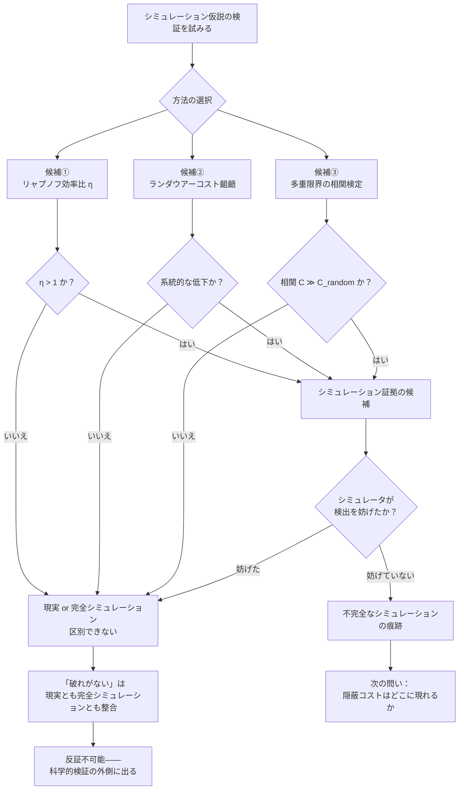

## 概要

私たちの宇宙がシミュレーションであるかどうかを、どうすれば判定できるか。

哲学者ニック・ボストロムが体系化したシミュレーション仮説（g019）はこれまで主に論理的・確率論的な議論として扱われてきた。本記事はその問いを実験可能な形に変換しようとする試みだ——「現実なら必ず破れるはずの方程式が破れない」という観測をシミュレーション証拠とする検証枠組みを構築する。

カオスの創発文法（[wiim_054](wiim_054.md)）の補遺「シミュレータの内側では限界が消える」という考察が出発点だ。リャプノフ指数（g214）・ランダウアー原理（g172）・ハイゼンベルクの不確定性原理・ベッケンシュタイン限界（g171）——これらは現実の宇宙に存在する根本的な壁だ。シミュレータではこれらが「省略可能な実装コスト」になりうる。

ならば、これらの壁が「あるべき場所で現れない」ことを精密に測定できれば、シミュレーションの痕跡を見つけられるのではないか。

---

## 実現不可能性の根拠

### 物理的限界——完全なシミュレータは検出を妨げる

シミュレーション検証が原理的に困難な理由の一つは、検出しようとする行為そのものがシミュレータに「観測された」瞬間、シミュレータが壁を「出現させる」ことができるからだ。

リャプノフ効率比の実験を行おうとする観測者がいれば、完全なシミュレータはその実験領域だけ通常の物理法則を適用して η ≤ 1 を守ることができる。結果として観測者は常に「現実と区別がつかない」結果を見る。これは「検出を試みるほど証拠が消える」という逆説的な構造だ。

### 技術的限界——精度の要求が発散する

各候補の検証には、それぞれが要求する測定精度の問題がある。

リャプノフ効率比は「リャプノフ時間を超えた予測精度」を測るが、そのためには予測対象の初期条件を量子限界まで精密に制御する必要がある——これ自体がハイゼンベルクの不確定性原理に阻まれる。ランダウアーコストの齟齬を測るには個々のビット消去に伴う熱散逸を原子スケールで計測する必要があり、現在の技術では統計的ノイズに埋もれる。

複数の限界の同時違反を相関検定するには、それぞれの違反を独立に検出する精度が要求されるが、各検出精度は他の物理限界に阻まれるという多重の壁が存在する。

### 論理的限界——「破れがない」は何の証明にもならない

この検証枠組みが抱える最も深い問題は認識論的なものだ。

「壁が破れない」という観測結果は、二つの全く異なる結論と整合する。

ひとつは「私たちは現実の宇宙にいる（だから壁が機能している）」。もうひとつは「私たちは完全なシミュレーションの中にいる（だからシミュレータが壁を守っている）」。どちらの仮説も同じ観測結果「壁は破れなかった」を予測する。

これは反証不可能性の典型的な構造であり、ポパーの反証可能性基準を満たさない——つまり科学的仮説の検証として機能しない。「破れがない」という観測の不在（ネガティブな結果）は、シミュレーション仮説を否定する証拠にも肯定する証拠にもなれない。

---

## 実験の設定

- **候補①　リャプノフ効率比**：カオス系（ローレンツ系などの古典的アトラクタ）で予測精度を測定し、η（予測可能時間をリャプノフ時間で割った値）が 1 を超えるかを確認する。超える場合はシミュレーション証拠の候補。
- **候補②　ランダウアーコストの齟齬**：量子情報実験でビット消去一回あたりの熱散逸を精密測定し、理論値（kT×ln2、ボルツマン定数×温度×自然対数2）より系統的に低い値が出ないかを検定する。
- **候補③　多重限界の相関違反**：上記二つに加え、ハイゼンベルク不確定性の精度限界・ベッケンシュタイン限界への接近を同一実験系で同時測定し、各限界への「接触」が統計的に相関しているかを検定する。相関係数が偶然水準を超えれば、共通の原因（シミュレーションの数値精度）を示唆する。

---

## 考察と予測

仮に候補③の相関が観測されたとして、それは何を意味するか。

現実の宇宙では、各物理限界は異なる物理機構に由来する——リャプノフは初期値の力学的増幅、ランダウアーは熱力学的エントロピー増大、ハイゼンベルクは量子力学の非可換性、ベッケンシュタインは重力と情報の結びつき。これらが同一の原因から生じる理由はない。したがって違反が相関する理由もない。

シミュレーションの数値精度（浮動小数点の有効桁数に相当するもの）が原因であれば、すべての限界は同じ精度スレッシュルドで揺らぎ始める。違反が相関するのは自然な帰結だ。

しかし、ここに最後の反論が立ちふさがる。

**相関を隠蔽するコストは、別の場所に歪みを生む。**

完全なシミュレータが相関を偽装しようとすれば、ある限界の違反を見せかけるために別の場所に計算資源を割り当てる必要がある。その非対称な資源配分は、別の物理量に新たな統計的偏りとして現れるかもしれない。検証の網を広げるほど、隠蔽コストも膨らむ——しかしシミュレータが無限の計算能力を持つなら、この追いかけっこには終わりがない。

シミュレーション検証方程式が成立するとすれば、それは「完全なシミュレータは無限の計算能力を持てない」という前提に依拠するときだけだ。その前提が正しいかどうかを知る方法もまた、私たちの内側には存在しない。

---

## 数式による表現

相関検定の核心を一本の式で表すとすれば：

$$C(\delta_1, \delta_2, \ldots, \delta_n) \gg C_\text{random}$$

$\delta_i$ は各物理限界（リャプノフ・ランダウアー・ハイゼンベルク・ベッケンシュタイン）への「接触度」（理論限界からの偏差）、$C$ はその相関行列のオフ対角成分の平均、$C_\text{random}$ は独立なノイズ源が生む期待相関だ。左辺が右辺を統計的に有意に超えれば、共通の原因があることを示す。

---

## 図解

---

## 関連記事

- [wiim_054](../physics/wiim_054.md) — カオスの創発文法——階層的折り畳み評価が相転移を起こすとき
- [wiim_041](../philosophy/wiim_041.md) — ラプラスの悪魔が宇宙の情報を格納できない理由
- [wiim_040](../philosophy/wiim_040.md) — 自由意志と決定論の両立可能性
- [wiim_056](wiim_056.md) — ベッケンシュタイン限界の突破——局所情報密度が時空を書き換えるとき

