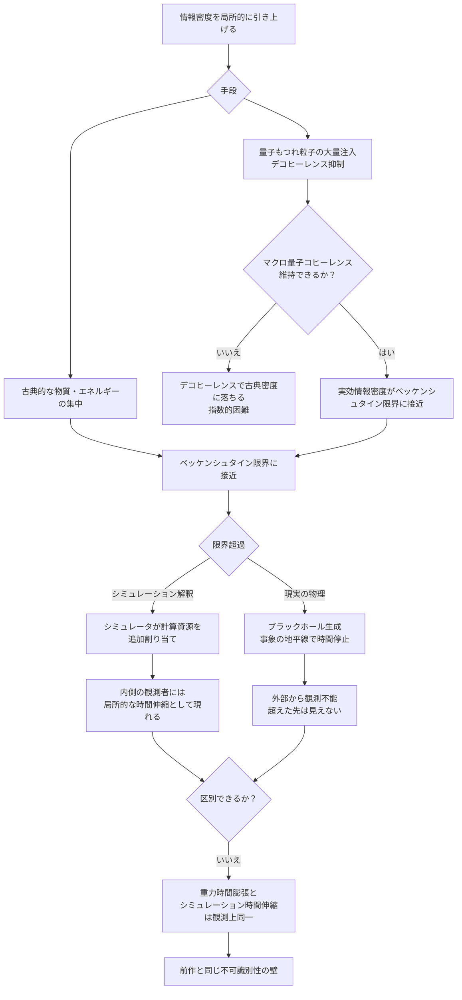

## 概要

ある空間領域に詰め込める情報量には上限がある。これをベッケンシュタイン限界（g171）と呼ぶ。表面積に比例するこの限界は、重力・熱力学・量子力学が交差する地点に立っており、現代物理学の最も深い謎の一つと結びついている。

この限界を「超える」ことができたとしたら、何が起きるか。

標準的な物理の答えは明快だ——その領域はブラックホールに崩壊する。そして事象の地平線付近では時間が極端に遅れる。つまり、情報密度と時間の流れは、重力を媒介としてすでに接続している。

本記事はここから先を問う。マクロスケールで量子的な情報密度を維持できれば、重力崩壊なしに時空へ働きかけることができるのか。さらに、シミュレーション仮説（g019）の枠組みでは、この限界超過がまったく異なる意味を持つ——シミュレータの計算資源の追加割り当てとして現れ、内側の観測者には局所的な時間の伸縮として感じられる可能性がある。

前作（[wiim_055](wiim_055.md)）で論じた「現実なら破れるはずの限界が破れない」という検証の問いと、この情報密度操作の試みは表裏一体だ。

---

## 実現不可能性の根拠

### 物理的限界——限界超過はブラックホール生成と等価

ベッケンシュタイン限界は単なる情報理論の上限ではなく、重力の構造に根ざしている。ある球形領域に詰め込める情報の最大量は、その領域の表面積に比例する——体積ではなく表面積だ。これはホログラフィック原理（宇宙の情報は一次元低い次元の表面に格納されているという考え方）の核心でもある。

この限界を超えようとすると、エネルギー密度が上昇し、シュワルツシルト半径（その質量がブラックホールになる臨界半径）が現在の空間サイズを超えてしまう。結果として空間は重力崩壊を起こし、内部を外側から観測できなくなる——物理は「超えた先」を見せることを拒否する。

事象の地平線付近では、外部の観測者の座標時間で見ると地平線に落ちていく物体は永遠に止まって見える——ただしこれは外部観測者の視点であり、落下していく側の固有時は有限であることに注意が必要だ。情報密度を極限まで高めようとする試みは、それ自体が時間を止める構造を生み出す。

### 技術的限界——マクロ量子コヒーレンスの指数的困難

量子スケールでは、重ね合わせともつれによって n 量子ビットが 2 の n 乗の状態を同時に保持できる。マクロスケールの同じ空間では、デコヒーレンスによってこの指数関数的な情報密度は古典ビットの密度にまで落ちる。

この差を埋める——つまりマクロスケールで量子コヒーレンスを維持する——ことの困難さは、[wiim_050](../quantum/wiim_050.md)で詳しく論じた問題と同根だ。系が大きくなるほどデコヒーレンス時間は指数的に短縮し、環境との相互作用が量子情報を古典的な確率に還元していく。

「創発をスケールに還元する」——量子スケールの情報粒度をマクロスケールに引き上げる——という操作は、デコヒーレンスの逆走に相当する。これは熱力学第二法則が禁じる方向ではないが、必要なエネルギーと制御精度は系のサイズに対して指数関数的に増大する。現時点では数百量子ビットのコヒーレンス維持も極めて困難であり、「空間領域の情報密度を古典的限界の上に引き上げる」スケールまでの道のりは現実的でない。

### 論理的限界——シミュレーション解釈での区別不可能性

シミュレーション仮説の観点でこの思考実験を眺めると、独特のパラドックスが現れる。

シミュレータがある領域の情報密度の上昇に対して計算資源を追加割り当てすれば、その領域の「処理速度」が相対的に変化する。内側の観測者には局所的な時間の伸縮として現れるかもしれない。

しかしここで根本的な問いが生じる——この「シミュレーション由来の時間伸縮」は、重力による時間膨張と観測上どう区別するのか。

ブラックホール周辺で測定される時間膨張の式と、シミュレータの計算資源割り当て変化による時間伸縮は、内側の観測者には同一の計測値として現れる。現実とシミュレーションの両仮説が同じ観測を予測するとき、それを識別する実験的な手段は存在しない。前作で論じた「破れがない」の問題と同じ構造の不可識別性が、ここでも現れる。

---

## 実験の設定

- **対象領域**：小さな閉じた空間（たとえば直径 1 マイクロメートルの球形領域）
- **操作**：量子もつれを持つ粒子ペアを大量に注入し、デコヒーレンスを極限まで抑制しながら実効的な情報密度を段階的に引き上げる
- **観測A（物理的）**：領域の外部に配置した測定装置で重力ポテンシャル・局所的な時間の流れを精密に測定する（装置を領域内に置くと装置自体も時間変化の影響を受けるため、差分の検出が不可能になる）。情報密度の上昇に伴い、重力時間膨張に相当する変化が現れるか
- **観測B（シミュレーション解釈）**：上記と同じ計測値が「重力崩壊の前兆」と「シミュレータの資源割り当て変化」のどちらを示すか、追加の手がかりがないかを探す
- **判定基準**：情報密度が古典的なベッケンシュタイン限界に近づくにつれ、時間の流れの変化が理論曲線（重力時間膨張の予測）に沿うかどうか

---

## 考察と予測

この思考実験が興味深いのは、「情報密度と時間は無関係ではない」という事実がすでに標準物理の中に埋め込まれているからだ。

ブラックホールはその究極例だ。情報をある空間に詰め込もうとするとき、物理は「それ以上は許さない」のではなく、「その代償として時間を止める」という形で限界を守る。限界の外側を封じることで、内側の整合性を保つ構造だ。

量子コヒーレンスによる情報密度の引き上げが、もし重力崩壊なしに達成できたとしたら——これは物理が許さない操作だが——その領域は時間膨張なしに時空への影響を持ちうるか。あるいは、ブラックホールとは別の経路で「時間を書き換える」機構が存在しうるか。

シミュレーション解釈はここに別の答えを置く。限界を「自然法則の帰結」ではなく「レンダリングの設計上限」として扱えば、上限への接触はシステムの応答を引き出す操作になる。そして応答は、内側から見れば時空の変化として区別できない形をとるだろう。

これは「シミュレーション検証」と「時空工学」が、同じ実験で同時に問われる稀な状況だ。

---

### 時間膨張の第三の要因として

物理学には時間膨張をもたらす要因が二つある。速度（特殊相対性理論）と重力・質量エネルギー密度（一般相対性理論）だ。本記事の論点はここに第三の柱を提起する——**情報密度**だ。

ただし現状では、この第三の要因は第二の要因（重力）に還元できてしまう。ベッケンシュタイン限界は情報とエネルギーを直接結びつけており、情報密度の上昇はエネルギー密度の上昇と等価だ。したがって「情報密度による時間膨張」は今のところ「重力時間膨張の別の言い方」に過ぎない。

第三の要因として独立するための条件は一つだ。

> 量子コヒーレンスによって、同じエネルギー量でも古典的な場合より情報密度を高められたとき、その「余剰情報」が一般相対性理論の予測を超える時間膨張を引き起こすか。

これが成立すれば、標準的な重力理論の予測値と実測値の差として原理上検出可能になる。速度・重力に次ぐ第三の軸が開くか否かは、マクロ量子コヒーレンスの達成とセットの問いだ。

---

## 図解

---

## 関連記事

- [wiim_055](wiim_055.md) — シミュレーション世界検証方程式——現実なら破れるはずの限界が破れないとき
- [wiim_054](../physics/wiim_054.md) — カオスの創発文法——階層的折り畳み評価が相転移を起こすとき
- [wiim_050](../quantum/wiim_050.md) — マクロ量子コヒーレンスの限界
- [wiim_082](../physics/wiim_082.md) — パラドックス解消公理——空間歪みが因果矛盾を自動解消するとき

