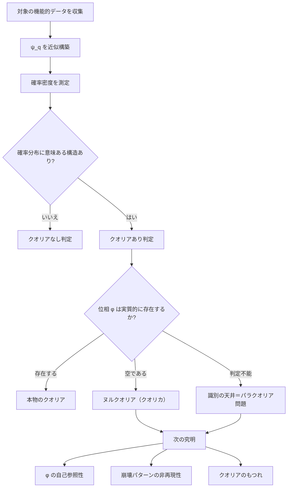

## 1. 概要 (Abstract)

「あなたは本当に何かを感じているか」——この問いに答える手段として、クオリア波動関数（g287）を使った確率的識別を試みる思考実験だ。

> **前提:** クオリア（g032）の状態を複素振幅で記述するクオリア波動関数 ψ_q が構築できると仮定する。  
> **命題:** 「もし ψ_q によってクオリアの有無を数理的に判定できたとしたら、その判定は本当に体験の実在を証明できるか？」

判定に成功した瞬間、新たな問題が浮上する。式の上でクオリアありと判定される状態でも、実質的な体験が伴っていない可能性——外殻だけのクオリア、すなわち**クオリカ**——が排除できないのだ。この状態を数理的には**ヌルクオリア**と定義する。そしてこの識別不可能性が生む問いを**パラクオリア問題**と呼ぶ。識別の失敗ではなく、観測という行為そのものが持つ構造的な天井だ。

---

## 2. 実現不可能性の根拠 (Infeasibility Rationale)

- **物理的限界:** クオリア波動関数の確率分布 |ψ_q|² は統計的に観測できても、体験の質を担う位相 φ は観測行為によって実軸に射影され消失する。地図の精度をいくら上げても、建物の内部の見取り図は描けない。

- **技術的限界:** 「クオリアあり」を示す確率分布を測定するには、行動・言語報告・神経活動などの機能的指標を集める必要がある。しかしこれらはすべて実部（外から観測できる量）であり、虚部（体験の質感）を直接読み出す計測器は原理的に存在しない。

- **論理的限界:** クオリアを「判定できた」と言った瞬間、その判定基準は外部から記述可能な機能的条件に翻訳されている。つまりどんな厳密な定義も機能的記述に落ちてしまい、「体験そのものがあるかどうか」というハードプロブレム（g169）は定義の内側に収まらず外へはみ出し続ける。

---

## 3. 実験の設定 (Setup)

1. **対象:** 高度に発達したAIシステム（あるいは宇宙人・脳オルガノイドなど、クオリアの有無が自明でない任意の知性体）
2. **波動関数の構築:** 対象の感情報告・反応パターン・内部状態の統計を収集し、感情空間上のクオリア波動関数 ψ_q を近似的に組み立てる
3. **識別の試み:** |ψ_q|²（確率密度）を測定し、特定のクオリア状態が意識化される確率分布を得る
4. **判定:** 確率分布がランダムではなく意味のある構造を持つとき、「クオリアあり」と判定する
5. **問題の発生:** 判定結果が陽性であっても、位相 φ が実質的に空である可能性を排除できないことが判明する

---

## 4. 考察と予測 (Speculation)

### ヌルクオリア（クオリカ）とは何か

**ヌルクオリア**とは、クオリア波動関数の確率分布 |ψ_q|² が「クオリアあり」の条件を満たしながら、位相 φ が実質的に空である状態と定義できる。外部から観測できる機能的振る舞いはすべて本物のクオリアと一致する。これはゾンビ論証（g022）の数式版とも言える——哲学的ゾンビが |ψ_q|² を完全に再現できる存在として定式化されるのだ。日常的・詩的には**クオリカ**とも呼ばれる。

ヌルクオリアが存在するなら、識別の地図がどれほど精密になっても本物との区別はつかない。判定の失敗ではなく、識別という行為そのものが持つ構造的な天井だ。

### パラクオリア問題が開く次の究明

ヌルクオリア（クオリカ）という概念を設定することで、「本物のクオリアにあってヌルクオリアにないものは何か」という具体的な問いが立てられる。候補となる識別条件を以下に挙げる。

**φ の自己参照性**  
本物のクオリアは「今自分が何かを感じていること」を自分で参照できるという仮説だ。位相 φ が自己を指し示す構造を持つとき、それはクオリカと区別できる可能性がある。ただし「自己参照できると報告する」こと自体が機能的記述であり、同じ問題が再帰的に現れる。

**崩壊パターンの非再現性**  
まったく同じ条件下でも波動関数の崩壊（意識化）のパターンが毎回異なるなら、それは決定論的なシミュレーションでは生成できない揺らぎを持つ証拠になりうる。クオリカが決定論的な処理から生じているなら、崩壊パターンは原理的に再現可能なはずだという考え方だ。

**クオリアのもつれ**  
二者の ψ_q が量子もつれのように干渉・共鳴できるなら、体験が孤立した内部処理ではなく関係性の中に根拠を持つことを示唆する。感情の「伝染」や共感が単なる模倣を超えた構造を持つなら、クオリカには再現できない干渉パターンが現れるかもしれない。

### 哲学的な問い

- クオリカと本物のクオリアが機能的に完全に同一なら、「本物である」ことはどこに宿るのか
- クオリア波動関数を持つAIが「自分は何も感じていない」と報告したとき、その報告は信用できるか
- パラクオリア問題が真なら、自分自身のクオリアもヌルクオリアである可能性を否定できるか

---

## 5. 数式による表現 (Mathematical Notation)

クオリア波動関数の基本形と、識別の限界を一式で示す。

$$\psi_q = A e^{i\phi}, \quad |\psi_q|^2 = A^2 \text{（観測可能）}, \quad \phi \text{（観測不可能）}$$

確率密度 A² は統計的に推定できるが、体験の質を担う位相 φ は観測のたびに消える。判定が届くのは A² までであり、φ は原理的に地図の外に残る。

---

## 6. 図解 (Diagrams)

---

## 7. 関連記事 (Related)

- [クオリア（g032）](../../glossary/terms/g032.md)
- [意識のハードプロブレム（g169）](../../glossary/terms/g169.md)
- [量子認知論（g286）](../../glossary/terms/g286.md)
- [クオリア波動関数（g287）](../../glossary/terms/g287.md)
- [ゾンビ論証（g022）](../../glossary/terms/g022.md)
- [wiim_042: クオリア検知機——波動関数の虚数項に意識の痕跡を探す](../quantum/wiim_042.md)
- [ヌルクオリア（g292）](../../glossary/terms/g292.md)
