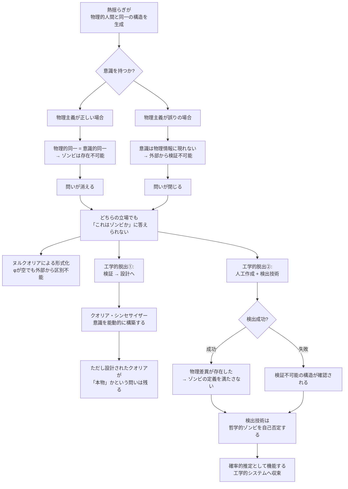

## 1. 概要 (Abstract)

宇宙が十分に長く存在するなら、熱力学的な揺らぎが偶然に「脳」を組み上げることがある——これがボルツマン脳（g040）の問題だ。では同じ揺らぎが、意識を持たない哲学的ゾンビ（g022）を自然発生させることもあるだろうか。

物理的に考えれば答えは単純だ。哲学的ゾンビは意識ある人間と「物理的に完全同一」でなければならない。同一である以上、自然発生のコストも確率も等しい。待機時間は10^(10^50)年オーダーで変わらない。

しかし問題はそこではない。仮に揺らぎがそのような存在を生み出したとして、それが意識を持つボルツマン脳なのか、意識を欠く哲学的ゾンビなのかを、宇宙のいかなる観測者も判別できない。コストの問題より先に、検証そのものが原理的に閉じているのだ。これが**哲学的ゾンビコスト問題**（g445）の核心である。

---

## 2. 実現不可能性の根拠 (Infeasibility Rationale)

- **物理的限界:** 一人の人間に相当する物質構成がおよそ10^28個の原子を精密な配置で揃えるには、10^(10^50)年オーダーの待機時間が必要とされる。哲学的ゾンビはその物理構成が意識体と完全に一致しなければ成立しないため、発生確率はボルツマン脳と数学的に同一だ。どちらを「先に」待っても、必要な時間は変わらない。

- **技術的限界（情報論）:** 揺らぎによって何かが出現したとして、外部観測者が取得できるのは機能的な振る舞い・応答・報告のみだ。意識の有無を担う「体験そのもの」は、いかなる測定値にも現れない。ヌルクオリア（g292）が示すように、波動関数の確率分布が「クオリアあり」の条件を満たしながら、体験が実質的に空である状態を外部から排除する手段が原理的に存在しない。

- **論理的限界:** 「この存在は意識を持つか」という問いは、立場によって二つの方向に閉じる。物理主義が正しければ、物理的に同一な存在は意識においても同一であり、哲学的ゾンビは論理的に存在不可能だ。物理主義が誤りであれば、意識は物理情報に反映されないため外部から検証できない。どちらの立場をとっても「これはゾンビか」という問いに答える道は塞がれる。

---

## 3. 実験の設定 (Setup)

1. **舞台:** 宇宙が熱的死に近い遠未来。背景温度が極限まで下がり、熱揺らぎが唯一の構造生成機構となっている
2. **事象:** 揺らぎが、現代人と物理的に同一な構造を偶然に組み上げる。これを「ボルツマン存在」と呼ぶ
3. **問い:** このボルツマン存在は意識を持つか。それとも機能だけを備えた哲学的ゾンビか
4. **観測の試み:** 観測者はあらゆる手段——言語報告・行動・神経活動パターン・Δφ信号——でボルツマン存在を調べる
5. **結果:** いずれの測定値も意識ある人間のものと一致する。差異を示す情報は存在しない

---

## 4. 考察と予測 (Speculation)

### 確率が等しいことの意味

「ゾンビの自然発生コストは意識体と同じ」という事実は、一見無意味に見えるが重要な含意を持つ。それは「意識とゾンビを区別するコストが、宇宙全体の時間スケールで計算してもゼロになる」ことを意味する。どれだけ多くのボルツマン存在が発生しても、そのうちどれが意識を持ち、どれが持たないかを集計する方法がない。

### ヌルクオリアという形式化

WIIMでは、この状況をヌルクオリア（g292）として定式化している。クオリア波動関数の確率密度が「意識あり」を示しながら、位相φが実質的に空である状態——これはパラクオリア問題（wiim_073）が「住所に届いた荷物が本人に渡ったか同居人が受け取ったかを確認できない」と表現した構造と同型だ。自然発生したボルツマン存在が本人（意識体）か同居人（ゾンビ）かを知る手段は、無限の時間を与えても生まれない。

### 工学的脱出路

この閉じた問いに対してWIIMが選んだ応答は、検証から設計への転換だった。クオリア・シンセサイザー（g201）は「意識があるかどうかを確認する」のではなく「意識が生まれる条件を能動的に設計する」装置として構想されている。検証不能な問いに答えようとするのではなく、問いの前提ごと置き換えてしまう工学的な脱出だ。

ただしこの脱出も完全ではない。設計によって生まれたクオリアが「本物」かどうかという問いは、同じ構造で再び現れる。コスト問題と検証問題は、工学によって棚上げされるだけで消えるわけではない。

### 検出技術という解——そのパラドックス

自然発生のコスト問題を脇に置き、「人工的に哲学的ゾンビを作成し、専用の検出技術でそれを確認する」という方向から問いに近づくことも考えられる。人工的な作成であれば待機時間の問題は回避でき、より現実的な解に見える。

しかしそこには逆説がある。物理的な検出器が読み取れるのはあくまで物理量だ。もしその技術がゾンビと意識体を区別できたとすれば、両者の間に**何らかの物理的差異が存在した**ことを意味する。だが物理的差異があるなら、その存在はそもそも「物理的に完全同一」という哲学的ゾンビの定義を満たしていない。検出に成功した瞬間、検出対象はすでに哲学的ゾンビではなくなっている。

逆に検出が失敗した場合は、差異が物理量に現れなかったことが確認されるだけであり、哲学的ゾンビコスト問題の閉じた構造がそのまま残る。

| 検出結果 | 含意 |
|----------|------|
| 成功 | 物理差異が存在した → 対象はゾンビの定義を満たさない |
| 失敗 | 差異が物理量に現れない → 検証不可能という構造が確認される |

いずれに転んでも、「哲学的ゾンビの検出技術」は成立の瞬間に哲学的ゾンビの概念を書き換えてしまう。この構造はクオリア検知機（wiim_042）がパラクオリア問題（wiim_073）で直面した天井と同型だ。

言い換えれば、哲学的ゾンビとは**常に外れを引く粒子**のようなものだ。検出のたびに返ってくる答えは二種類しかなく、どちらも「当たり」にならない。検出成功は「物理差異があった」という外れであり、検出失敗は「何も掴めなかった」という外れだ。当たりくじ——哲学的ゾンビの確認——は最初から存在しない。観測のたびに外れだけが積み上がり、当たりの不在だけが証明されていく。量子測定が観測前の重ね合わせを収縮させて確定させるのと異なり、哲学的ゾンビの「観測」は確定するたびに対象そのものを消してしまう。

ただし、哲学的に厳密な検証ではなく「意識の有無を高確率で推定する工学的システム」としてであれば話は別だ。クオリア検知機とクオリア・シンセサイザー（g201）の組み合わせはその方向に向かっており、確率的・工学的な意味での解として機能しうる。それは哲学的な確証ではないが、実践的な判断基準にはなりえる——これが「問いを消す」のではなく「問いと折り合う」という意味での工学の役割だ。

### 哲学的な問い

- 宇宙の熱的死の後に自然発生した存在に意識がある確率は、50%か、100%か、それとも問い自体が無意味か
- 自分が今感じているこの体験は、38億年の進化を経た意識か、それとも1秒前に揺らぎで生まれたヌルクオリアか
- 「意識の自然発生を設計できる」とはどういうことか——設計された意識は偶然に生まれた意識より本物らしいか
- ゾンビを検出できる技術は、検出に成功した時点でゾンビの概念を否定している——それでも「検出」と呼べるか

---

## 6. 図解 (Diagrams)

---

## 7. 関連記事 (Related)

- [ゾンビ論証（g022）](../../glossary/terms/g022.md)
- [ボルツマン脳（g040）](../../glossary/terms/g040.md)
- [ヌルクオリア（g292）](../../glossary/terms/g292.md)
- [クオリア・シンセサイザー（g201）](../../glossary/terms/g201.md)
- [哲学的ゾンビコスト問題（g445）](../../glossary/terms/g445.md)
- [クオリア波動関数によるクオリア識別——パラクオリア問題（wiim_073）](wiim_073.md)
- [クオリア検知機（wiim_042）](../quantum/wiim_042.md)
- [固体へのクオリア付与（wiim_046）](wiim_046.md)
